# //uses-http2/samples/pages+cached+noadtech+nomedia+nocss

[→ Parent](../..)


## Raw


```yaml
p90min: 0
p90max: 150
p90range: 150
p90mean: 4.787234042553192
median: 0
p90stdev: 26.36602921573137
mad: 0
stdevBySn: 0
lfitCenter: 4.480000698497739
lfitStdev: 10.894302780110127
mfitCenter: 4.480000698497739
mfitStdev: 13.6539837042468
mfitConfidence: 1.36539837042468
p90skewness: 5.326002287485447
p90eccentricity: 0.9999999999999988
p90discretization: 47
outlandishness: 3.5343999999999998

```

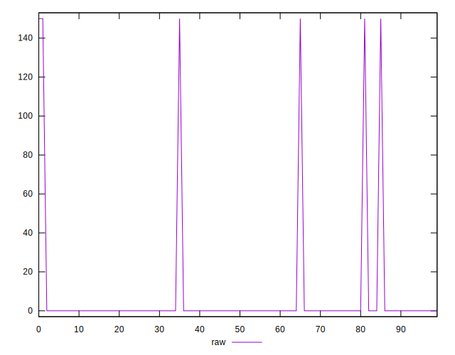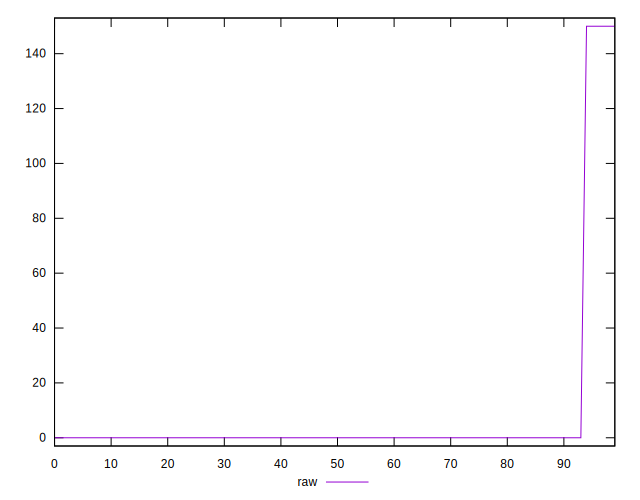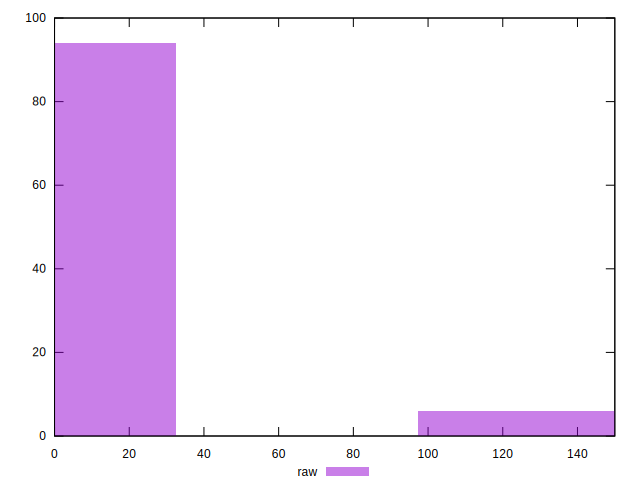
## Score


```yaml
p90min: 0.88
p90max: 1
p90range: 0.12
p90mean: 0.9961702127659574
median: 1
p90stdev: 0.021092823372585067
mad: 0
stdevBySn: 0
lfitCenter: 0.996415999441202
lfitStdev: 0.00871544222408792
mfitCenter: 0.996415999441202
mfitStdev: 0.010923186963397212
mfitConfidence: 0.0010923186963397212
p90skewness: -5.326002287485468
p90eccentricity: 1.000000000000003
p90discretization: 47
outlandishness: 0.9932451066651509

```

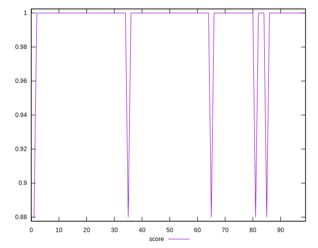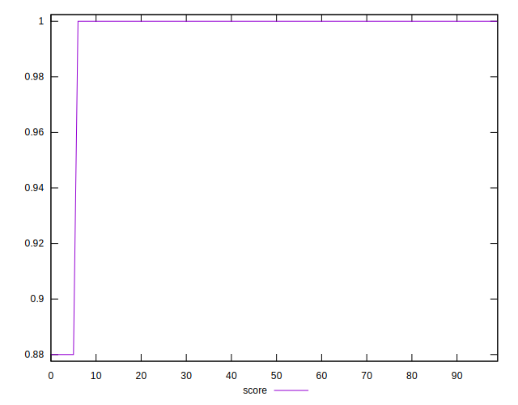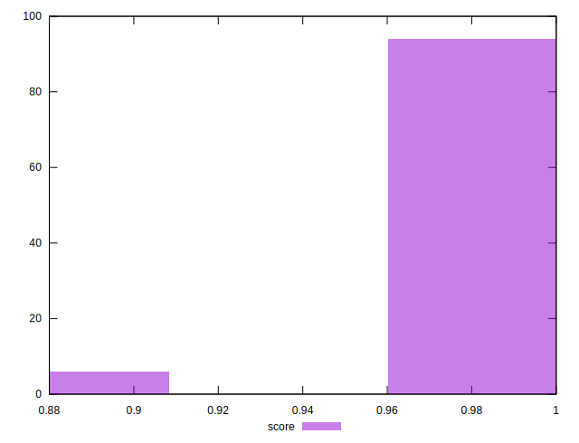
## Raw Estimate

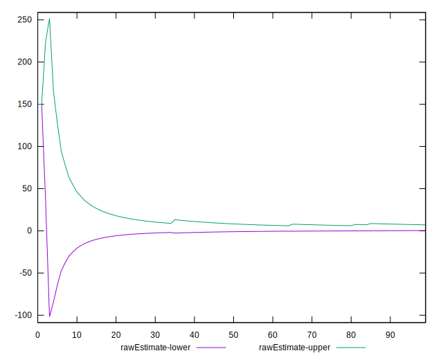
## Score Estimate

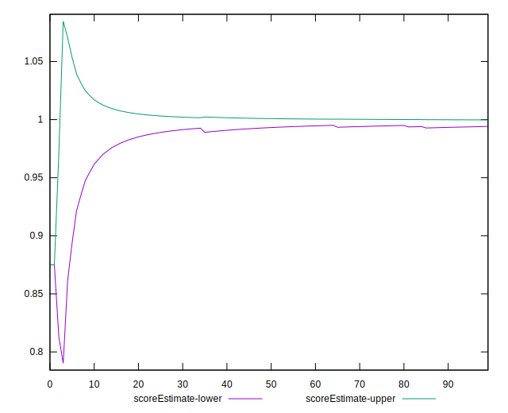
## P Score


```yaml
p90min: 0.875
p90max: 1
p90range: 0.125
p90mean: 0.9960106382978723
median: 1
p90stdev: 0.02197169101310945
mad: 0
stdevBySn: 0
lfitCenter: 0.9962666660845854
lfitStdev: 0.009078585650091597
mfitCenter: 0.9962666660845854
mfitStdev: 0.01137831975353878
mfitConfidence: 0.001137831975353878
p90skewness: -5.326002287485478
p90eccentricity: 1.0000000000000024
p90discretization: 47
outlandishness: 0.9929630243083347

```

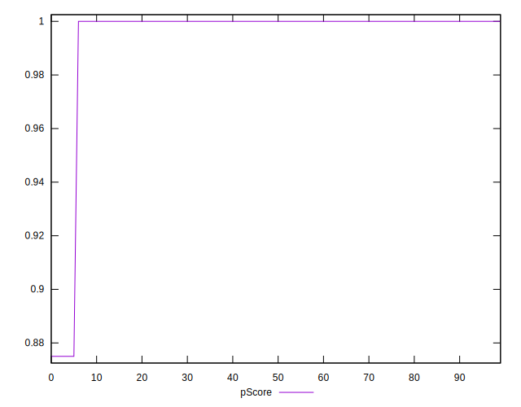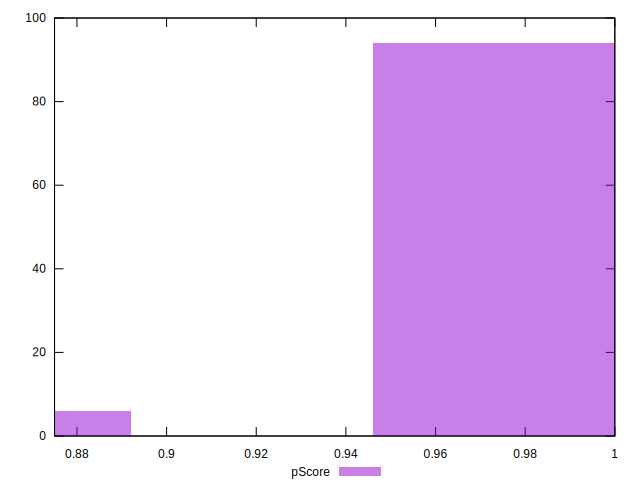
## Score Difference


```yaml
p90min: 0
p90max: 0
p90range: 0
p90mean: 0
median: 0
p90stdev: 0
mad: 0
stdevBySn: 0
lfitCenter: 0
lfitStdev: 0
mfitCenter: 0
mfitStdev: 0
mfitConfidence: 0
p90skewness: .nan
p90eccentricity: .nan
p90discretization: 94
outlandishness: .nan

```


## P Score Difference


```yaml
p90min: -0.0050000000000000044
p90max: 0
p90range: 0.0050000000000000044
p90mean: -0.00015957446808510654
median: 0
p90stdev: 0.0008788676405243787
mad: 0
stdevBySn: 0
lfitCenter: -0.00014933335661659143
lfitStdev: 0.0003631434260036712
mfitCenter: -0.00014933335661659143
mfitStdev: 0.0004551327901415603
mfitConfidence: 0.000045513279014156034
p90skewness: -5.326002287485487
p90eccentricity: 1.0000000000000033
p90discretization: 47
outlandishness: 3.534399999999999

```

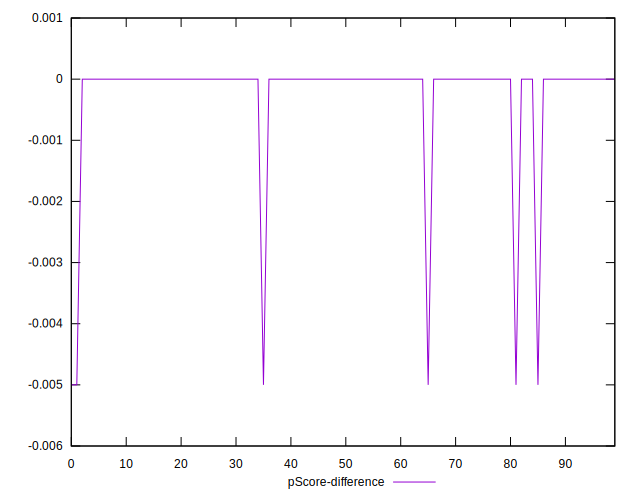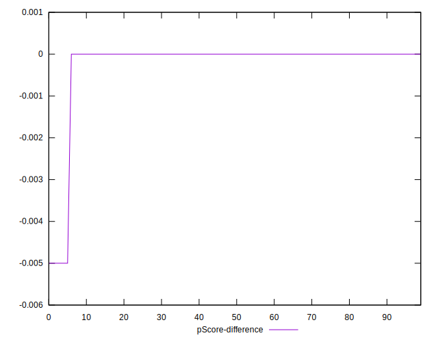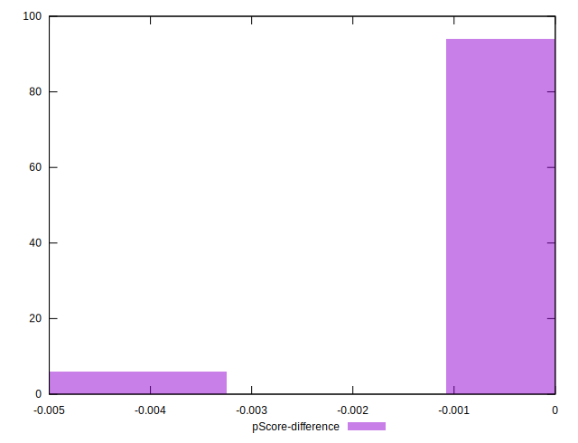