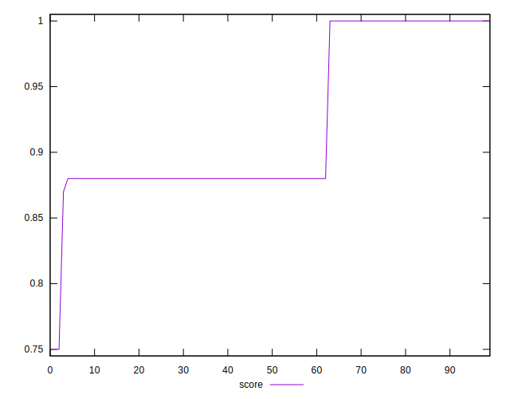

# //uses-http2/samples/pages+cached

[→ Parent](../..)


## Raw


```yaml
p90min: 0
p90max: 160
p90range: 160
p90mean: 95.85106382978724
median: 150
p90stdev: 72.16130828748801
mad: 0
stdevBySn: 0
lfitCenter: 107.49815964897341
lfitStdev: 80.30335386352324
mfitCenter: 107.49815964897341
mfitStdev: 100.64532877227659
mfitConfidence: 10.06453287722766
p90skewness: -0.574995673222208
p90eccentricity: 0.9999999999999979
p90discretization: 31.333333333333332
outlandishness: 1.0689402594970934

```


## Score


```yaml
p90min: 0.87
p90max: 1
p90range: 0.13
p90mean: 0.9232978723404252
median: 0.88
p90stdev: 0.05774832221699017
mad: 0
stdevBySn: 0
lfitCenter: 0.9138480293244472
lfitStdev: 0.06435730816034411
mfitCenter: 0.9138480293244472
mfitStdev: 0.08065992423809293
mfitConfidence: 0.008065992423809292
p90skewness: 0.5746180388222815
p90eccentricity: 1.0000000000000004
p90discretization: 31.333333333333332
outlandishness: 0.9937326299975058

```


## Raw Estimate


## Score Estimate


## P Score


```yaml
p90min: 0.8666666666666667
p90max: 1
p90range: 0.1333333333333333
p90mean: 0.9201241134751774
median: 0.875
p90stdev: 0.06013442357290664
mad: 0
stdevBySn: 0
lfitCenter: 0.9104182002925225
lfitStdev: 0.06691946155293624
mfitCenter: 0.9104182002925225
mfitStdev: 0.08387110731023074
mfitConfidence: 0.008387110731023075
p90skewness: 0.5749956732222141
p90eccentricity: 1.0000000000000016
p90discretization: 31.333333333333332
outlandishness: 0.9941236981731799

```


## Score Difference


```yaml
p90min: 0
p90max: 0
p90range: 0
p90mean: 0
median: 0
p90stdev: 0
mad: 0
stdevBySn: 0
lfitCenter: 0
lfitStdev: 0
mfitCenter: 0
mfitStdev: 0
mfitConfidence: 0
p90skewness: .nan
p90eccentricity: .nan
p90discretization: 94
outlandishness: .nan

```


## P Score Difference


```yaml
p90min: -0.0050000000000000044
p90max: 0
p90range: 0.0050000000000000044
p90mean: -0.0030141843971631227
median: -0.0050000000000000044
p90stdev: 0.0024344430062886407
mad: 0
stdevBySn: 0
lfitCenter: -0.003282009801001604
lfitStdev: 0.002787360586487188
mfitCenter: -0.003282009801001604
mfitStdev: 0.0034934384323556627
mfitConfidence: 0.0003493438432355663
p90skewness: 0.42373203145388266
p90eccentricity: 0.9999999999999988
p90discretization: 31.333333333333332
outlandishness: 0.9796341730103807

```

