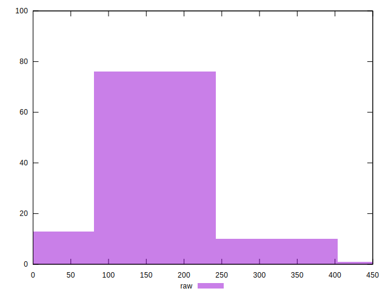
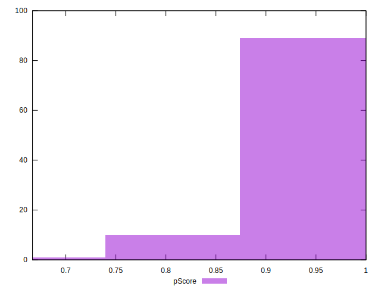
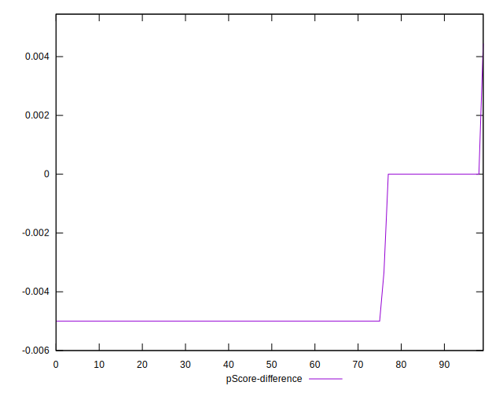

# //uses-http2/samples/pages

[→ Parent](../..)


## Raw


```yaml
p90min: 0
p90max: 300
p90range: 300
p90mean: 146.80851063829786
median: 150
p90stdev: 65.56161250268346
mad: 0
stdevBySn: 0
lfitCenter: 148.83648645241078
lfitStdev: 26.66792825843889
mfitCenter: 148.83648645241078
mfitStdev: 33.42329153284893
mfitConfidence: 3.3423291532848927
p90skewness: -0.10866313394966334
p90eccentricity: 0.9999999999999982
p90discretization: 31.333333333333332
outlandishness: 1.0245547078344888

```


## Score


```yaml
p90min: 0.75
p90max: 1
p90range: 0.25
p90mean: 0.8817021276595742
median: 0.88
p90stdev: 0.05447307158025847
mad: 0
stdevBySn: 0
lfitCenter: 0.8805198796242569
lfitStdev: 0.0214079716233342
mfitCenter: 0.8805198796242569
mfitStdev: 0.02683091351377222
mfitConfidence: 0.002683091351377222
p90skewness: -0.11325324208568469
p90eccentricity: 0.9999999999999992
p90discretization: 31.333333333333332
outlandishness: 0.9970485130849268

```


## Raw Estimate


## Score Estimate


## P Score


```yaml
p90min: 0.75
p90max: 1
p90range: 0.25
p90mean: 0.8776595744680851
median: 0.875
p90stdev: 0.05463467708556946
mad: 0
stdevBySn: 0
lfitCenter: 0.8761767654691041
lfitStdev: 0.022186153502445627
mfitCenter: 0.8761767654691041
mfitStdev: 0.027806219865246704
mfitConfidence: 0.0027806219865246706
p90skewness: 0.10866313394966605
p90eccentricity: 1.000000000000001
p90discretization: 31.333333333333332
outlandishness: 0.9976122015105036

```


## Score Difference


```yaml
p90min: 0
p90max: 0
p90range: 0
p90mean: 0
median: 0
p90stdev: 0
mad: 0
stdevBySn: 0
lfitCenter: 0
lfitStdev: 0
mfitCenter: 0
mfitStdev: 0
mfitConfidence: 0
p90skewness: .nan
p90eccentricity: .nan
p90discretization: 94
outlandishness: .nan

```


## P Score Difference


```yaml
p90min: -0.0050000000000000044
p90max: 0
p90range: 0.0050000000000000044
p90mean: -0.003918439716312061
median: -0.0050000000000000044
p90stdev: 0.0020442424309123045
mad: 0
stdevBySn: 0
lfitCenter: -0.004228095798086805
lfitStdev: 0.0016327433402392947
mfitCenter: -0.004228095798086805
mfitStdev: 0.0020463403129887545
mfitConfidence: 0.00020463403129887544
p90skewness: 1.3836932243843756
p90eccentricity: 1
p90discretization: 31.333333333333332
outlandishness: 0.9349694050308369

```

