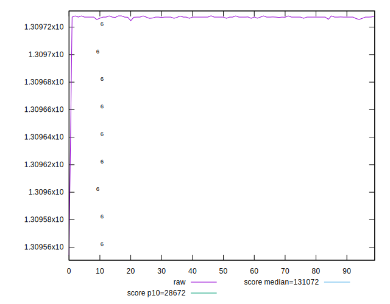
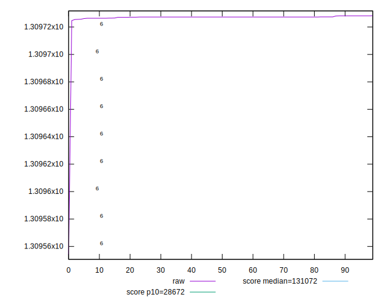
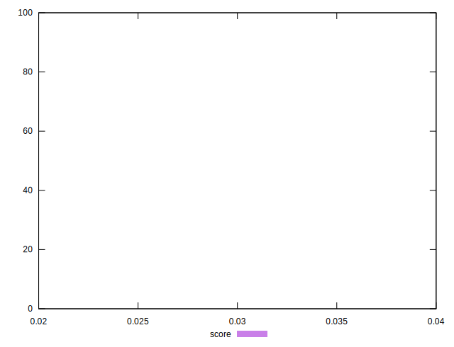
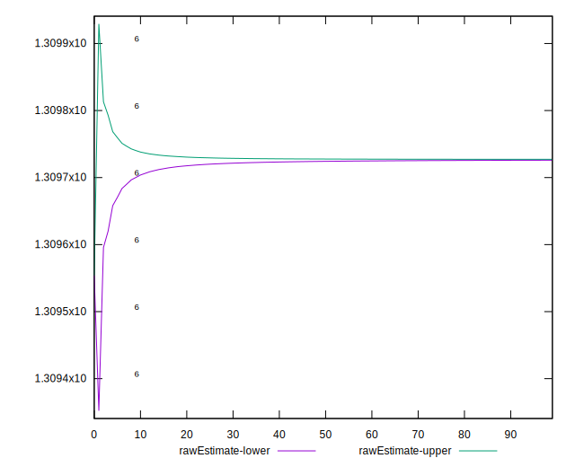
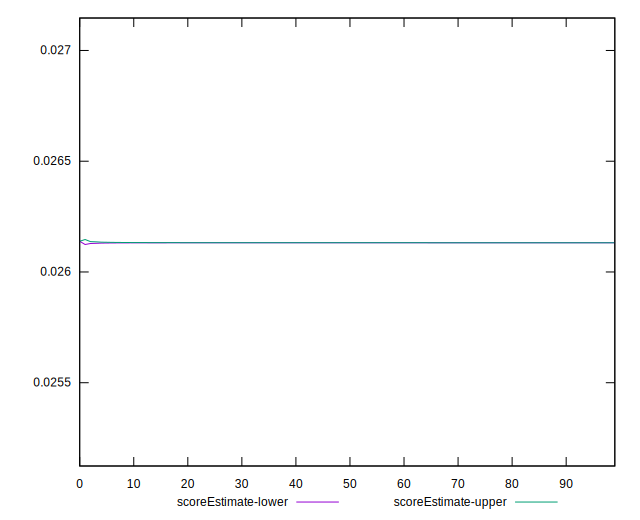
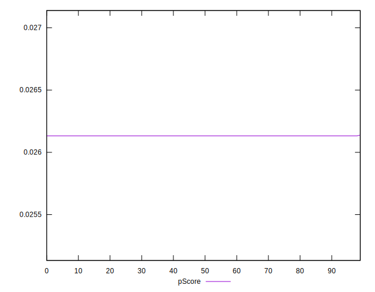
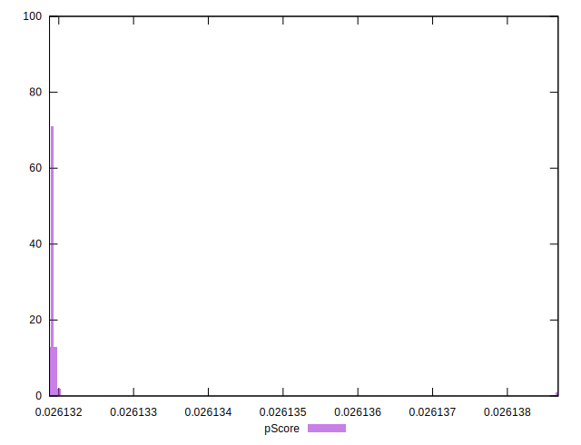
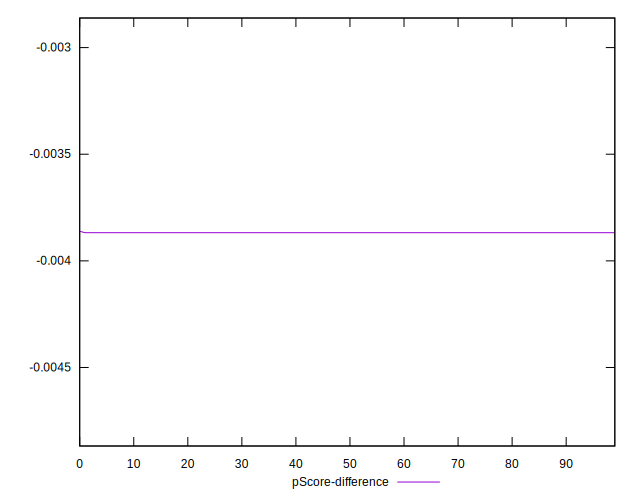
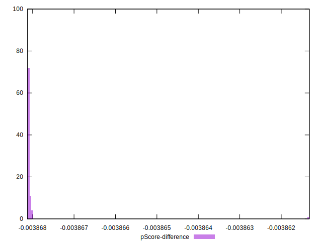

# //uses-long-cache-ttl/samples/pages+cached

[→ Parent](../..)


## Raw


```yaml
p90min: 1309725.5697408444
p90max: 1309728.1527948482
p90range: 2.5830540037713945
p90mean: 1309727.2191336486
median: 1309727.269461515
p90stdev: 0.47811880442603333
mad: 0
stdevBySn: 0
lfitCenter: 1309726.4251385198
lfitStdev: 2.0709976250023954
mfitCenter: 1309726.4251385198
mfitStdev: 2.5956106043741407
mfitConfidence: 0.25956106043741406
p90skewness: -0.6376377899832095
p90eccentricity: 0.9999999999999992
p90discretization: 7.230769230769231
outlandishness: 0.9999973347550186

```


## Score


```yaml
p90min: 0.03
p90max: 0.03
p90range: 0
p90mean: 0.02999999999999996
median: 0.03
p90stdev: 3.8163916471489756e-17
mad: 0
stdevBySn: 0
lfitCenter: 0.02999999999999995
lfitStdev: 0
mfitCenter: 0.02999999999999995
mfitStdev: 0
mfitConfidence: 0
p90skewness: 1
p90eccentricity: 1
p90discretization: 94
outlandishness: 0.9999999999999993

```


## Raw Estimate


## Score Estimate


## P Score


```yaml
p90min: 0.026131879583306927
p90max: 0.026131980449827064
p90range: 1.0086652013630015e-7
p90mean: 0.02613191604209673
median: 0.02613191407682003
p90stdev: 1.867020975832036e-8
mad: 0
stdevBySn: 0
lfitCenter: 0.02613194705253308
lfitStdev: 8.088378050636117e-8
mfitCenter: 0.02613194705253308
mfitStdev: 1.0137278569015194e-7
mfitConfidence: 1.0137278569015194e-8
p90skewness: 0.637643348496486
p90eccentricity: 0.9999999999999999
p90discretization: 7.230769230769231
outlandishness: 1.0000052171816254

```


## Score Difference


```yaml
p90min: 0
p90max: 0
p90range: 0
p90mean: 0
median: 0
p90stdev: 0
mad: 0
stdevBySn: 0
lfitCenter: 0
lfitStdev: 0
mfitCenter: 0
mfitStdev: 0
mfitConfidence: 0
p90skewness: .nan
p90eccentricity: .nan
p90discretization: 94
outlandishness: .nan

```


## P Score Difference


```yaml
p90min: -0.0038681204166930716
p90max: -0.0038680195501729353
p90range: 1.0086652013630015e-7
p90mean: -0.003868083957903241
median: -0.0038680859231799702
p90stdev: 1.8670209758320353e-8
mad: 0
stdevBySn: 0
lfitCenter: -0.0038680529474669346
lfitStdev: 8.088378048819367e-8
mfitCenter: -0.0038680529474669346
mfitStdev: 1.0137278566738235e-7
mfitConfidence: 1.0137278566738235e-8
p90skewness: 0.6376433442456725
p90eccentricity: 1.000000000000001
p90discretization: 7.230769230769231
outlandishness: 0.9999647542363198

```

