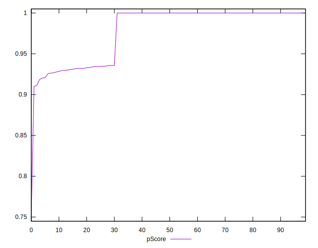

# //uses-rel-preconnect/samples/pages+cached+noadtech+nomedia+nocss

[→ Parent](../..)


## Raw


```yaml
p90min: 0
p90max: 97.82499980926514
p90range: 97.82499980926514
p90mean: 24.835500027271028
median: 0
p90stdev: 38.25272145427143
mad: 0
stdevBySn: 0
lfitCenter: 19.83566525115696
lfitStdev: 38.48622857797106
mfitCenter: 19.83566525115696
mfitStdev: 48.235334417263395
mfitConfidence: 4.823533441726339
p90skewness: 0.9059292313873374
p90eccentricity: 1.000000000000001
p90discretization: 3.2413793103448274
outlandishness: 1.316238237723025

```


## Score


```yaml
p90min: 0.92
p90max: 1
p90range: 0.07999999999999996
p90mean: 0.9791489361702133
median: 1
p90stdev: 0.032112156327077264
mad: 0
stdevBySn: 0
lfitCenter: 0.9833134274085009
lfitStdev: 0.03237618899128629
mfitCenter: 0.9833134274085009
mfitStdev: 0.04057753541600841
mfitConfidence: 0.004057753541600841
p90skewness: -0.9041869828353555
p90eccentricity: 1.0000000000000009
p90discretization: 23.5
outlandishness: 0.9937819690709465

```


## Raw Estimate


## Score Estimate


## P Score


```yaml
p90min: 0.9184791668256124
p90max: 1
p90range: 0.08152083317438763
p90mean: 0.9793037499772743
median: 1
p90stdev: 0.03187726787855955
mad: 0
stdevBySn: 0
lfitCenter: 0.9834705400761119
lfitStdev: 0.032071350511627926
mfitCenter: 0.9834705400761119
mfitStdev: 0.04019547703947038
mfitConfidence: 0.004019547703947038
p90skewness: -0.9059292313873312
p90eccentricity: 0.9999999999999968
p90discretization: 3.2413793103448274
outlandishness: 0.9937859479571785

```


## Score Difference


```yaml
p90min: 0
p90max: 0
p90range: 0
p90mean: 0
median: 0
p90stdev: 0
mad: 0
stdevBySn: 0
lfitCenter: 1.5916911634687915e-18
lfitStdev: 3.932577909407442e-18
mfitCenter: 1.5916911634687915e-18
mfitStdev: 4.928755494914505e-18
mfitConfidence: 4.928755494914504e-19
p90skewness: .nan
p90eccentricity: .nan
p90discretization: 94
outlandishness: .inf

```


## P Score Difference


```yaml
p90min: -0.004285000165303532
p90max: 0.0043916662534077
p90range: 0.008676666418711232
p90mean: 0.00015128840170288728
median: 0
p90stdev: 0.0012404414017566968
mad: 0
stdevBySn: 0
lfitCenter: 0.00009354367500676784
lfitStdev: 0.0006008500991554998
mfitCenter: 0.00009354367500676784
mfitStdev: 0.0007530539244367629
mfitConfidence: 0.00007530539244367628
p90skewness: 0.4473149807350844
p90eccentricity: 0.9999999999999982
p90discretization: 3.6153846153846154
outlandishness: 1.0671596271213522

```

