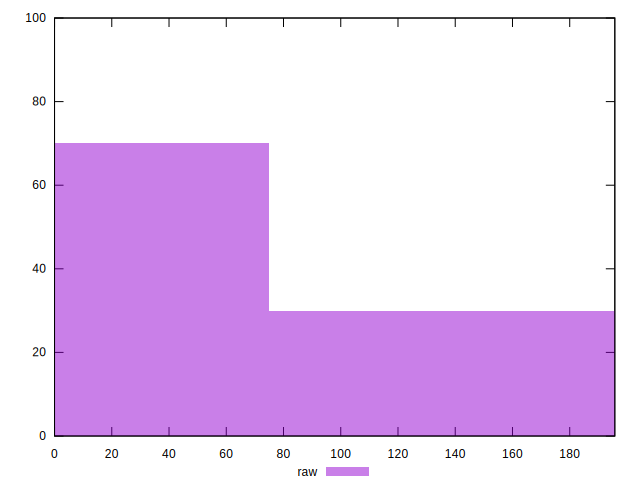

# //uses-rel-preconnect/samples/pages+cached+noadtech

[→ Parent](../..)


## Raw


```yaml
p90min: 0
p90max: 151.1670002937317
p90range: 151.1670002937317
p90mean: 38.47334045552193
median: 0
p90stdev: 60.82271389575316
mad: 0
stdevBySn: 0
lfitCenter: 29.013854247192903
lfitStdev: 57.0839963511128
mfitCenter: 29.013854247192903
mfitStdev: 71.5441797133069
mfitConfidence: 7.15441797133069
p90skewness: 0.9638651692264407
p90eccentricity: 1.0000000000000004
p90discretization: 3.357142857142857
outlandishness: 1.1619035070552828

```


## Score


```yaml
p90min: 0.87
p90max: 1
p90range: 0.13
p90mean: 0.9679787234042554
median: 1
p90stdev: 0.05066745539957751
mad: 0
stdevBySn: 0
lfitCenter: 0.9759232060952058
lfitStdev: 0.04737045977063698
mfitCenter: 0.9759232060952058
mfitStdev: 0.059370066981415184
mfitConfidence: 0.0059370066981415184
p90skewness: -0.9697436225228199
p90eccentricity: 0.9999999999999983
p90discretization: 15.666666666666666
outlandishness: 0.9950912130731399

```


## Raw Estimate


## Score Estimate


## P Score


```yaml
p90min: 0.8740274997552235
p90max: 1
p90range: 0.12597250024477646
p90mean: 0.9679388829537318
median: 1
p90stdev: 0.050685594913127636
mad: 0
stdevBySn: 0
lfitCenter: 0.9758217881273396
lfitStdev: 0.047569996959260445
mfitCenter: 0.9758217881273396
mfitStdev: 0.0596201497610888
mfitConfidence: 0.00596201497610888
p90skewness: -0.9638651692264307
p90eccentricity: 1.0000000000000009
p90discretization: 3.357142857142857
outlandishness: 0.9948450063076333

```


## Score Difference


```yaml
p90min: 0
p90max: 0
p90range: 0
p90mean: 0
median: 0
p90stdev: 0
mad: 0
stdevBySn: 0
lfitCenter: 0
lfitStdev: 0
mfitCenter: 0
mfitStdev: 0
mfitConfidence: 0
p90skewness: .nan
p90eccentricity: .nan
p90discretization: 94
outlandishness: .nan

```


## P Score Difference


```yaml
p90min: -0.0037841665744781094
p90max: 0.00414833307266238
p90range: 0.00793249964714049
p90mean: -0.00017607271248567676
median: 0
p90stdev: 0.0012542639906413552
mad: 0
stdevBySn: 0
lfitCenter: -0.00010405120230046819
lfitStdev: 0.0006361369097354329
mfitCenter: -0.00010405120230046819
mfitStdev: 0.0007972793830418686
mfitConfidence: 0.00007972793830418686
p90skewness: 0.18289293273841492
p90eccentricity: 1.0000000000000022
p90discretization: 3.76
outlandishness: 0.8175270878625681

```

