# //uses-rel-preload/samples/pages+cached+noadtech+nomedia

[→ Parent](../..)


## Raw


```yaml
p90min: 755
p90max: 764
p90range: 9
p90mean: 757.7872340425532
median: 757
p90stdev: 1.7496038483254277
mad: 1
stdevBySn: 1.1926
lfitCenter: 758.0999939064944
lfitStdev: 2.0281090546683784
mfitCenter: 758.0999939064944
mfitStdev: 2.5418577527911785
mfitConfidence: 0.25418577527911784
p90skewness: 1.1254034321241677
p90eccentricity: 1.0000000000000004
p90discretization: 9.4
outlandishness: 1.0025690333117492

```

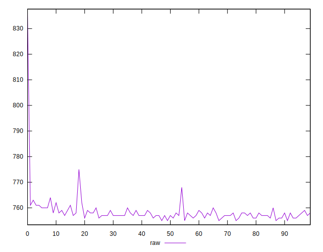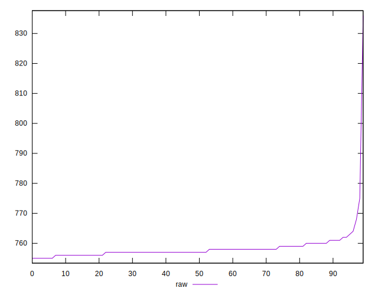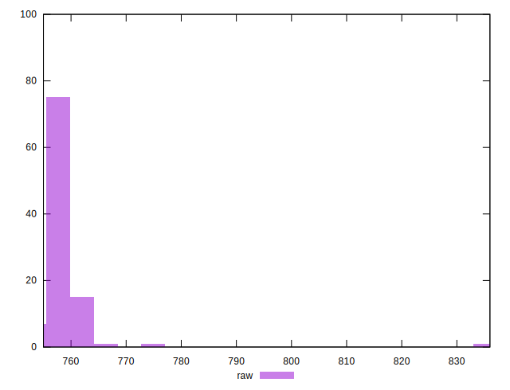
## Score


```yaml
p90min: 0.5
p90max: 0.5
p90range: 0
p90mean: 0.5
median: 0.5
p90stdev: 0
mad: 0
stdevBySn: 0
lfitCenter: 0.4999534639864745
lfitStdev: 0.00011610565185020858
mfitCenter: 0.4999534639864745
mfitStdev: 0.0001455168550325232
mfitConfidence: 0.00001455168550325232
p90skewness: .nan
p90eccentricity: .nan
p90discretization: 94
outlandishness: 0.99960004

```

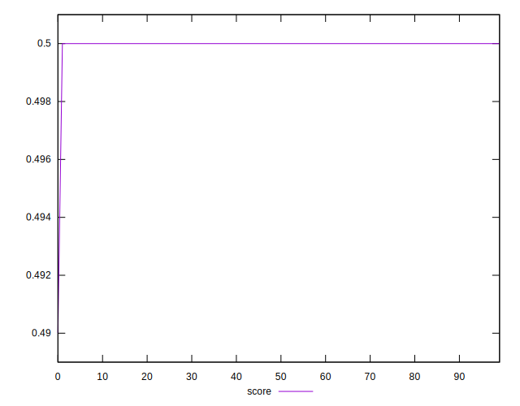
## Raw Estimate

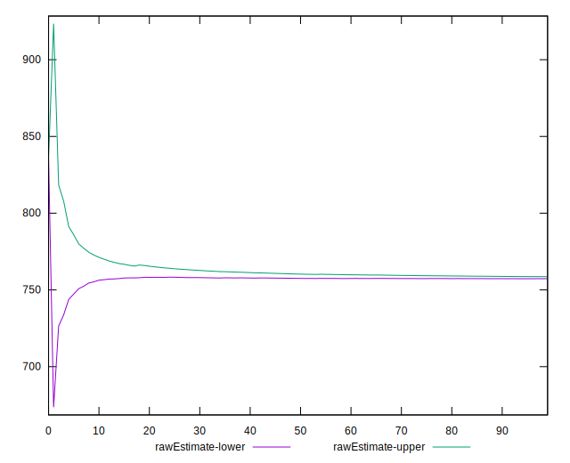
## Score Estimate

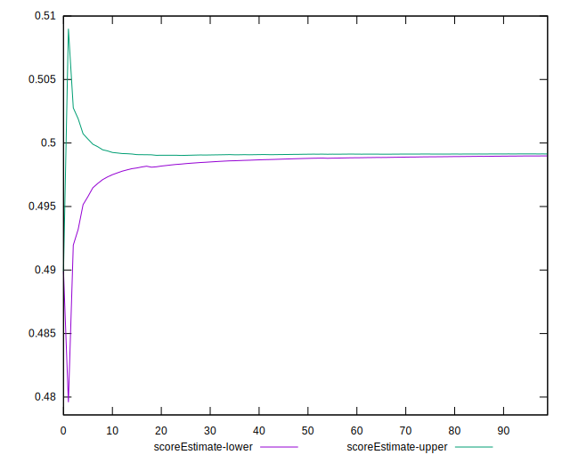
## P Score


```yaml
p90min: 0.4983529411764706
p90max: 0.49941176470588233
p90range: 0.0010588235294117232
p90mean: 0.49908385481852297
median: 0.4991764705882353
p90stdev: 0.000205835746861811
mad: 0.00011764705882350013
stdevBySn: 0.00014030588235290625
lfitCenter: 0.49904705954041273
lfitStdev: 0.00023860106525484657
mfitCenter: 0.49904705954041273
mfitStdev: 0.0002990420885633463
mfitConfidence: 0.00002990420885633463
p90skewness: -1.1254034321215014
p90eccentricity: 0.9999999999999996
p90discretization: 9.4
outlandishness: 0.99954144005478

```

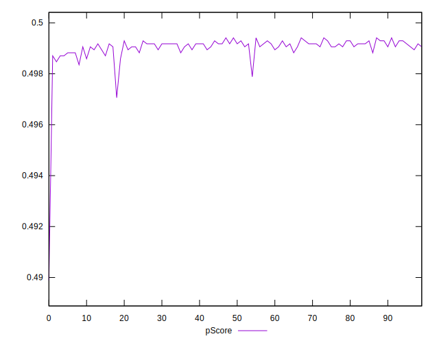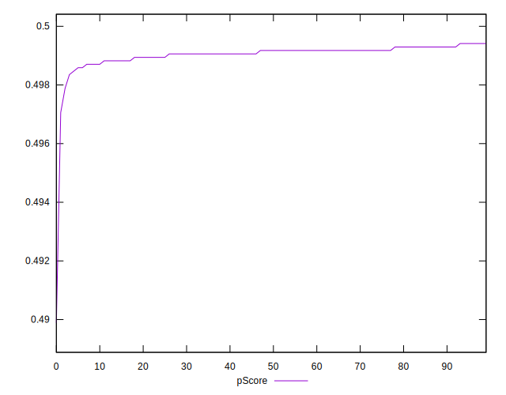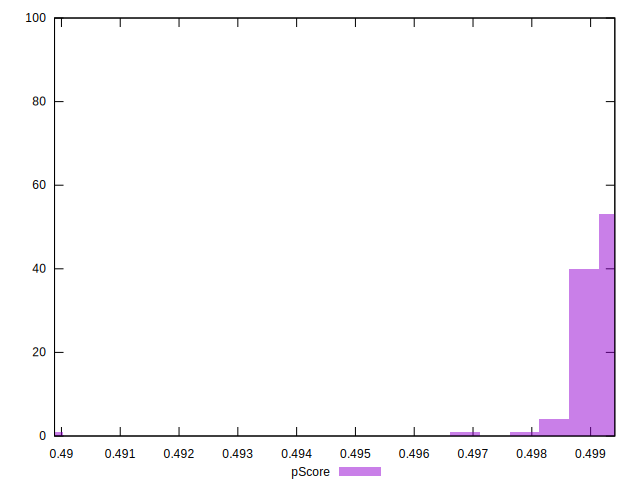
## Score Difference


```yaml
p90min: 0
p90max: 0
p90range: 0
p90mean: 0
median: 0
p90stdev: 0
mad: 0
stdevBySn: 0
lfitCenter: 0
lfitStdev: 0
mfitCenter: 0
mfitStdev: 0
mfitConfidence: 0
p90skewness: .nan
p90eccentricity: .nan
p90discretization: 94
outlandishness: .nan

```


## P Score Difference


```yaml
p90min: -0.0015294117647058902
p90max: -0.0005882352941176672
p90range: 0.0009411764705882231
p90mean: -0.0009048811013767236
median: -0.0008235294117647229
p90stdev: 0.0001941700507599988
mad: 0.00011764705882350013
stdevBySn: 0.00014030588235290625
lfitCenter: -0.0009029295332649803
lfitStdev: 0.00017429818718144822
mfitCenter: -0.0009029295332649803
mfitStdev: 0.0002184503823227864
mfitConfidence: 0.000021845038232278642
p90skewness: -0.8962232726413321
p90eccentricity: 1.0000000000000002
p90discretization: 10.444444444444445
outlandishness: 1.0576259048187489

```

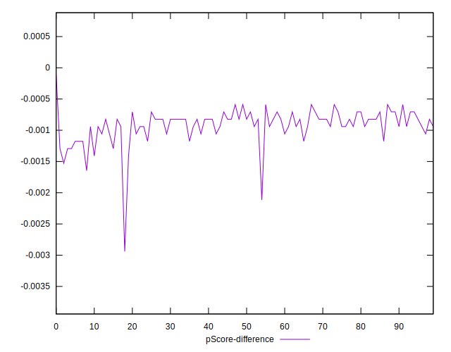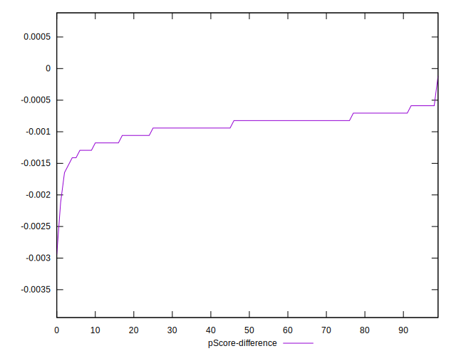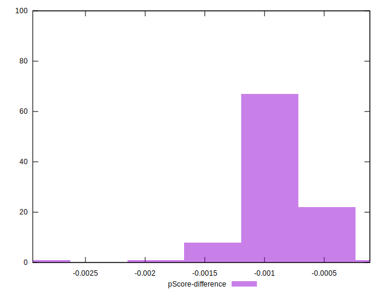