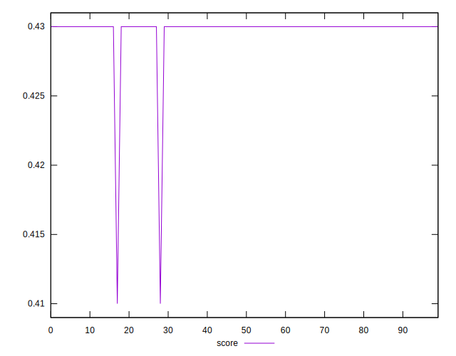
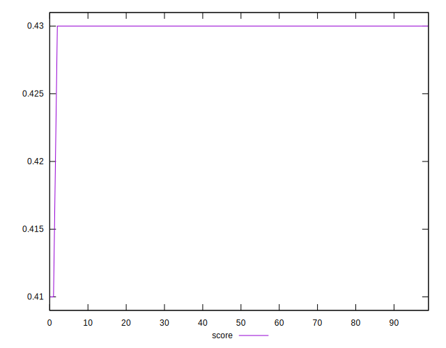
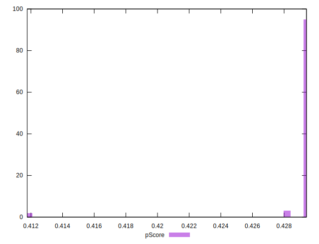

# //uses-text-compression/samples/pages+cached+noadtech+nomedia+nocss

[→ Parent](../..)


## Raw


```yaml
p90min: 1350
p90max: 1360
p90range: 10
p90mean: 1350.212765957447
median: 1350
p90stdev: 1.4430489325798441
mad: 0
stdevBySn: 0
lfitCenter: 1351.565850600195
lfitStdev: 3.8286470565762545
mfitCenter: 1351.565850600195
mfitStdev: 4.798497487626849
mfitConfidence: 0.47984974876268494
p90skewness: 6.634888026970213
p90eccentricity: 0.9999999999999982
p90discretization: 47
outlandishness: 1.0045781873337603

```


## Score


```yaml
p90min: 0.43
p90max: 0.43
p90range: 0
p90mean: 0.42999999999999977
median: 0.43
p90stdev: 2.220446049250313e-16
mad: 0
stdevBySn: 0
lfitCenter: 0.42981137828670235
lfitStdev: 0.0004683454603039058
mfitCenter: 0.42981137828670235
mfitStdev: 0.0005869839871370688
mfitConfidence: 0.00005869839871370688
p90skewness: 1
p90eccentricity: 1
p90discretization: 94
outlandishness: 0.9981404002163334

```


## Raw Estimate


## Score Estimate


## P Score


```yaml
p90min: 0.42823529411764705
p90max: 0.4294117647058824
p90range: 0.0011764705882353343
p90mean: 0.42938673341677114
median: 0.4294117647058824
p90stdev: 0.00016977046265645804
mad: 0
stdevBySn: 0
lfitCenter: 0.4292275469882125
lfitStdev: 0.0004504290654793788
mfitCenter: 0.4292275469882125
mfitStdev: 0.0005645291161911678
mfitConfidence: 0.000056452911619116784
p90skewness: -6.634888026972937
p90eccentricity: 0.9999999999999979
p90discretization: 47
outlandishness: 0.9983089817843092

```


## Score Difference


```yaml
p90min: 0
p90max: 0
p90range: 0
p90mean: 0
median: 0
p90stdev: 0
mad: 0
stdevBySn: 0
lfitCenter: 5.235304226182962e-19
lfitStdev: 1.2999197837702497e-18
mfitCenter: 5.235304226182962e-19
mfitStdev: 1.6292078440147404e-18
mfitConfidence: 1.6292078440147404e-19
p90skewness: .nan
p90eccentricity: .nan
p90discretization: 94
outlandishness: .inf

```


## P Score Difference


```yaml
p90min: -0.0005882352941176117
p90max: -0.0005882352941176117
p90range: 0
p90mean: -0.0005882352941176117
median: -0.0005882352941176117
p90stdev: 0
mad: 0
stdevBySn: 0
lfitCenter: -0.0005829111860371501
lfitStdev: 0.000055498198086023085
mfitCenter: -0.0005829111860371501
mfitStdev: 0.00006955667632673966
mfitConfidence: 0.000006955667632673966
p90skewness: .nan
p90eccentricity: .nan
p90discretization: 94
outlandishness: 0.9604000000000039

```

