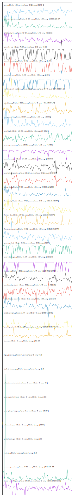

# //correlation/pages+cached

[→ Parent](../..)

[0. score, p90stdev=0.023, score:p90stdev=0.023, range=[0.24:0.42]](../../meta/score/samples/pages+cached)  
[1. estimated-input-latency, p90stdev=18.489, score:p90stdev=0.088, range=[106.933:225.667]](../../estimated-input-latency/samples/pages+cached/)  
[2. total-blocking-time, p90stdev=83.437, score:p90stdev=0.073, range=[526:1213]](../../total-blocking-time/samples/pages+cached/)  
[3. unminified-css, p90stdev=74.675, score:p90stdev=0.06, range=[0:300]](../../unminified-css/samples/pages+cached/)  
[4. unminified-javascript, p90stdev=72.961, score:p90stdev=0.058, range=[0:300]](../../unminified-javascript/samples/pages+cached/)  
[5. unused-css-rules, p90stdev=65.455, score:p90stdev=0.052, range=[0:300]](../../unused-css-rules/samples/pages+cached/)  
[6. mainthread-work-breakdown, p90stdev=221.138, score:p90stdev=0.044, range=[3197.968:5656.616]](../../mainthread-work-breakdown/samples/pages+cached/)  
[7. speed-index, p90stdev=243.868, score:p90stdev=0.043, range=[4431.297:9466.782]](../../speed-index/samples/pages+cached/)  
[8. max-potential-fid, p90stdev=39.567, score:p90stdev=0.027, range=[419:732]](../../max-potential-fid/samples/pages+cached/)  
[9. uses-http2, p90stdev=168.678, score:p90stdev=0.02, range=[4240:5140]](../../uses-http2/samples/pages+cached/)  
[10. uses-rel-preconnect, p90stdev=23.036, score:p90stdev=0.019, range=[0:305.01]](../../uses-rel-preconnect/samples/pages+cached/)  
[11. unused-javascript, p90stdev=149.122, score:p90stdev=0.018, range=[1500:4990]](../../unused-javascript/samples/pages+cached/)  
[12. uses-text-compression, p90stdev=134.186, score:p90stdev=0.016, range=[3300:8090]](../../uses-text-compression/samples/pages+cached/)  
[13. bootup-time, p90stdev=97.506, score:p90stdev=0.016, range=[983.036:1601.532]](../../bootup-time/samples/pages+cached/)  
[14. first-meaningful-paint, p90stdev=47.183, score:p90stdev=0.01, range=[2352.85:4329.773]](../../first-meaningful-paint/samples/pages+cached/)  
[15. first-cpu-idle, p90stdev=157.731, score:p90stdev=0.009, range=[2352.85:4329.773]](../../first-cpu-idle/samples/pages+cached/)  
[16. first-contentful-paint, p90stdev=43.582, score:p90stdev=0.009, range=[2352.85:4329.773]](../../first-contentful-paint/samples/pages+cached/)  
[17. uses-rel-preload, p90stdev=68.921, score:p90stdev=0.008, range=[0:1437]](../../uses-rel-preload/samples/pages+cached/)  
[18. uses-webp-images, p90stdev=53.404, score:p90stdev=0.007, range=[1500:1650]](../../uses-webp-images/samples/pages+cached/)  
[19. interactive, p90stdev=143.825, score:p90stdev=0.007, range=[11325.976:14119.743]](../../interactive/samples/pages+cached/)  
[20. cumulative-layout-shift, p90stdev=0.022, score:p90stdev=0.005, range=[1.052:1.291]](../../cumulative-layout-shift/samples/pages+cached/)  
[21. render-blocking-resources, p90stdev=26.1, score:p90stdev=0.005, range=[1354:1668]](../../render-blocking-resources/samples/pages+cached/)  
[22. total-byte-weight, p90stdev=2.984, score:p90stdev=0, range=[2365084:2365981]](../../total-byte-weight/samples/pages+cached/)  
[23. uses-long-cache-ttl, p90stdev=1.585, score:p90stdev=0, range=[519228.094:519431.996]](../../uses-long-cache-ttl/samples/pages+cached/)  
[24. uses-passive-event-listeners, p90stdev=NaN, score:p90stdev=0, range=[NaN:NaN]](../../uses-passive-event-listeners/samples/pages+cached/)  
[25. no-document-write, p90stdev=NaN, score:p90stdev=0, range=[NaN:NaN]](../../no-document-write/samples/pages+cached/)  
[26. dom-size, p90stdev=0, score:p90stdev=0, range=[422:422]](../../dom-size/samples/pages+cached/)  
[27. legacy-javascript, p90stdev=0, score:p90stdev=0, range=[0:0]](../../legacy-javascript/samples/pages+cached/)  
[28. duplicated-javascript, p90stdev=0, score:p90stdev=0, range=[0:0]](../../duplicated-javascript/samples/pages+cached/)  
[29. efficient-animated-content, p90stdev=0, score:p90stdev=0, range=[0:0]](../../efficient-animated-content/samples/pages+cached/)  
[30. uses-responsive-images, p90stdev=0, score:p90stdev=0, range=[0:0]](../../uses-responsive-images/samples/pages+cached/)  
[31. uses-optimized-images, p90stdev=0, score:p90stdev=0, range=[150:300]](../../uses-optimized-images/samples/pages+cached/)  
[32. offscreen-images, p90stdev=0, score:p90stdev=0, range=[0:1200]](../../offscreen-images/samples/pages+cached/)  
[33. preload-lcp-image, p90stdev=0, score:p90stdev=0, range=[0:0]](../../preload-lcp-image/samples/pages+cached/)  
[34. unsized-images, p90stdev=NaN, score:p90stdev=0, range=[NaN:NaN]](../../unsized-images/samples/pages+cached/)  
[35. third-party-summary, p90stdev=NaN, score:p90stdev=0, range=[NaN:NaN]](../../third-party-summary/samples/pages+cached/)  
[36. font-display, p90stdev=NaN, score:p90stdev=0, range=[NaN:NaN]](../../font-display/samples/pages+cached/)  
[37. redirects, p90stdev=0, score:p90stdev=0, range=[0:0]](../../redirects/samples/pages+cached/)  
[38. server-response-time, p90stdev=0.715, score:p90stdev=0, range=[2.412:125.417]](../../server-response-time/samples/pages+cached/)  
[39. largest-contentful-paint, p90stdev=143.275, score:p90stdev=0, range=[11888.254:13966.789]](../../largest-contentful-paint/samples/pages+cached/)  
