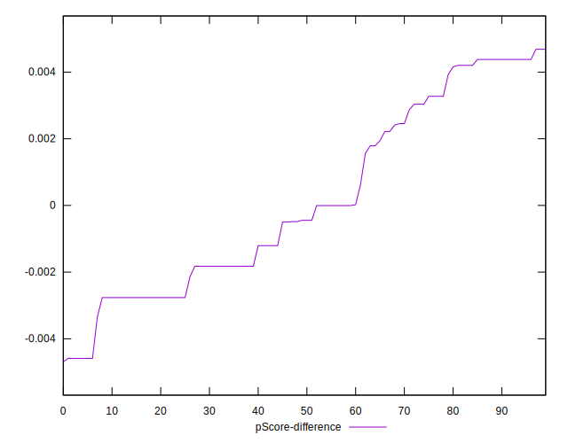

# //cumulative-layout-shift/samples/pages+cached+noadtech+nomedia+nocss

[→ Parent](../..)


## Raw


```yaml
p90min: 0.20731867133246526
p90max: 0.95905275132921
p90range: 0.7517340799967447
p90mean: 0.22914691667128398
median: 0.22252071804470486
p90stdev: 0.07583500443705891
mad: 0.0011727193196614527
stdevBySn: 0.0018427831878662004
lfitCenter: 0.2359599512341913
lfitStdev: 0.03528904773772753
mfitCenter: 0.2359599512341913
mfitStdev: 0.04422826246659984
mfitConfidence: 0.004422826246659984
p90skewness: 9.482724580722655
p90eccentricity: 1.0000000000000007
p90discretization: 3.76
outlandishness: 1.1953414411840833

```


## Score


```yaml
p90min: 0.03
p90max: 0.6
p90range: 0.57
p90mean: 0.5620212765957452
median: 0.56
p90stdev: 0.056353364362441115
mad: 0.009999999999999898
stdevBySn: 0.01192599999999988
lfitCenter: 0.556327754388237
lfitStdev: 0.02556127694082991
mfitCenter: 0.556327754388237
mfitStdev: 0.03203630979001513
mfitConfidence: 0.003203630979001513
p90skewness: -8.9212073102711
p90eccentricity: 0.9999999999999989
p90discretization: 23.5
outlandishness: 0.947952689882143

```


## Raw Estimate


## Score Estimate


## P Score


```yaml
p90min: 0.030024203241952152
p90max: 0.6032732496425959
p90range: 0.5732490464006437
p90mean: 0.5620893209722271
median: 0.5646846677471791
p90stdev: 0.05645200377093068
mad: 0.002895945704476488
stdevBySn: 0.0045412653949292855
lfitCenter: 0.5566134399817568
lfitStdev: 0.025590882825116838
mfitCenter: 0.5566134399817568
mfitStdev: 0.032073415263376995
mfitConfidence: 0.0032073415263376994
p90skewness: -8.87067481934198
p90eccentricity: 1.0000000000000007
p90discretization: 3.76
outlandishness: 0.9482613044135767

```


## Score Difference


```yaml
p90min: 0
p90max: 1.1102230246251565e-16
p90range: 1.1102230246251565e-16
p90mean: 3.897591469428741e-17
median: 0
p90stdev: 5.29912621446783e-17
mad: 0
stdevBySn: 0
lfitCenter: 3.1657710212153656e-17
lfitStdev: 5.672650063496794e-17
mfitCenter: 3.1657710212153656e-17
mfitStdev: 7.109612527778195e-17
mfitConfidence: 7.109612527778195e-18
p90skewness: 0.6240740781687912
p90eccentricity: 0.9999999999999992
p90discretization: 47
outlandishness: 1.0515570247933883

```


## P Score Difference


```yaml
p90min: -0.004587602624637865
p90max: 0.004380584093648832
p90range: 0.008968186718286697
p90mean: 0.00016324951504126264
median: -0.00044626002687167543
p90stdev: 0.002806062995845266
mad: 0.0023187773391760425
stdevBySn: 0.0032352422003209115
lfitCenter: 0.00002407829610361193
lfitStdev: 0.0025521689744406207
mfitCenter: 0.00002407829610361193
mfitStdev: 0.0031986694597030685
mfitConfidence: 0.00031986694597030684
p90skewness: 0.24513435636882835
p90eccentricity: 1.0000000000000002
p90discretization: 3.76
outlandishness: 0.9052883300892641

```

