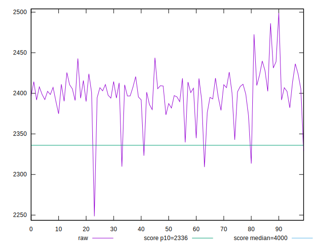

# //first-contentful-paint/samples/pages+cached+noadtech+nomedia

[→ Parent](../..)


## Raw


```yaml
p90min: 2313.4725
p90max: 2443.8225
p90range: 130.35000000000036
p90mean: 2399.5595968085104
median: 2401.660125
p90stdev: 23.331826066704657
mad: 10.052999999999656
stdevBySn: 18.691321649999672
lfitCenter: 2400.2352755722745
lfitStdev: 17.229196143404536
mfitCenter: 2400.2352755722745
mfitStdev: 21.593595122838995
mfitConfidence: 2.1593595122838996
p90skewness: -1.3089122825835304
p90eccentricity: 1.0000000000000002
p90discretization: 1
outlandishness: 0.9994002467071877

```


## Score


```yaml
p90min: 0.88
p90max: 0.9
p90range: 0.020000000000000018
p90mean: 0.8889361702127663
median: 0.89
p90stdev: 0.004719377236769969
mad: 0
stdevBySn: 0
lfitCenter: 0.8892736819038023
lfitStdev: 0.003016790495834573
mfitCenter: 0.8892736819038023
mfitStdev: 0.0037809861815530973
mfitConfidence: 0.0003780986181553097
p90skewness: -0.3243811490573091
p90eccentricity: 0.9999999999999997
p90discretization: 31.333333333333332
outlandishness: 0.9999186230055492

```


## Raw Estimate


## Score Estimate


## P Score


```yaml
p90min: 0.8798095661137249
p90max: 0.903992380027704
p90range: 0.02418281391397914
p90mean: 0.8882684625552617
median: 0.8879126705910575
p90stdev: 0.004350018870744887
mad: 0.001893260976929767
stdevBySn: 0.003525348215306426
lfitCenter: 0.8881369142253503
lfitStdev: 0.0032294822236148208
mfitCenter: 0.8881369142253503
mfitStdev: 0.004047555731138375
mfitConfidence: 0.0004047555731138375
p90skewness: 1.2152504315894432
p90eccentricity: 0.9999999999999999
p90discretization: 1
outlandishness: 1.0002061206197848

```


## Score Difference


```yaml
p90min: 0
p90max: 0
p90range: 0
p90mean: 0
median: 0
p90stdev: 0
mad: 0
stdevBySn: 0
lfitCenter: 0
lfitStdev: 0
mfitCenter: 0
mfitStdev: 0
mfitConfidence: 0
p90skewness: .nan
p90eccentricity: .nan
p90discretization: 94
outlandishness: .nan

```


## P Score Difference


```yaml
p90min: -0.004498228907307111
p90max: 0.004655744175141363
p90range: 0.009153973082448474
p90mean: -0.0005734111824993017
median: -0.0008604991865374667
p90stdev: 0.002478035799478873
mad: 0.00211555365419297
stdevBySn: 0.002761018143357396
lfitCenter: -0.0006628177947086471
lfitStdev: 0.002006272950874252
mfitCenter: -0.0006628177947086471
mfitStdev: 0.002514490255174573
mfitConfidence: 0.00025144902551745734
p90skewness: 0.42502554063685116
p90eccentricity: 0.9999999999999992
p90discretization: 1
outlandishness: 0.886850221800173

```

