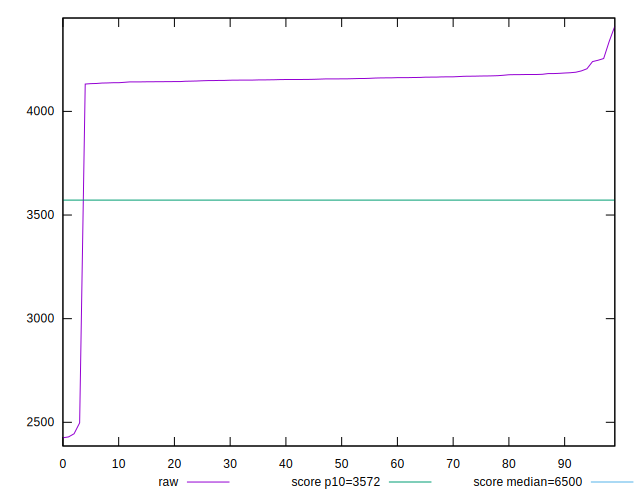
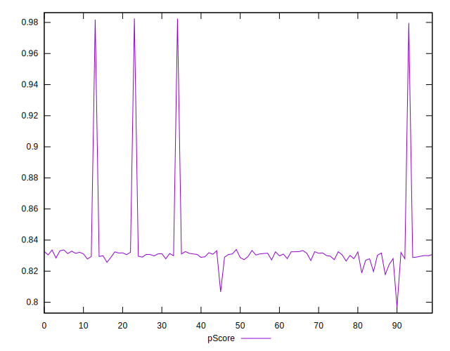

# //first-cpu-idle/samples/pages+cached+noadtech+nomedia

[→ Parent](../..)


## Raw


```yaml
p90min: 2497.3025
p90max: 4246.76
p90range: 1749.4575000000004
p90mean: 4143.104367021277
median: 4156.901599999999
p90stdev: 171.72197646637977
mad: 11.972000000001117
stdevBySn: 17.607307879999123
lfitCenter: 4128.756985060757
lfitStdev: 81.53155636550972
mfitCenter: 4128.756985060757
mfitStdev: 102.18465233305143
mfitConfidence: 10.218465233305142
p90skewness: -9.358022385604851
p90eccentricity: 0.9999999999999997
p90discretization: 1
outlandishness: 0.9781326507560577

```


## Score


```yaml
p90min: 0.82
p90max: 0.98
p90range: 0.16000000000000003
p90mean: 0.8312765957446795
median: 0.83
p90stdev: 0.015521710433905912
mad: 0
stdevBySn: 0
lfitCenter: 0.8324667004678561
lfitStdev: 0.0071650022175233745
mfitCenter: 0.8324667004678561
mfitStdev: 0.008979998582155011
mfitConfidence: 0.0008979998582155011
p90skewness: 9.345408820156706
p90eccentricity: 1.0000000000000033
p90discretization: 31.333333333333332
outlandishness: 1.009220028636099

```


## Raw Estimate


## Score Estimate


## P Score


```yaml
p90min: 0.8188931655967515
p90max: 0.9797062520217146
p90range: 0.16081308642496306
p90mean: 0.8317777430545712
median: 0.8307000972700322
p90stdev: 0.015540139535900676
mad: 0.0015561603946360192
stdevBySn: 0.0022850853890131733
lfitCenter: 0.8329724035117685
lfitStdev: 0.007262027207014668
mfitCenter: 0.8329724035117685
mfitStdev: 0.0091016013732797
mfitConfidence: 0.00091016013732797
p90skewness: 9.159598320881274
p90eccentricity: 1.0000000000000007
p90discretization: 1
outlandishness: 1.0090933196949277

```


## Score Difference


```yaml
p90min: 0
p90max: 1.1102230246251565e-16
p90range: 1.1102230246251565e-16
p90mean: 1.0747903749030771e-16
median: 1.1102230246251565e-16
p90stdev: 1.951478180216299e-17
mad: 0
stdevBySn: 0
lfitCenter: 1.077064358453097e-16
lfitStdev: 8.063403855810709e-18
mfitCenter: 1.077064358453097e-16
mfitStdev: 1.0105978057540941e-17
mfitConfidence: 1.0105978057540941e-18
p90skewness: -5.326002287485483
p90eccentricity: 1.0000000000000029
p90discretization: 47
outlandishness: 0.9428196594614175

```


## P Score Difference


```yaml
p90min: -0.003263849691664711
p90max: 0.0035862402148393313
p90range: 0.006850089906504042
p90mean: 0.0004717371407217444
median: 0.0007000972700323405
p90stdev: 0.0017176198059010639
mad: 0.0013796466536317165
stdevBySn: 0.002004307328842147
lfitCenter: 0.0005187329297882605
lfitStdev: 0.0014926566283394193
mfitCenter: 0.0005187329297882605
mfitStdev: 0.0018707676563379286
mfitConfidence: 0.00018707676563379285
p90skewness: -0.3134647093144808
p90eccentricity: 0.9999999999999999
p90discretization: 1
outlandishness: 0.9139942836151269

```

