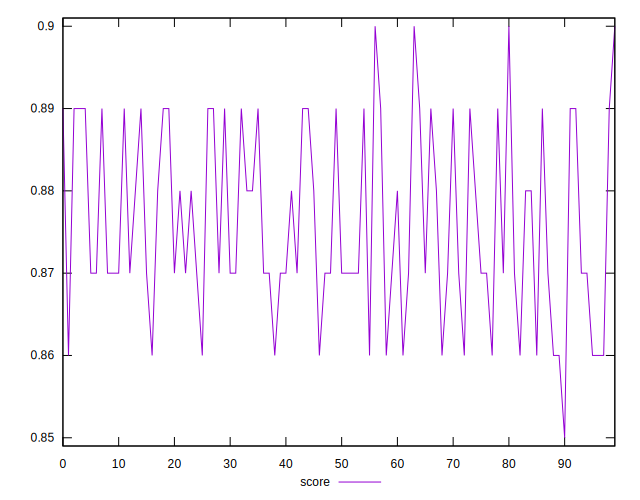

# //first-meaningful-paint/samples/pages+cached+noadtech+nomedia

[→ Parent](../..)


## Raw


```yaml
p90min: 2339.565
p90max: 2539.3975000000005
p90range: 199.83250000000044
p90mean: 2465.021091489362
median: 2493.2237499999997
p90stdev: 53.59015532399563
mad: 37.23687500000051
stdevBySn: 52.79118437500028
lfitCenter: 2467.9461153743055
lfitStdev: 57.11116426127035
mfitCenter: 2467.9461153743055
mfitStdev: 71.57822963922294
mfitConfidence: 7.157822963922294
p90skewness: -0.3585626377380642
p90eccentricity: 1
p90discretization: 1
outlandishness: 0.9986876303380555

```


## Score


```yaml
p90min: 0.86
p90max: 0.9
p90range: 0.040000000000000036
p90mean: 0.8759574468085106
median: 0.87
p90stdev: 0.01113926818102846
mad: 0.010000000000000009
stdevBySn: 0.011926000000000011
lfitCenter: 0.8755195868847234
lfitStdev: 0.011083884839413152
mfitCenter: 0.8755195868847234
mfitStdev: 0.013891589579591754
mfitConfidence: 0.0013891589579591755
p90skewness: 0.15135482407173512
p90eccentricity: 0.9999999999999999
p90discretization: 18.8
outlandishness: 1.000325506202503

```


## Raw Estimate


## Score Estimate


## P Score


```yaml
p90min: 0.8605128753384825
p90max: 0.8993607699191268
p90range: 0.038847894580644304
p90mean: 0.8754352249256415
median: 0.8699910209702841
p90stdev: 0.010548076036414299
mad: 0.007621593172280061
stdevBySn: 0.010766833642876332
lfitCenter: 0.8748726630107609
lfitStdev: 0.011251389908360736
mfitCenter: 0.8748726630107609
mfitStdev: 0.014101526050787017
mfitConfidence: 0.0014101526050787016
p90skewness: 0.3324899468838098
p90eccentricity: 0.9999999999999997
p90discretization: 1
outlandishness: 1.0006085137086462

```


## Score Difference


```yaml
p90min: 0
p90max: 0
p90range: 0
p90mean: 0
median: 0
p90stdev: 0
mad: 0
stdevBySn: 0
lfitCenter: 0
lfitStdev: 0
mfitCenter: 0
mfitStdev: 0
mfitConfidence: 0
p90skewness: .nan
p90eccentricity: .nan
p90discretization: 94
outlandishness: .nan

```


## P Score Difference


```yaml
p90min: -0.004545574525615326
p90max: 0.004580172659912285
p90range: 0.00912574718552761
p90mean: -0.0004227571485107244
median: -0.0007949652769426163
p90stdev: 0.002778661860327869
mad: 0.002375120298120592
stdevBySn: 0.0033683546435447713
lfitCenter: -0.0005411951745783093
lfitStdev: 0.0023856179952144907
mfitCenter: -0.0005411951745783093
mfitStdev: 0.002989928762645176
mfitConfidence: 0.0002989928762645176
p90skewness: 0.3544673103645908
p90eccentricity: 1.0000000000000004
p90discretization: 1
outlandishness: 0.8883499575476367

```

