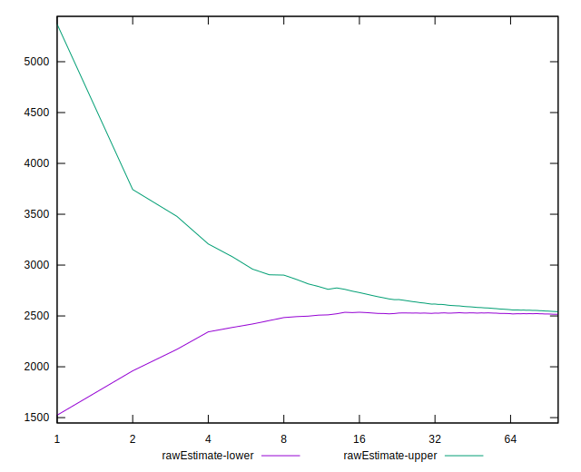
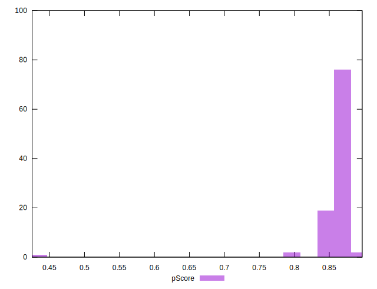
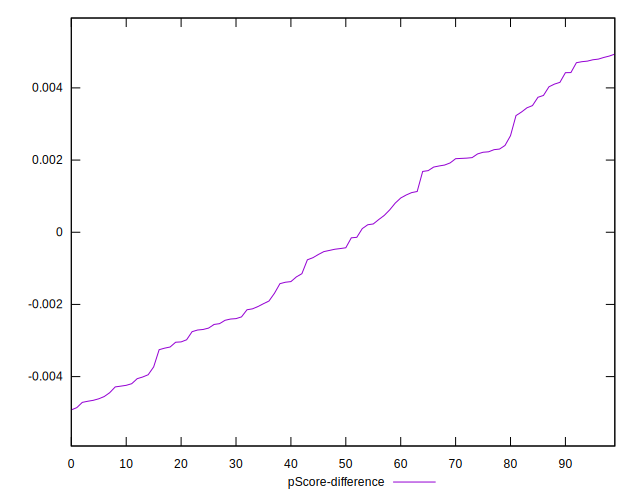

# //first-meaningful-paint/samples/pages+cached

[→ Parent](../..)


## Raw


```yaml
p90min: 2441.7825
p90max: 2647.3995000000004
p90range: 205.61700000000064
p90mean: 2521.121659574468
median: 2518.37625
p90stdev: 47.18269732635567
mad: 33.9862499999997
stdevBySn: 48.51049574999971
lfitCenter: 2529.3312363137493
lfitStdev: 52.31273954440943
mfitCenter: 2529.3312363137493
mfitStdev: 65.56429609868555
mfitConfidence: 6.556429609868554
p90skewness: 0.6777909797752582
p90eccentricity: 0.9999999999999994
p90discretization: 1
outlandishness: 1.0169689764199341

```


## Score


```yaml
p90min: 0.84
p90max: 0.88
p90range: 0.040000000000000036
p90mean: 0.8642553191489356
median: 0.86
p90stdev: 0.0098379812950612
mad: 0.010000000000000009
stdevBySn: 0.011926000000000011
lfitCenter: 0.8619370634111453
lfitStdev: 0.011751766819683675
mfitCenter: 0.8619370634111453
mfitStdev: 0.014728655508365364
mfitConfidence: 0.0014728655508365364
p90skewness: -0.46239078556218166
p90eccentricity: 0.9999999999999976
p90discretization: 18.8
outlandishness: 0.9881054980216786

```


## Raw Estimate


## Score Estimate


## P Score


```yaml
p90min: 0.8372908461182209
p90max: 0.8802075894289103
p90range: 0.0429167433106894
p90mean: 0.8641528899705277
median: 0.8648632062280025
p90stdev: 0.009809218956110569
mad: 0.006908699842693988
stdevBySn: 0.010131876834098084
lfitCenter: 0.8621339967320633
lfitStdev: 0.011425734758975072
mfitCenter: 0.8621339967320633
mfitStdev: 0.014320034917049996
mfitConfidence: 0.0014320034917049995
p90skewness: -0.7582737815297602
p90eccentricity: 0.9999999999999997
p90discretization: 1
outlandishness: 0.9880009527838733

```


## Score Difference


```yaml
p90min: 0
p90max: 0
p90range: 0
p90mean: 0
median: 0
p90stdev: 0
mad: 0
stdevBySn: 0
lfitCenter: 0
lfitStdev: 0
mfitCenter: 0
mfitStdev: 0
mfitConfidence: 0
p90skewness: .nan
p90eccentricity: .nan
p90discretization: 94
outlandishness: .nan

```


## P Score Difference


```yaml
p90min: -0.004683076258720331
p90max: 0.004797657402368927
p90range: 0.009480733661089258
p90mean: -0.00015842851289513542
median: -0.00044099142102910216
p90stdev: 0.0028296675153390845
mad: 0.0024907905661457064
stdevBySn: 0.0033273226583266256
lfitCenter: -0.0001927455975685252
lfitStdev: 0.0025321823853956395
mfitCenter: -0.0001927455975685252
mfitStdev: 0.003173619985071073
mfitConfidence: 0.0003173619985071073
p90skewness: 0.11915866479926594
p90eccentricity: 0.9999999999999994
p90discretization: 1
outlandishness: 0.864001757377271

```

