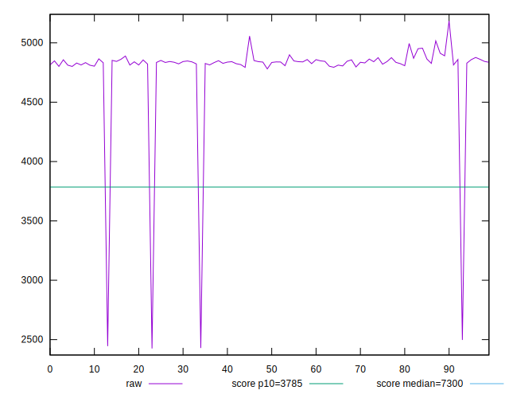
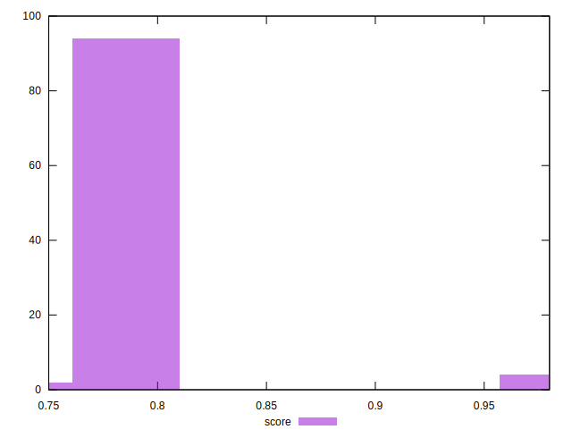
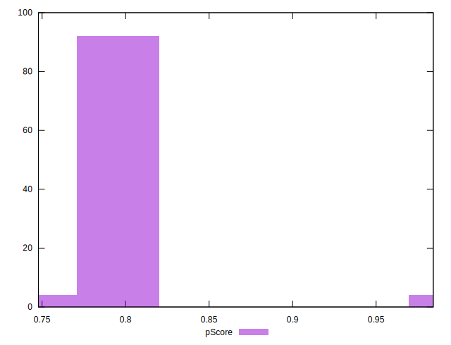

# //interactive/samples/pages+cached+noadtech+nomedia

[→ Parent](../..)


## Raw


```yaml
p90min: 2497.3025
p90max: 4994.4349999999995
p90range: 2497.1324999999997
p90mean: 4816.419498936171
median: 4838.2633
p90stdev: 242.7319137281218
mad: 18.405500000000302
stdevBySn: 27.25529280500144
lfitCenter: 4796.634126149049
lfitStdev: 114.257442359048
mfitCenter: 4796.634126149049
mfitStdev: 143.20046794620015
mfitConfidence: 14.320046794620016
p90skewness: -9.266751520757705
p90eccentricity: 1.0000000000000007
p90discretization: 1
outlandishness: 0.9738437209673989

```


## Score


```yaml
p90min: 0.77
p90max: 0.98
p90range: 0.20999999999999996
p90mean: 0.7909574468085109
median: 0.79
p90stdev: 0.019950425204031036
mad: 0
stdevBySn: 0
lfitCenter: 0.7926835521228371
lfitStdev: 0.009191992981542232
mfitCenter: 0.7926835521228371
mfitStdev: 0.011520454765464106
mfitConfidence: 0.0011520454765464106
p90skewness: 9.023654086244425
p90eccentricity: 1.0000000000000042
p90discretization: 18.8
outlandishness: 1.0120278816571684

```


## Raw Estimate


## Score Estimate


## P Score


```yaml
p90min: 0.7705162787541711
p90max: 0.9818208124188683
p90range: 0.21130453366469726
p90mean: 0.7905660315935994
median: 0.7888774272047769
p90stdev: 0.02020410333472922
mad: 0.002145828481580181
stdevBySn: 0.0031800040401775737
lfitCenter: 0.7920954151004603
lfitStdev: 0.009494038188078069
mfitCenter: 0.7920954151004603
mfitStdev: 0.011899012293304772
mfitConfidence: 0.001189901229330477
p90skewness: 8.998707260987759
p90eccentricity: 1.0000000000000007
p90discretization: 1
outlandishness: 1.0123653952041962

```


## Score Difference


```yaml
p90min: 0
p90max: 0
p90range: 0
p90mean: 0
median: 0
p90stdev: 0
mad: 0
stdevBySn: 0
lfitCenter: 0
lfitStdev: 0
mfitCenter: 0
mfitStdev: 0
mfitConfidence: 0
p90skewness: .nan
p90eccentricity: .nan
p90discretization: 94
outlandishness: .nan

```


## P Score Difference


```yaml
p90min: -0.004282256522443961
p90max: 0.0042199374576776805
p90range: 0.008502193980121642
p90mean: -0.0002721387700215829
median: -0.0007032333190474804
p90stdev: 0.0022898590935357577
mad: 0.0018079091898287603
stdevBySn: 0.0025719126539242684
lfitCenter: -0.00033253272553960487
lfitStdev: 0.0019927196688600906
mfitCenter: -0.00033253272553960487
mfitStdev: 0.0024975037352021083
mfitConfidence: 0.0002497503735202108
p90skewness: 0.1895351952976077
p90eccentricity: 0.9999999999999997
p90discretization: 1
outlandishness: 0.9209070550347952

```

