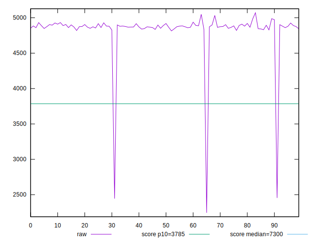
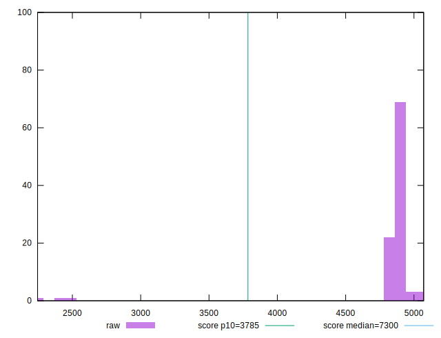
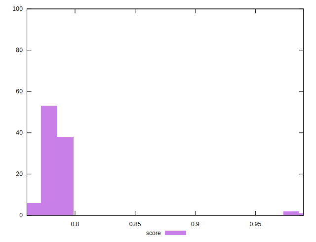
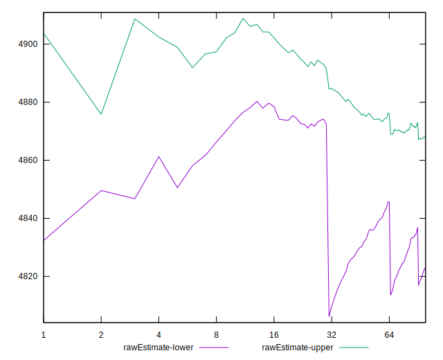
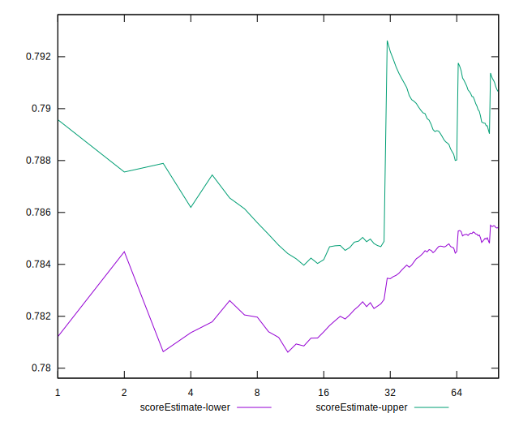
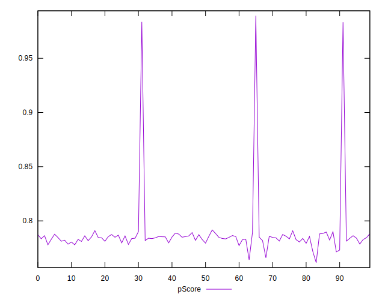
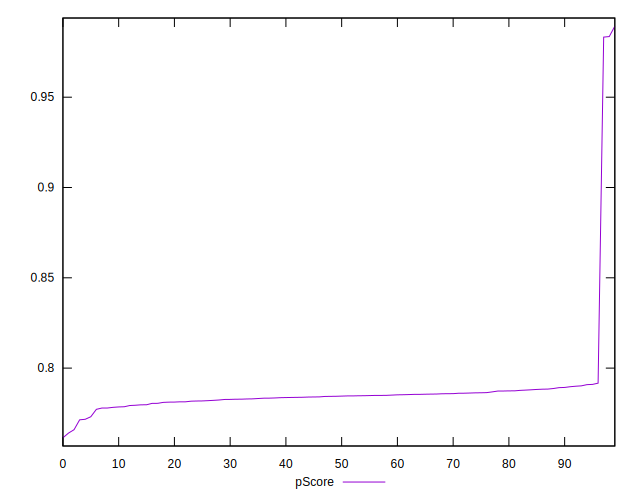
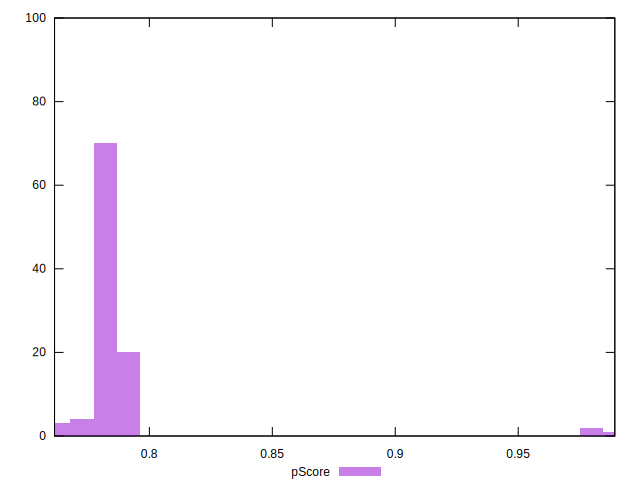
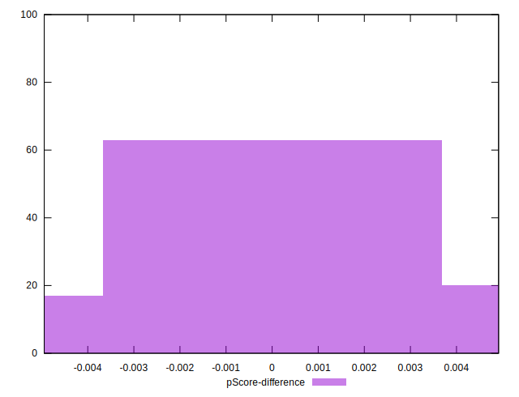

# //interactive/samples/pages+cached+noadtech

[→ Parent](../..)


## Raw


```yaml
p90min: 4814.2955
p90max: 4987.242000000002
p90range: 172.94650000000183
p90mean: 4879.884367553192
median: 4876.13475
p90stdev: 32.64663490230676
mad: 19.989750000000186
stdevBySn: 31.57065627500028
lfitCenter: 4845.350954310249
lfitStdev: 90.69294492865225
mfitCenter: 4845.350954310249
mfitStdev: 113.66675014823228
mfitConfidence: 11.366675014823228
p90skewness: 0.7987877929210885
p90eccentricity: 1.0000000000000007
p90discretization: 1
outlandishness: 0.9715944040978458

```


## Score


```yaml
p90min: 0.77
p90max: 0.79
p90range: 0.020000000000000018
p90mean: 0.7837234042553196
median: 0.78
p90stdev: 0.005454656912040116
mad: 0
stdevBySn: 0
lfitCenter: 0.785909157541977
lfitStdev: 0.01056603804055168
mfitCenter: 0.785909157541977
mfitStdev: 0.013242564864962019
mfitConfidence: 0.0013242564864962018
p90skewness: -0.07166238325198201
p90eccentricity: 1.000000000000002
p90discretization: 31.333333333333332
outlandishness: 1.0137677101571296

```


## Raw Estimate


## Score Estimate


## P Score


```yaml
p90min: 0.7713681854322046
p90max: 0.7916677924602313
p90range: 0.02029960702802669
p90mean: 0.7840066673745519
median: 0.7844525241086369
p90stdev: 0.0038290812334517304
mad: 0.0023404577963815343
stdevBySn: 0.0036963505005408567
lfitCenter: 0.7867461753066223
lfitStdev: 0.007736005594127691
mfitCenter: 0.7867461753066223
mfitStdev: 0.009695645187228201
mfitConfidence: 0.0009695645187228201
p90skewness: -0.8130772667275157
p90eccentricity: 0.9999999999999999
p90discretization: 1
outlandishness: 1.0139117733158873

```


## Score Difference


```yaml
p90min: 0
p90max: 0
p90range: 0
p90mean: 0
median: 0
p90stdev: 0
mad: 0
stdevBySn: 0
lfitCenter: 0
lfitStdev: 0
mfitCenter: 0
mfitStdev: 0
mfitConfidence: 0
p90skewness: .nan
p90eccentricity: .nan
p90discretization: 94
outlandishness: .nan

```


## P Score Difference


```yaml
p90min: -0.004655078599712259
p90max: 0.0047925842480617264
p90range: 0.009447662847773985
p90mean: 0.0003611766800053437
median: 0.0009097468795248864
p90stdev: 0.0029892322240979174
mad: 0.002751658039992999
stdevBySn: 0.0036300473165131204
lfitCenter: 0.0004286967036304224
lfitStdev: 0.0027733365410105228
mfitCenter: 0.0004286967036304224
mfitStdev: 0.003475861897879717
mfitConfidence: 0.0003475861897879717
p90skewness: -0.17201222770522304
p90eccentricity: 0.9999999999999997
p90discretization: 1
outlandishness: 0.8929250242696901

```

