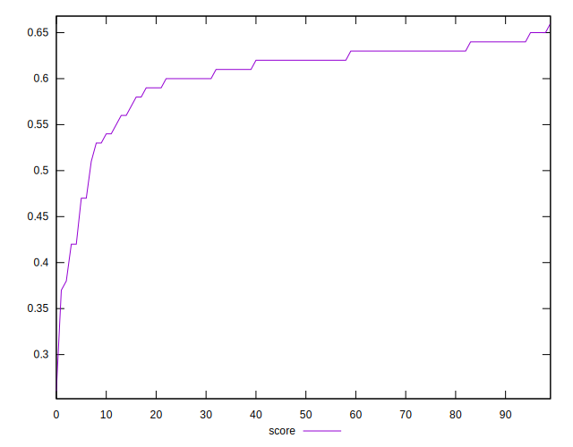
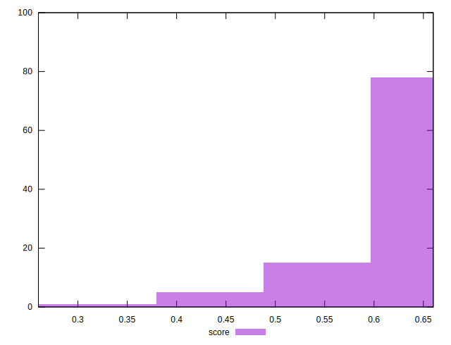

# //mainthread-work-breakdown/samples/pages+cached

[→ Parent](../..)


## Raw


```yaml
p90min: 3273.9879999999966
p90max: 4443.791999999995
p90range: 1169.8039999999983
p90mean: 3467.1797021276593
median: 3389.845999999996
p90stdev: 221.13776130612646
mad: 67.2600000000009
stdevBySn: 105.71683440000001
lfitCenter: 3458.1065768903204
lfitStdev: 161.80246613264472
mfitCenter: 3458.1065768903204
mfitStdev: 202.7893184606113
mfitConfidence: 20.27893184606113
p90skewness: 2.6111962430305287
p90eccentricity: 0.9999999999999997
p90discretization: 1
outlandishness: 1.0233334240604977

```


## Score


```yaml
p90min: 0.42
p90max: 0.65
p90range: 0.23000000000000004
p90mean: 0.6058510638297876
median: 0.62
p90stdev: 0.04406015169008583
mad: 0.010000000000000009
stdevBySn: 0.023852000000000022
lfitCenter: 0.6083027971795687
lfitStdev: 0.03189029394421955
mfitCenter: 0.6083027971795687
mfitStdev: 0.03996855628365531
mfitConfidence: 0.003996855628365531
p90skewness: -2.4378766572920645
p90eccentricity: 0.9999999999999996
p90discretization: 5.875
outlandishness: 0.9781644157583199

```


## Raw Estimate


## Score Estimate


## P Score


```yaml
p90min: 0.4219399550974715
p90max: 0.6461263095324481
p90range: 0.2241863544349766
p90mean: 0.6063778911330072
median: 0.6216404292459503
p90stdev: 0.04342757125925531
mad: 0.014118586348596307
stdevBySn: 0.022307540628008223
lfitCenter: 0.6087067604364109
lfitStdev: 0.03145334391704791
mfitCenter: 0.6087067604364109
mfitStdev: 0.039420920636749644
mfitConfidence: 0.003942092063674964
p90skewness: -2.4383195279547016
p90eccentricity: 1.0000000000000002
p90discretization: 1
outlandishness: 0.9782477640264657

```


## Score Difference


```yaml
p90min: 0
p90max: 0
p90range: 0
p90mean: 0
median: 0
p90stdev: 0
mad: 0
stdevBySn: 0
lfitCenter: 1.0541723501857061e-18
lfitStdev: 2.6045347189173595e-18
mfitCenter: 1.0541723501857061e-18
mfitStdev: 3.264300187632857e-18
mfitConfidence: 3.264300187632857e-19
p90skewness: .nan
p90eccentricity: .nan
p90discretization: 94
outlandishness: .inf

```


## P Score Difference


```yaml
p90min: -0.004281965679063693
p90max: 0.004817086476172183
p90range: 0.009099052155235876
p90mean: 0.0005682542254024447
median: 0.0007941387957438595
p90stdev: 0.0026183053093005795
mad: 0.002371610779090927
stdevBySn: 0.0031868018318820172
lfitCenter: 0.0006198985659724098
lfitStdev: 0.0023498527098027235
mfitCenter: 0.0006198985659724098
mfitStdev: 0.0029451036247683795
mfitConfidence: 0.00029451036247683793
p90skewness: -0.176789621140141
p90eccentricity: 1.0000000000000002
p90discretization: 1
outlandishness: 0.9252186148896812

```

