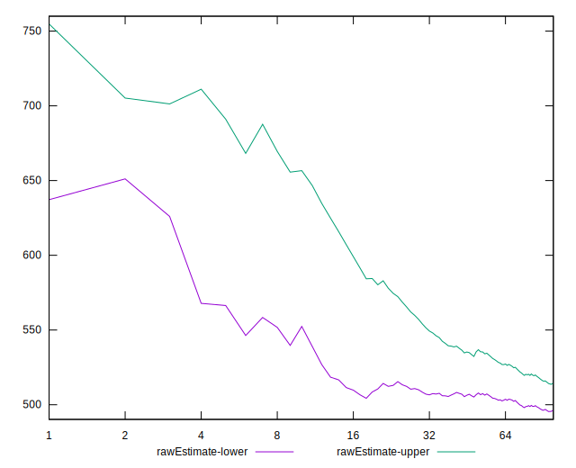
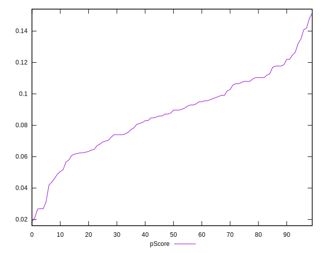

# //max-potential-fid/samples/pages

[→ Parent](../..)


## Raw


```yaml
p90min: 433
p90max: 669
p90range: 236
p90mean: 507.2340425531915
median: 497.5
p90stdev: 46.61919646886291
mad: 29
stdevBySn: 42.337300000000546
lfitCenter: 505.49649906257093
lfitStdev: 36.884128784012326
mfitCenter: 505.49649906257093
mfitStdev: 46.227400094084196
mfitConfidence: 4.622740009408419
p90skewness: 1.2657206539911119
p90eccentricity: 0.9999999999999997
p90discretization: 1.2207792207792207
outlandishness: 1.013276156537325

```


## Score


```yaml
p90min: 0.03
p90max: 0.14
p90range: 0.11000000000000001
p90mean: 0.08680851063829789
median: 0.09
p90stdev: 0.024763252027415368
mad: 0.020000000000000004
stdevBySn: 0.023852000000000005
lfitCenter: 0.08726932185211057
lfitStdev: 0.021123814871230037
mfitCenter: 0.08726932185211057
mfitStdev: 0.026474775838788055
mfitConfidence: 0.0026474775838788056
p90skewness: -0.23752520509047081
p90eccentricity: 0.9999999999999994
p90discretization: 7.833333333333333
outlandishness: 0.9975015624999992

```


## Raw Estimate


## Score Estimate


## P Score


```yaml
p90min: 0.02686187897531489
p90max: 0.14086052997954235
p90range: 0.11399865100422746
p90mean: 0.0869913724477568
median: 0.08873929835329902
p90stdev: 0.024411458489562148
mad: 0.019275843971702566
stdevBySn: 0.027846791835981547
lfitCenter: 0.08739387447130348
lfitStdev: 0.02019420090333431
mfitCenter: 0.08739387447130348
mfitStdev: 0.02530967750940601
mfitConfidence: 0.002530967750940601
p90skewness: -0.25527715359948294
p90eccentricity: 0.9999999999999996
p90discretization: 1.2207792207792207
outlandishness: 0.9967552054139368

```


## Score Difference


```yaml
p90min: 0
p90max: 0
p90range: 0
p90mean: 0
median: 0
p90stdev: 0
mad: 0
stdevBySn: 0
lfitCenter: 0
lfitStdev: 0
mfitCenter: 0
mfitStdev: 0
mfitConfidence: 0
p90skewness: .nan
p90eccentricity: .nan
p90discretization: 94
outlandishness: .nan

```


## P Score Difference


```yaml
p90min: -0.004357423923150333
p90max: 0.004716032485991076
p90range: 0.009073456409141409
p90mean: 0.0001446923158360991
median: 0.00036228818439780486
p90stdev: 0.0026452862851210177
mad: 0.0024670408001441838
stdevBySn: 0.0030670565186257316
lfitCenter: 0.00015552181614845184
lfitStdev: 0.002410810093331896
mfitCenter: 0.00015552181614845184
mfitStdev: 0.0030215023753961297
mfitConfidence: 0.000302150237539613
p90skewness: 0.02314260669385209
p90eccentricity: 0.9999999999999997
p90discretization: 1.205128205128205
outlandishness: 1.076476931218057

```

