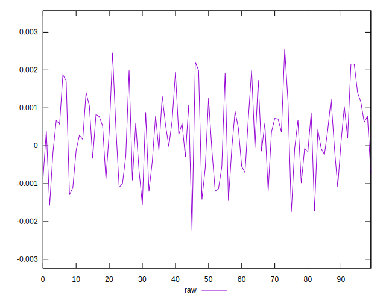
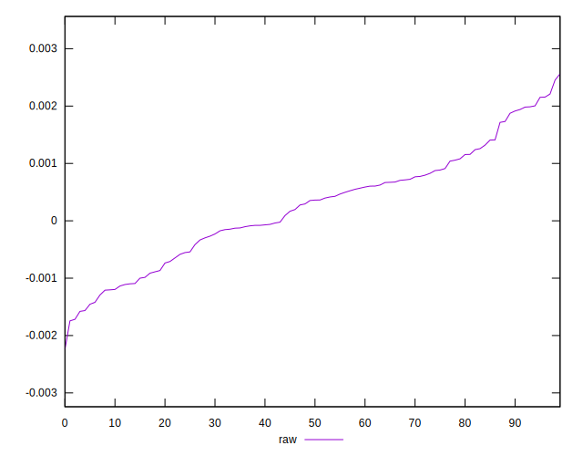

# //meta/pScore-difference/samples/pages

[→ Parent](../..)


## Raw


```yaml
p90min: -0.0015786150998662255
p90max: 0.0021567782348748416
p90range: 0.0037353933347410674
p90mean: 0.00024837300979856525
median: 0.00035769442036449206
p90stdev: 0.0009581114828569537
mad: 0.0006871889356799757
stdevBySn: 0.0011406173486037431
lfitCenter: 0.0002542755039844092
lfitStdev: 0.0008071744816720145
mfitCenter: 0.0002542755039844092
mfitStdev: 0.0010116431901778051
mfitConfidence: 0.00010116431901778052
p90skewness: 0.039994420779681725
p90eccentricity: 0.9999999999999992
p90discretization: 1
outlandishness: 1.0027004832697695

```

