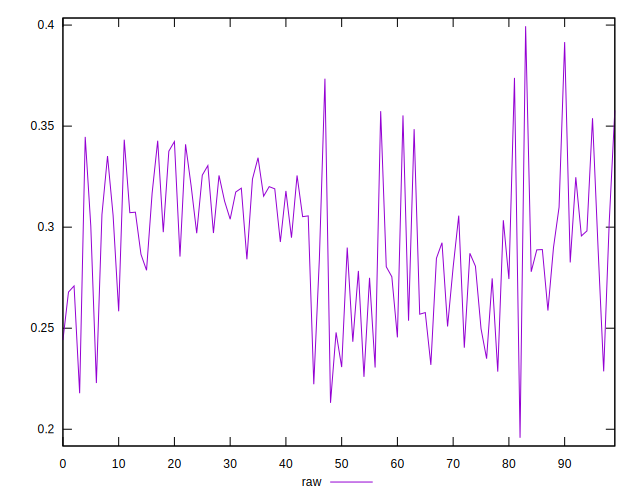
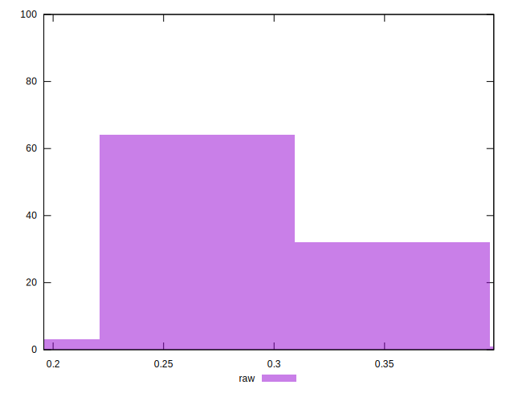

# //meta/pScore/samples/pages

[→ Parent](../..)


## Raw


```yaml
p90min: 0.2222586068563553
p90max: 0.3734823405196808
p90range: 0.15122373366332553
p90mean: 0.29288073529951403
median: 0.2937308520105093
p90stdev: 0.03590362480800212
mad: 0.0256971364986959
stdevBySn: 0.039751315642801814
lfitCenter: 0.29353478712823317
lfitStdev: 0.029460495315786345
mfitCenter: 0.29353478712823317
mfitStdev: 0.03692325530874585
mfitConfidence: 0.003692325530874585
p90skewness: -0.11726175259016028
p90eccentricity: 1.0000000000000002
p90discretization: 1
outlandishness: 1.0023434362357446

```

