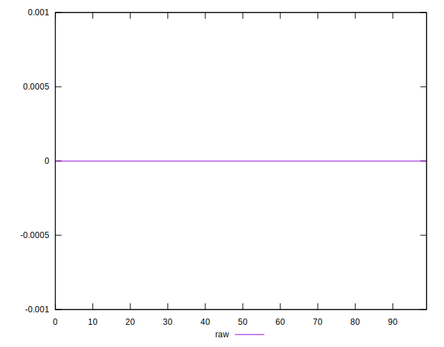

# //meta/score-difference/samples/pages

[→ Parent](../..)


## Raw


```yaml
p90min: 0
p90max: 2.7755575615628914e-17
p90range: 2.7755575615628914e-17
p90mean: 4.045227509937405e-18
median: 0
p90stdev: 8.575557316358864e-18
mad: 0
stdevBySn: 0
lfitCenter: 2.964723841816577e-18
lfitStdev: 6.336874802678009e-18
mfitCenter: 2.964723841816577e-18
mfitStdev: 7.942094784586393e-18
mfitConfidence: 7.942094784586394e-19
p90skewness: 1.9594777214908483
p90eccentricity: 1.0000000000000027
p90discretization: 23.5
outlandishness: 1.5593993499920082

```

