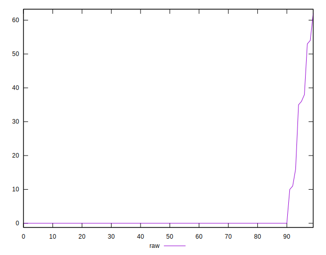
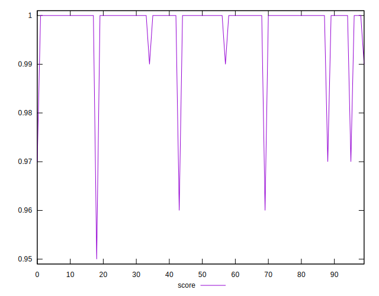
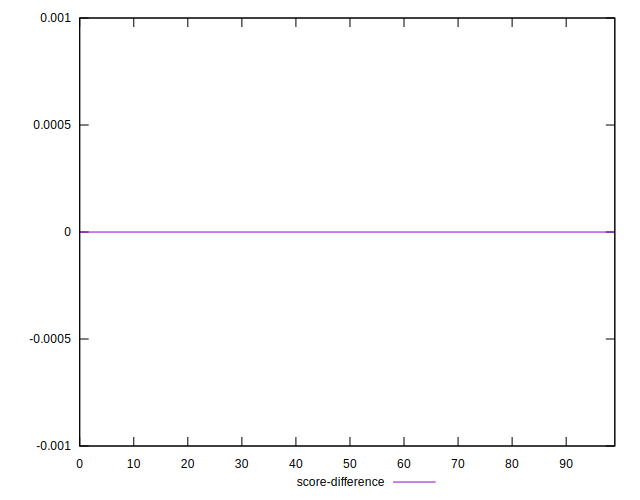
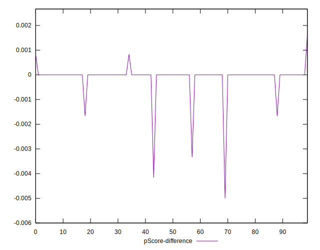

# //render-blocking-resources/samples/pages+cached+noadtech+nomedia+nocss

[→ Parent](../..)


## Raw


```yaml
p90min: 0
p90max: 38
p90range: 38
p90mean: 1.553191489361702
median: 0
p90stdev: 6.696485297998541
mad: 0
stdevBySn: 0
lfitCenter: 1.5772385940504963
lfitStdev: 3.768853951493059
mfitCenter: 1.5772385940504963
mfitStdev: 4.723557943636682
mfitConfidence: 0.4723557943636682
p90skewness: 4.6351160376785945
p90eccentricity: 0.9999999999999983
p90discretization: 13.428571428571429
outlandishness: 4.1131173766185025

```


## Score


```yaml
p90min: 0.97
p90max: 1
p90range: 0.030000000000000027
p90mean: 0.9987234042553189
median: 1
p90stdev: 0.005503198789947899
mad: 0
stdevBySn: 0
lfitCenter: 0.9987455966168552
lfitStdev: 0.0029974305505613102
mfitCenter: 0.9987455966168552
mfitStdev: 0.003756722088420047
mfitConfidence: 0.0003756722088420047
p90skewness: -4.653337897768236
p90eccentricity: 1.0000000000000027
p90discretization: 31.333333333333332
outlandishness: 0.9975515644580863

```


## Raw Estimate


## Score Estimate


## P Score


```yaml
p90min: 0.9683333333333334
p90max: 1
p90range: 0.03166666666666662
p90mean: 0.9987056737588651
median: 1
p90stdev: 0.005580404414998778
mad: 0
stdevBySn: 0
lfitCenter: 0.998685634504958
lfitStdev: 0.003140711626244177
mfitCenter: 0.998685634504958
mfitStdev: 0.003936298286363853
mfitConfidence: 0.0003936298286363853
p90skewness: -4.635116037678583
p90eccentricity: 0.9999999999999996
p90discretization: 13.428571428571429
outlandishness: 0.9973369786513339

```


## Score Difference


```yaml
p90min: 0
p90max: 0
p90range: 0
p90mean: 0
median: 0
p90stdev: 0
mad: 0
stdevBySn: 0
lfitCenter: 5.166535369026208e-19
lfitStdev: 1.2890316797319448e-18
mfitCenter: 5.166535369026208e-19
mfitStdev: 1.6155616292812394e-18
mfitConfidence: 1.6155616292812395e-19
p90skewness: .nan
p90eccentricity: .nan
p90discretization: 94
outlandishness: .inf

```


## P Score Difference


```yaml
p90min: -0.0016666666666665941
p90max: 0
p90range: 0.0016666666666665941
p90mean: -0.00003546099290779987
median: 0
p90stdev: 0.00024050815542996372
mad: 0
stdevBySn: 0
lfitCenter: -0.000060722905457106976
lfitStdev: 0.00018814100274797124
mfitCenter: -0.000060722905457106976
mfitStdev: 0.0002357997787900185
mfitConfidence: 0.00002357997787900185
p90skewness: -6.634888026970369
p90eccentricity: 0.9999999999999979
p90discretization: 47
outlandishness: 12.425625000000556

```

