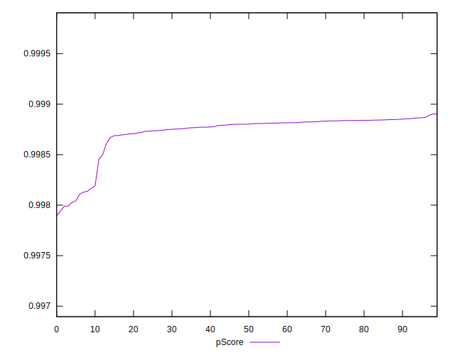

# //speed-index/samples/pages+cached+noadtech+nomedia+nocss

[→ Parent](../..)


## Raw


```yaml
p90min: 1609.9473
p90max: 1733.8577224586375
p90range: 123.91042245863741
p90mean: 1632.102567792114
median: 1621.610325
p90stdev: 29.37064574171449
mad: 7.04910000000018
stdevBySn: 11.187273745000434
lfitCenter: 1629.1635582043425
lfitStdev: 18.08213860121749
mfitCenter: 1629.1635582043425
mfitStdev: 22.662599964608276
mfitConfidence: 2.2662599964608274
p90skewness: 2.392566259634049
p90eccentricity: 0.9999999999999996
p90discretization: 1
outlandishness: 1.0029244892821618

```


## Score


```yaml
p90min: 1
p90max: 1
p90range: 0
p90mean: 1
median: 1
p90stdev: 0
mad: 0
stdevBySn: 0
lfitCenter: 1
lfitStdev: 0
mfitCenter: 1
mfitStdev: 0
mfitConfidence: 0
p90skewness: .nan
p90eccentricity: .nan
p90discretization: 94
outlandishness: 1

```


## Raw Estimate


## Score Estimate


## P Score


```yaml
p90min: 0.9979914736316291
p90max: 0.9988689205585044
p90range: 0.0008774469268753027
p90mean: 0.9987293160159614
median: 0.998802367209765
p90stdev: 0.00020447636718977334
mad: 0.00004058344801421976
stdevBySn: 0.00006411963244198935
lfitCenter: 0.9987494321535132
lfitStdev: 0.00012193177988887219
mfitCenter: 0.9987494321535132
mfitStdev: 0.0001528188236765381
mfitConfidence: 0.000015281882367653808
p90skewness: -2.535250137220773
p90eccentricity: 1
p90discretization: 1
outlandishness: 0.9999629944819409

```


## Score Difference


```yaml
p90min: 0
p90max: 0
p90range: 0
p90mean: 0
median: 0
p90stdev: 0
mad: 0
stdevBySn: 0
lfitCenter: 0
lfitStdev: 0
mfitCenter: 0
mfitStdev: 0
mfitConfidence: 0
p90skewness: .nan
p90eccentricity: .nan
p90discretization: 94
outlandishness: .nan

```


## P Score Difference


```yaml
p90min: -0.0020085263683709
p90max: -0.0011310794414955971
p90range: 0.0008774469268753027
p90mean: -0.0012706839840386857
median: -0.001197632790234937
p90stdev: 0.00020447636718977336
mad: 0.00004058344801416425
stdevBySn: 0.00006411963244198935
lfitCenter: -0.001250567846486882
lfitStdev: 0.00012193177988892904
mfitCenter: -0.001250567846486882
mfitStdev: 0.00015281882367660935
mfitConfidence: 0.000015281882367660937
p90skewness: -2.5352501372214817
p90eccentricity: 1
p90discretization: 1
outlandishness: 1.0292972779283378

```

