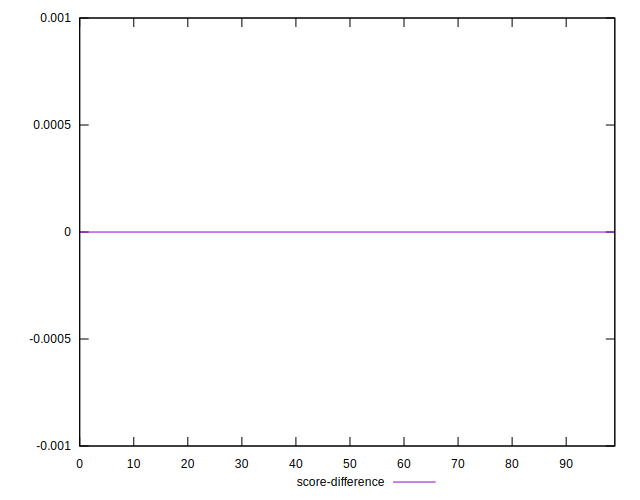
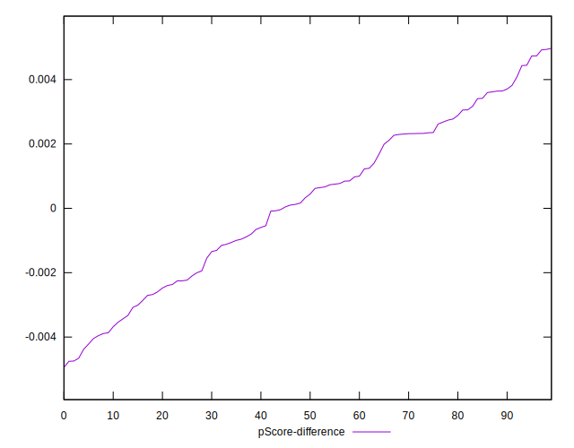

# //speed-index/samples/pages

[→ Parent](../..)


## Raw


```yaml
p90min: 6779.955660102734
p90max: 11299.61704276812
p90range: 4519.661382665387
p90mean: 8654.709730104401
median: 8731.982233690513
p90stdev: 1177.010037195947
mad: 1048.4403867577585
stdevBySn: 1399.364779257841
lfitCenter: 8735.261576355144
lfitStdev: 1148.7858796196192
mfitCenter: 8735.261576355144
mfitStdev: 1439.7895851244687
mfitConfidence: 143.97895851244687
p90skewness: 0.11428517044966159
p90eccentricity: 0.9999999999999992
p90discretization: 1
outlandishness: 1.0413962926748703

```


## Score


```yaml
p90min: 0.06
p90max: 0.35
p90range: 0.29
p90mean: 0.1879787234042553
median: 0.165
p90stdev: 0.08513543387155527
mad: 0.065
stdevBySn: 0.10137100000000002
lfitCenter: 0.1831042131235034
lfitStdev: 0.07792821806048972
mfitCenter: 0.1831042131235034
mfitStdev: 0.09766853748929509
mfitConfidence: 0.00976685374892951
p90skewness: 0.4361613631677016
p90eccentricity: 1
p90discretization: 3.2413793103448274
outlandishness: 1.0076887464293023

```


## Raw Estimate


## Score Estimate


## P Score


```yaml
p90min: 0.056043541621106474
p90max: 0.35497233999095273
p90range: 0.29892879836984626
p90mean: 0.18817152384137836
median: 0.1648444996185856
p90stdev: 0.08549532185606275
mad: 0.06932130370053666
stdevBySn: 0.10244474525800253
lfitCenter: 0.1833442426837963
lfitStdev: 0.0784708561109198
mfitCenter: 0.1833442426837963
mfitStdev: 0.09834863343002878
mfitConfidence: 0.009834863343002879
p90skewness: 0.42070373334154476
p90eccentricity: 0.9999999999999992
p90discretization: 1
outlandishness: 1.0078798565659934

```


## Score Difference


```yaml
p90min: 0
p90max: 5.551115123125783e-17
p90range: 5.551115123125783e-17
p90mean: 5.905441620346577e-19
median: 0
p90stdev: 5.695001657605474e-18
mad: 0
stdevBySn: 0
lfitCenter: 1.0755152514005351e-18
lfitStdev: 2.6436841970240598e-18
mfitCenter: 1.0755152514005351e-18
mfitStdev: 3.313366782061881e-18
mfitConfidence: 3.313366782061881e-19
p90skewness: 9.539955591519895
p90eccentricity: 1.0000000000000036
p90discretization: 47
outlandishness: 14.137600000000003

```


## P Score Difference


```yaml
p90min: -0.004656563539851388
p90max: 0.004737095672472658
p90range: 0.009393659212324046
p90mean: 0.00022081935939141946
median: 0.0003856638657002698
p90stdev: 0.00255780714762685
mad: 0.0023415778878161514
stdevBySn: 0.0029508482865077054
lfitCenter: 0.00025294028564896287
lfitStdev: 0.0022515028537104464
mfitCenter: 0.00025294028564896287
mfitStdev: 0.002821840359600951
mfitConfidence: 0.0002821840359600951
p90skewness: -0.10615402969918265
p90eccentricity: 1.0000000000000002
p90discretization: 1
outlandishness: 0.9169523233633449

```

