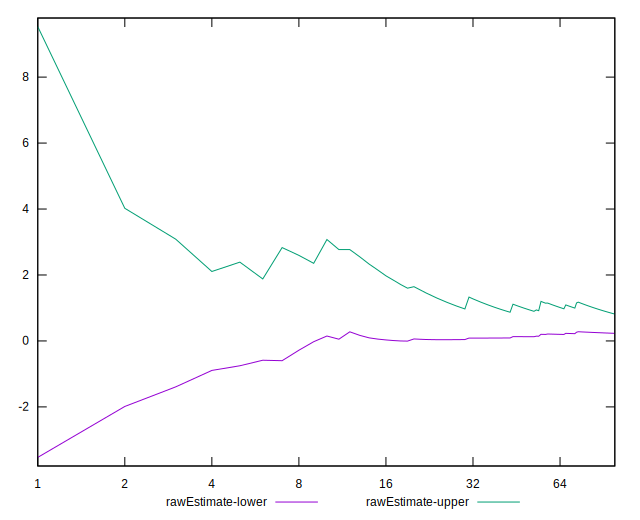
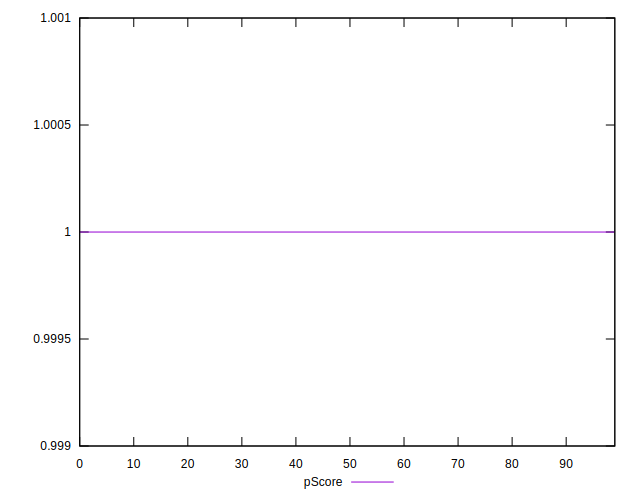

# //total-blocking-time/samples/pages+cached+noadtech+nomedia+nocss

[→ Parent](../..)


## Raw


```yaml
p90min: 0
p90max: 12
p90range: 12
p90mean: 0.5957446808510638
median: 0
p90stdev: 1.9258551509580633
mad: 0
stdevBySn: 0
lfitCenter: 0.522598437845418
lfitStdev: 1.189470440371286
mfitCenter: 0.522598437845418
mfitStdev: 1.4907801203363127
mfitConfidence: 0.14907801203363127
p90skewness: 4.050741582952184
p90eccentricity: 1.000000000000002
p90discretization: 7.833333333333333
outlandishness: 2.8458485012755177

```


## Score


```yaml
p90min: 1
p90max: 1
p90range: 0
p90mean: 1
median: 1
p90stdev: 0
mad: 0
stdevBySn: 0
lfitCenter: 1
lfitStdev: 0
mfitCenter: 1
mfitStdev: 0
mfitConfidence: 0
p90skewness: .nan
p90eccentricity: .nan
p90discretization: 94
outlandishness: 1

```


## Raw Estimate


## Score Estimate


## P Score


```yaml
p90min: 0.9999999999946796
p90max: 1
p90range: 5.320410778608675e-12
p90mean: 0.9999999999999402
median: 1
p90stdev: 5.463323879318926e-13
mad: 0
stdevBySn: 0
lfitCenter: 0.9999999999963238
lfitStdev: 9.032444147792554e-12
mfitCenter: 0.9999999999963238
mfitStdev: 1.1320489956332222e-11
mfitConfidence: 1.1320489956332223e-12
p90skewness: -9.497450258629963
p90eccentricity: 0.9999999991213666
p90discretization: 18.8
outlandishness: 0.9999999999843527

```


## Score Difference


```yaml
p90min: 0
p90max: 0
p90range: 0
p90mean: 0
median: 0
p90stdev: 0
mad: 0
stdevBySn: 0
lfitCenter: 0
lfitStdev: 0
mfitCenter: 0
mfitStdev: 0
mfitConfidence: 0
p90skewness: .nan
p90eccentricity: .nan
p90discretization: 94
outlandishness: .nan

```


## P Score Difference


```yaml
p90min: -5.320410778608675e-12
p90max: 0
p90range: 5.320410778608675e-12
p90mean: -5.978669096438875e-14
median: 0
p90stdev: 5.463323849904509e-13
mad: 0
stdevBySn: 0
lfitCenter: -3.676229232632705e-12
lfitStdev: 9.032514930994777e-12
mfitCenter: -3.676229232632705e-12
mfitStdev: 1.1320578669920342e-11
mfitConfidence: 1.1320578669920341e-12
p90skewness: -9.497139105721306
p90eccentricity: 0.9999999999999996
p90discretization: 18.8
outlandishness: 17386.59791072198

```

