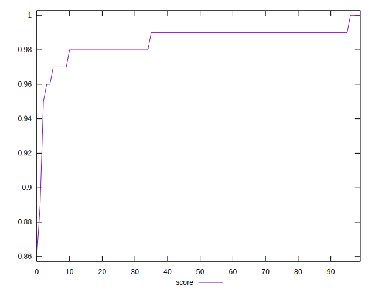
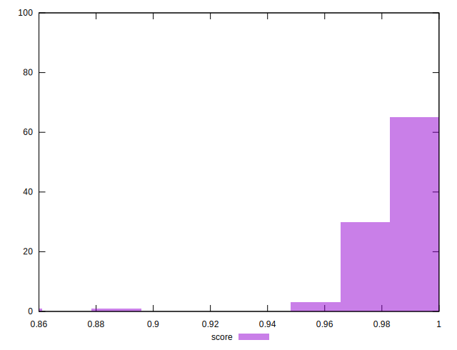
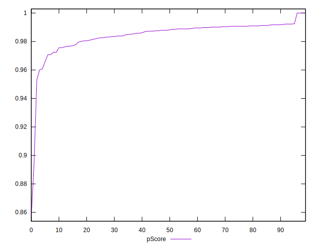

# //total-blocking-time/samples/pages+cached+noadtech+nomedia

[→ Parent](../..)


## Raw


```yaml
p90min: 0
p90max: 219
p90range: 219
p90mean: 166.7659574468085
median: 163.49999999999966
p90stdev: 23.774394205278433
mad: 10.499999999999659
stdevBySn: 16.696399999999798
lfitCenter: 165.23734701603811
lfitStdev: 18.06038848297786
mfitCenter: 165.23734701603811
mfitStdev: 22.635340233902834
mfitConfidence: 2.2635340233902834
p90skewness: -3.2215650717915914
p90eccentricity: 0.9999999999999991
p90discretization: 1.323943661971831
outlandishness: 0.9816643134096352

```


## Score


```yaml
p90min: 0.96
p90max: 1
p90range: 0.040000000000000036
p90mean: 0.985744680851063
median: 0.99
p90stdev: 0.00706946711737709
mad: 0
stdevBySn: 0
lfitCenter: 0.9858466060045603
lfitStdev: 0.008058315671907339
mfitCenter: 0.9858466060045603
mfitStdev: 0.010099600964715169
mfitConfidence: 0.0010099600964715168
p90skewness: -1.5291129722446144
p90eccentricity: 1.000000000000001
p90discretization: 18.8
outlandishness: 0.9956533414670016

```


## Raw Estimate


## Score Estimate


## P Score


```yaml
p90min: 0.9600681142336948
p90max: 1
p90range: 0.03993188576630524
p90mean: 0.9856492322263358
median: 0.9880691053362578
p90stdev: 0.007023208558528688
mad: 0.003149723122988002
stdevBySn: 0.005138617761678708
lfitCenter: 0.9854524879586638
lfitStdev: 0.0070351813281943525
mfitCenter: 0.9854524879586638
mfitStdev: 0.008817292226076355
mfitConfidence: 0.0008817292226076355
p90skewness: -1.4948592087160515
p90eccentricity: 1.0000000000000002
p90discretization: 1.5161290322580645
outlandishness: 0.9957279712215585

```


## Score Difference


```yaml
p90min: 0
p90max: 0
p90range: 0
p90mean: 0
median: 0
p90stdev: 0
mad: 0
stdevBySn: 0
lfitCenter: 5.166535369026208e-19
lfitStdev: 1.2890316797319448e-18
mfitCenter: 5.166535369026208e-19
mfitStdev: 1.6155616292812394e-18
mfitConfidence: 1.6155616292812395e-19
p90skewness: .nan
p90eccentricity: .nan
p90discretization: 94
outlandishness: .inf

```


## P Score Difference


```yaml
p90min: -0.004355862049517212
p90max: 0.00387291554960556
p90range: 0.008228777599122772
p90mean: -0.00004000286071164023
median: 0.00023835100564140177
p90stdev: 0.002084676397837198
mad: 0.0015098642314304578
stdevBySn: 0.0022309579856274833
lfitCenter: 0.00004040343464545385
lfitStdev: 0.0016589530076230375
mfitCenter: 0.00004040343464545385
mfitStdev: 0.00207918925968819
mfitConfidence: 0.000207918925968819
p90skewness: -0.3668646474646869
p90eccentricity: 0.9999999999999994
p90discretization: 1.5666666666666667
outlandishness: 2.1299868430755913

```

