# //unminified-css/samples/pages+cached

[→ Parent](../..)


## Raw


```yaml
p90min: 0
p90max: 150
p90range: 150
p90mean: 79.57446808510639
median: 150
p90stdev: 74.67539532717764
mad: 5
stdevBySn: 8.944500000000001
lfitCenter: 83.28685655883527
lfitStdev: 93.41267366149035
mfitCenter: 83.28685655883527
mfitStdev: 117.07542462219139
mfitConfidence: 11.70754246221914
p90skewness: -0.12586544484403953
p90eccentricity: 1.000000000000001
p90discretization: 31.333333333333332
outlandishness: 1.033592988790071

```

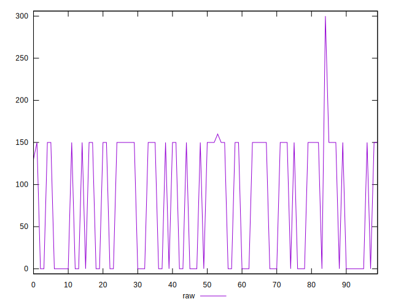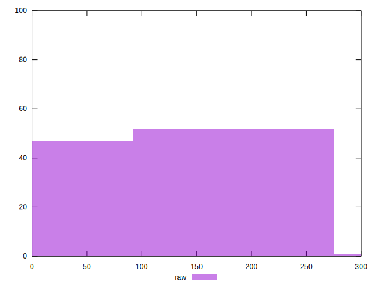
## Score


```yaml
p90min: 0.88
p90max: 1
p90range: 0.12
p90mean: 0.9362765957446806
median: 0.88
p90stdev: 0.05978657151143471
mad: 0.0050000000000000044
stdevBySn: 0.008944500000000008
lfitCenter: 0.9332117490562034
lfitStdev: 0.074908206980142
mfitCenter: 0.9332117490562034
mfitStdev: 0.0938835149036372
mfitConfidence: 0.00938835149036372
p90skewness: 0.12709059103857342
p90eccentricity: 1.0000000000000007
p90discretization: 31.333333333333332
outlandishness: 0.9974882284774088

```

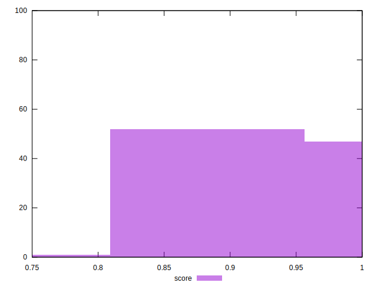
## Raw Estimate

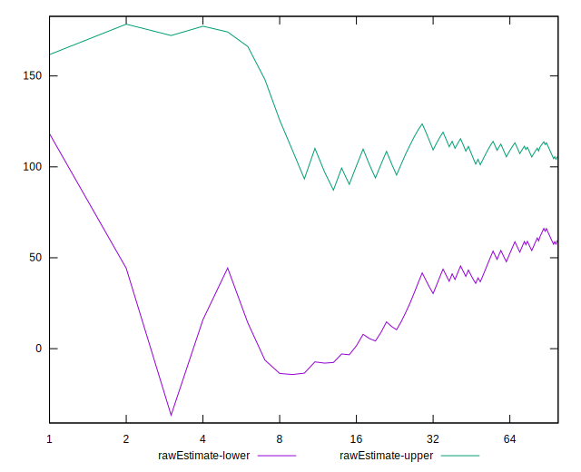
## Score Estimate

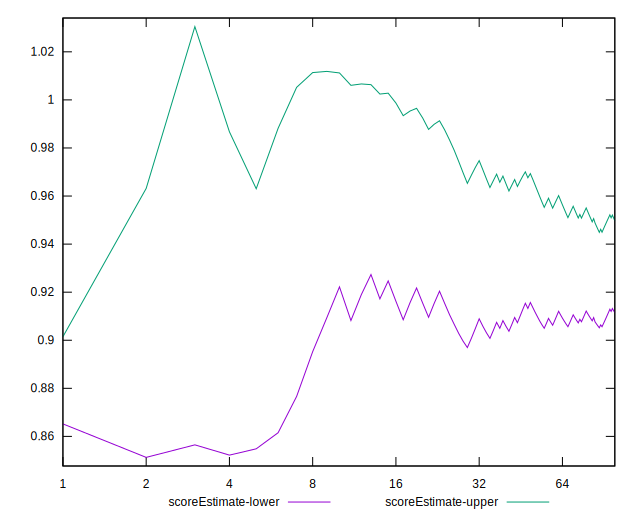
## P Score


```yaml
p90min: 0.875
p90max: 1
p90range: 0.125
p90mean: 0.9336879432624113
median: 0.875
p90stdev: 0.062229496105981316
mad: 0.004166666666666652
stdevBySn: 0.007453749999999974
lfitCenter: 0.930594286200971
lfitStdev: 0.0778438947179087
mfitCenter: 0.930594286200971
mfitStdev: 0.09756285385182627
mfitConfidence: 0.009756285385182627
p90skewness: 0.12586544484404022
p90eccentricity: 1.0000000000000016
p90discretization: 31.333333333333332
outlandishness: 0.997635277339716

```

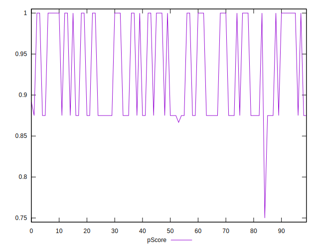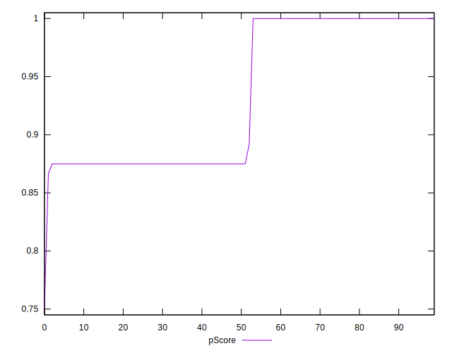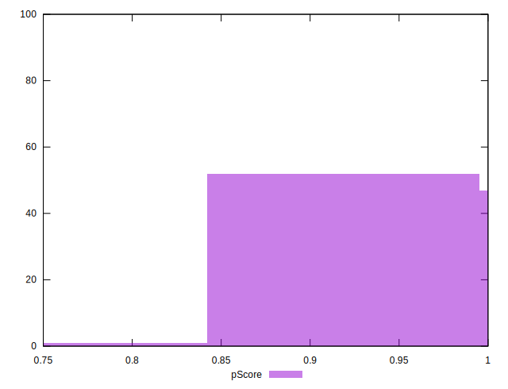
## Score Difference


```yaml
p90min: 0
p90max: 0
p90range: 0
p90mean: 0
median: 0
p90stdev: 0
mad: 0
stdevBySn: 0
lfitCenter: 0
lfitStdev: 0
mfitCenter: 0
mfitStdev: 0
mfitConfidence: 0
p90skewness: .nan
p90eccentricity: .nan
p90discretization: 94
outlandishness: .nan

```


## P Score Difference


```yaml
p90min: -0.0050000000000000044
p90max: 0
p90range: 0.0050000000000000044
p90mean: -0.002535460992907803
median: -0.004166666666666652
p90stdev: 0.002487898885231406
mad: 0.0008333333333333526
stdevBySn: 0.0014907500000000346
lfitCenter: -0.0025519930010379334
lfitStdev: 0.003103227843654538
mfitCenter: -0.0025519930010379334
mfitStdev: 0.0038893193316769255
mfitConfidence: 0.00038893193316769255
p90skewness: 0.031568989176464356
p90eccentricity: 0.9999999999999983
p90discretization: 31.333333333333332
outlandishness: 0.985229771626975

```

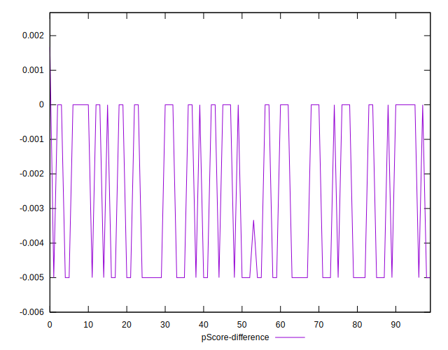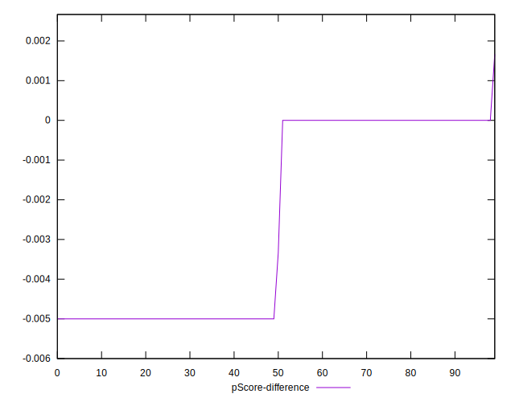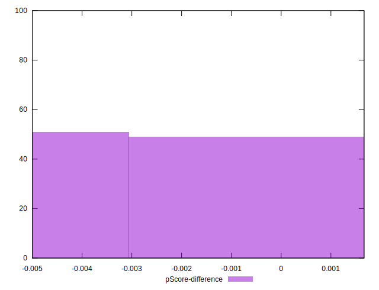