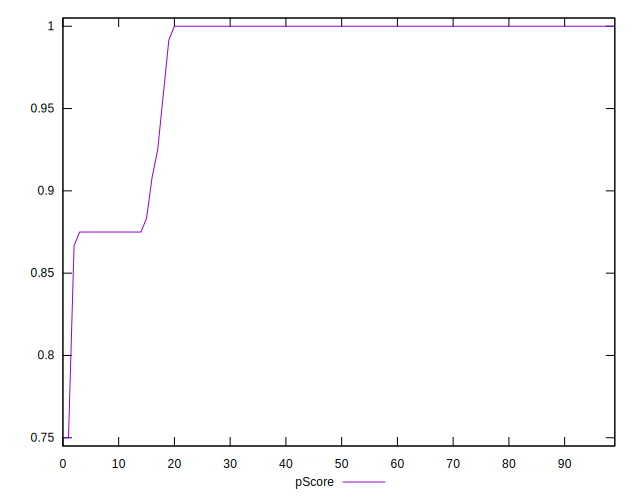

# //unminified-javascript/samples/pages

[→ Parent](../..)


## Raw


```yaml
p90min: 0
p90max: 150
p90range: 150
p90mean: 23.404255319148938
median: 0
p90stdev: 52.68439131540986
mad: 0
stdevBySn: 0
lfitCenter: 17.117967156264978
lfitStdev: 37.80543099935894
mfitCenter: 17.117967156264978
mfitStdev: 47.382081186480086
mfitConfidence: 4.738208118648009
p90skewness: 1.8846083569111594
p90eccentricity: 1.0000000000000027
p90discretization: 13.428571428571429
outlandishness: 1.5995350743801653

```


## Score


```yaml
p90min: 0.88
p90max: 1
p90range: 0.12
p90mean: 0.9811702127659572
median: 1
p90stdev: 0.042347508228303334
mad: 0
stdevBySn: 0
lfitCenter: 0.9861299229102461
lfitStdev: 0.030594878217095108
mfitCenter: 0.9861299229102461
mfitStdev: 0.038344993437515705
mfitConfidence: 0.0038344993437515705
p90skewness: -1.8842620826903111
p90eccentricity: 1.0000000000000013
p90discretization: 15.666666666666666
outlandishness: 0.989488896730591

```


## Raw Estimate


## Score Estimate


## P Score


```yaml
p90min: 0.875
p90max: 1
p90range: 0.125
p90mean: 0.9804964539007092
median: 1
p90stdev: 0.043903659429508225
mad: 0
stdevBySn: 0
lfitCenter: 0.9857350273697794
lfitStdev: 0.031504525832798926
mfitCenter: 0.9857350273697794
mfitStdev: 0.03948506765539983
mfitConfidence: 0.003948506765539983
p90skewness: -1.8846083569111616
p90eccentricity: 1.000000000000002
p90discretization: 13.428571428571429
outlandishness: 0.9894960833199805

```


## Score Difference


```yaml
p90min: 0
p90max: 0
p90range: 0
p90mean: 0
median: 0
p90stdev: 0
mad: 0
stdevBySn: 0
lfitCenter: 0
lfitStdev: 0
mfitCenter: 0
mfitStdev: 0
mfitConfidence: 0
p90skewness: .nan
p90eccentricity: .nan
p90discretization: 94
outlandishness: .nan

```


## P Score Difference


```yaml
p90min: -0.0050000000000000044
p90max: 0
p90range: 0.0050000000000000044
p90mean: -0.0006028368794326239
median: 0
p90stdev: 0.0015727260185487005
mad: 0
stdevBySn: 0
lfitCenter: -0.0003791599476747007
lfitStdev: 0.0009218362383699841
mfitCenter: -0.0003791599476747007
mfitStdev: 0.0011553503910014052
mfitConfidence: 0.00011553503910014052
p90skewness: -2.338769866942494
p90eccentricity: 1.000000000000003
p90discretization: 18.8
outlandishness: 1.2229757785467135

```

