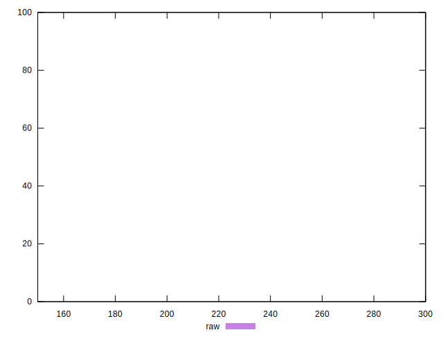

# //unused-css-rules/samples/pages+cached+noadtech

[→ Parent](../..)


## Raw


```yaml
p90min: 150
p90max: 150
p90range: 0
p90mean: 150
median: 150
p90stdev: 0
mad: 0
stdevBySn: 0
lfitCenter: 152.15050191920614
lfitStdev: 5.313226922223898
mfitCenter: 152.15050191920614
mfitStdev: 6.659142423089248
mfitConfidence: 0.6659142423089248
p90skewness: .nan
p90eccentricity: .nan
p90discretization: 94
outlandishness: 1.0609

```


## Score


```yaml
p90min: 0.88
p90max: 0.88
p90range: 0
p90mean: 0.8799999999999998
median: 0.88
p90stdev: 2.220446049250313e-16
mad: 0
stdevBySn: 0
lfitCenter: 0.8781362316700213
lfitStdev: 0.0046047966659274395
mfitCenter: 0.8781362316700213
mfitStdev: 0.0057712567666774245
mfitConfidence: 0.0005771256766677424
p90skewness: 1
p90eccentricity: 1
p90discretization: 94
outlandishness: 0.99115600464876

```


## Raw Estimate


## Score Estimate


## P Score


```yaml
p90min: 0.875
p90max: 0.875
p90range: 0
p90mean: 0.875
median: 0.875
p90stdev: 0
mad: 0
stdevBySn: 0
lfitCenter: 0.8732079150673286
lfitStdev: 0.004427689101852731
mfitCenter: 0.8732079150673286
mfitStdev: 0.005549285352573725
mfitConfidence: 0.0005549285352573725
p90skewness: .nan
p90eccentricity: .nan
p90discretization: 94
outlandishness: 0.9914469387755102

```


## Score Difference


```yaml
p90min: 0
p90max: 0
p90range: 0
p90mean: 0
median: 0
p90stdev: 0
mad: 0
stdevBySn: 0
lfitCenter: 0
lfitStdev: 0
mfitCenter: 0
mfitStdev: 0
mfitConfidence: 0
p90skewness: .nan
p90eccentricity: .nan
p90discretization: 94
outlandishness: .nan

```


## P Score Difference


```yaml
p90min: -0.0050000000000000044
p90max: -0.0050000000000000044
p90range: 0
p90mean: -0.0050000000000000044
median: -0.0050000000000000044
p90stdev: 0
mad: 0
stdevBySn: 0
lfitCenter: -0.004928316602693135
lfitStdev: 0.00017710756407412752
mfitCenter: -0.004928316602693135
mfitStdev: 0.0002219714141029719
mfitConfidence: 0.00002219714141029719
p90skewness: .nan
p90eccentricity: .nan
p90discretization: 94
outlandishness: 0.9409000000000002

```

