# //uses-http2/samples/pages+cached+noadtech+nomedia+nocss

[→ Parent](../..)


## Raw


```yaml
p90min: 610
p90max: 1260
p90range: 650
p90mean: 1011.063829787234
median: 930
p90stdev: 196.2167065409015
mad: 160
stdevBySn: 238.52
lfitCenter: 1007.781952923645
lfitStdev: 196.9795240704083
mfitCenter: 1007.781952923645
mfitStdev: 246.87722252753994
mfitConfidence: 24.687722252753993
p90skewness: -0.11705012657850976
p90eccentricity: 0.9999999999999999
p90discretization: 4.086956521739131
outlandishness: 0.9913864736423228

```

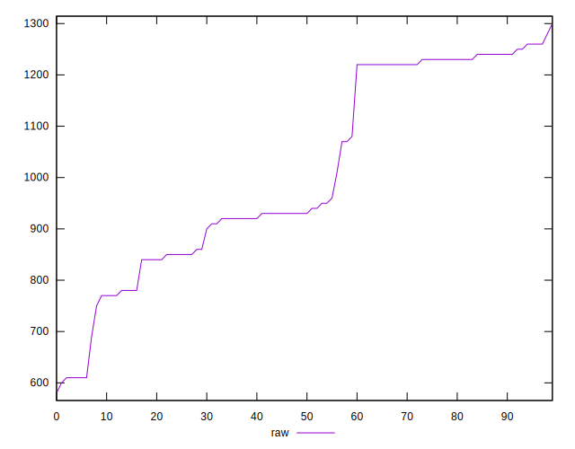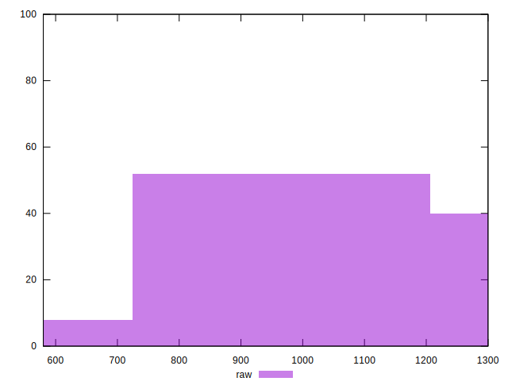
## Score


```yaml
p90min: 0.44
p90max: 0.58
p90range: 0.13999999999999996
p90mean: 0.4715957446808509
median: 0.48
p90stdev: 0.032821347214215445
mad: 0.020000000000000018
stdevBySn: 0.04174100000000001
lfitCenter: 0.4715927645968899
lfitStdev: 0.028177478152350284
mfitCenter: 0.4715927645968899
mfitStdev: 0.03531523175777494
mfitConfidence: 0.003531523175777494
p90skewness: 1.3316821395660607
p90eccentricity: 0.9999999999999997
p90discretization: 11.75
outlandishness: 1.010222246263375

```

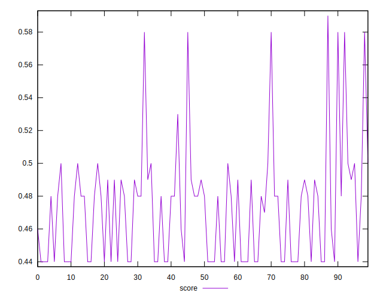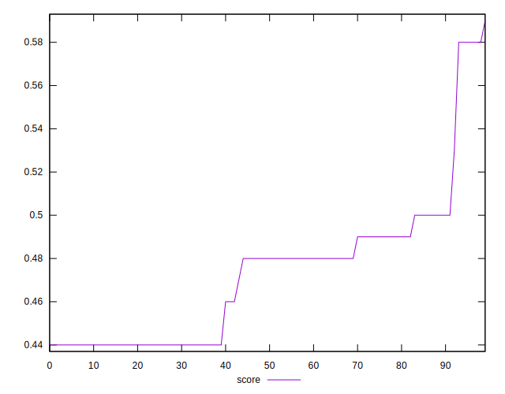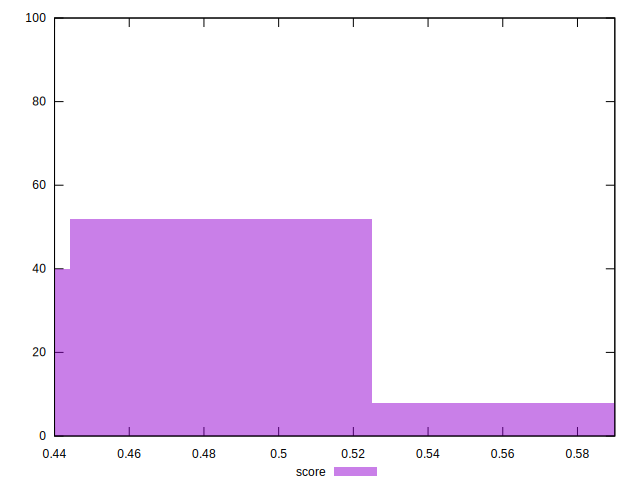
## Raw Estimate

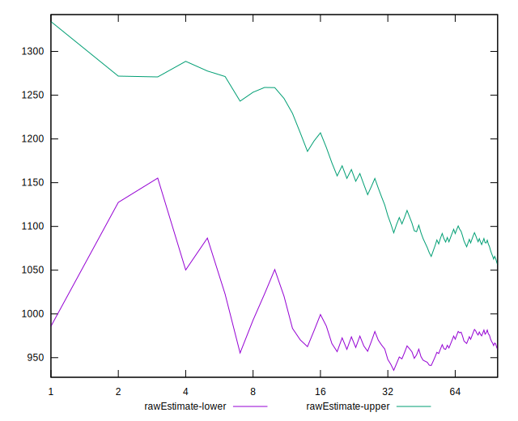
## Score Estimate

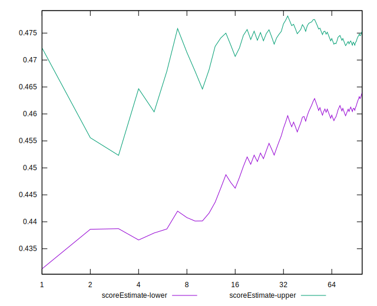
## P Score


```yaml
p90min: 0.44
p90max: 0.5777777777777777
p90range: 0.13777777777777772
p90mean: 0.47217494089834544
median: 0.4788235294117647
p90stdev: 0.030969843897821963
mad: 0.018823529411764683
stdevBySn: 0.040688705882352946
lfitCenter: 0.4720682838561553
lfitStdev: 0.02556711734731718
mfitCenter: 0.4720682838561553
mfitStdev: 0.03204362965404065
mfitConfidence: 0.0032043629654040654
p90skewness: 1.5215333025307567
p90eccentricity: 0.9999999999999992
p90discretization: 4.086956521739131
outlandishness: 1.0099977397058229

```

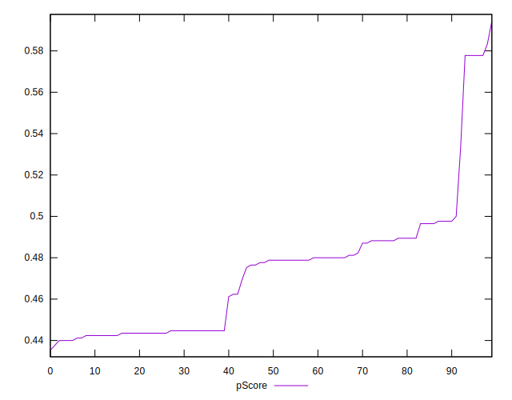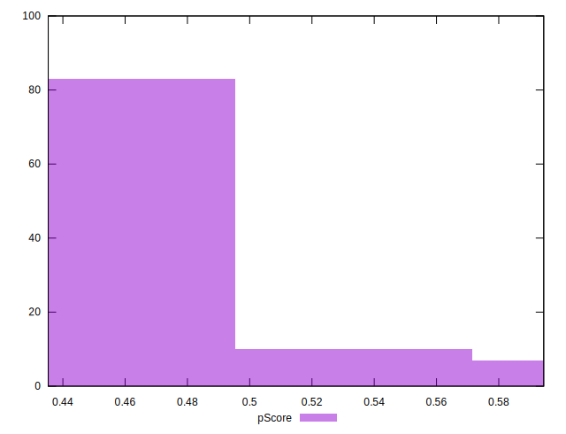
## Score Difference


```yaml
p90min: 0
p90max: 0
p90range: 0
p90mean: 0
median: 0
p90stdev: 0
mad: 0
stdevBySn: 0
lfitCenter: 2.583267684513104e-19
lfitStdev: 6.445158398659724e-19
mfitCenter: 2.583267684513104e-19
mfitStdev: 8.077808146406197e-19
mfitConfidence: 8.077808146406197e-20
p90skewness: .nan
p90eccentricity: .nan
p90discretization: 94
outlandishness: .inf

```


## P Score Difference


```yaml
p90min: -0.003529411764705892
p90max: 0.004705882352941171
p90range: 0.008235294117647063
p90mean: 0.0005506883604505685
median: 0
p90stdev: 0.002562825900356058
mad: 0.002352941176470613
stdevBySn: 0.0028061176470588534
lfitCenter: 0.00044570337127511296
lfitStdev: 0.002379710936266697
mfitCenter: 0.00044570337127511296
mfitStdev: 0.0029825253621485006
mfitConfidence: 0.00029825253621485007
p90skewness: 0.2124279011265672
p90eccentricity: 0.9999999999999999
p90discretization: 5.222222222222222
outlandishness: 0.9242200413223131

```

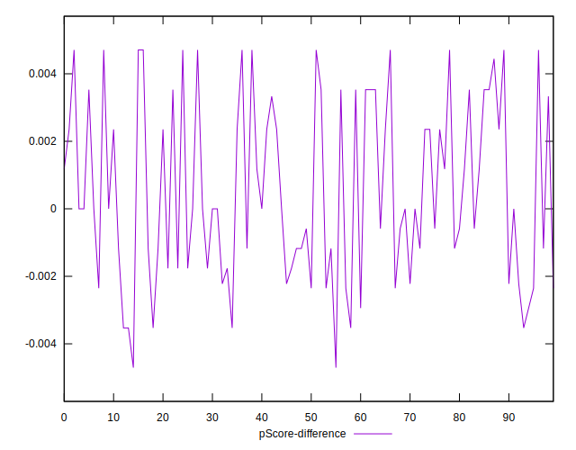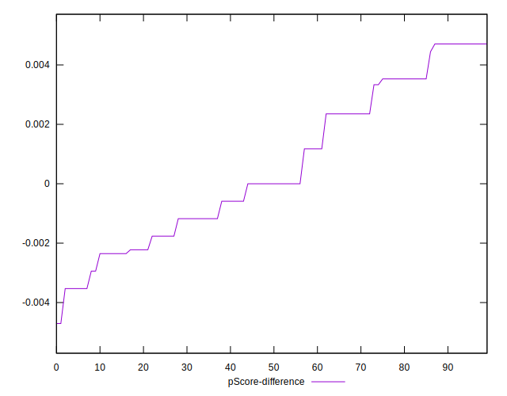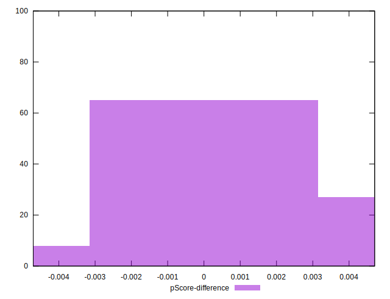