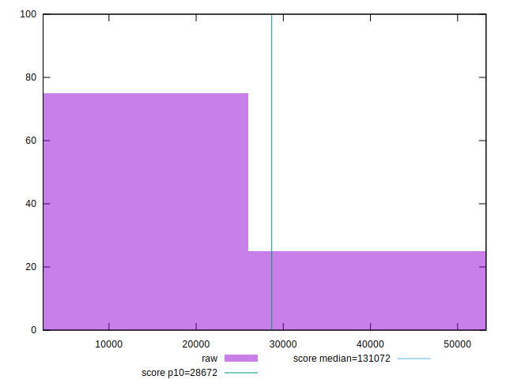
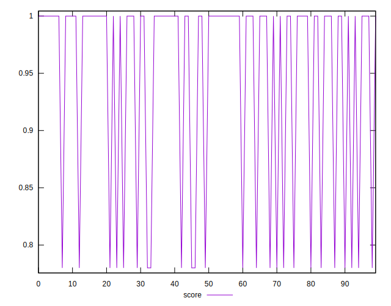
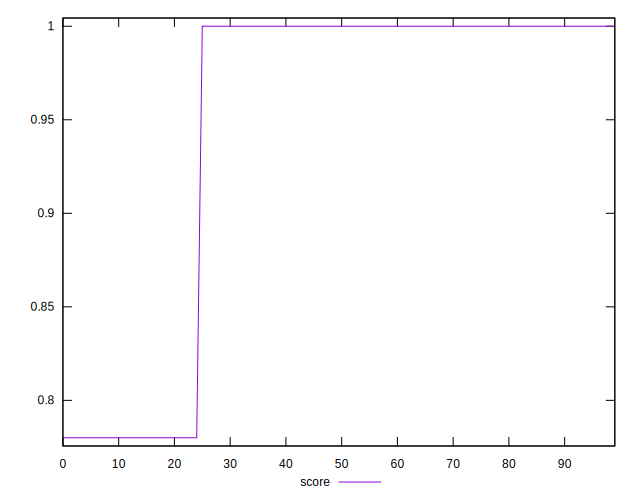
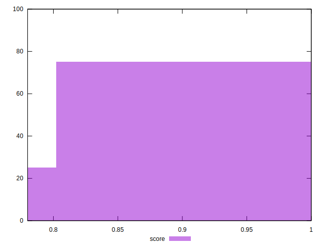
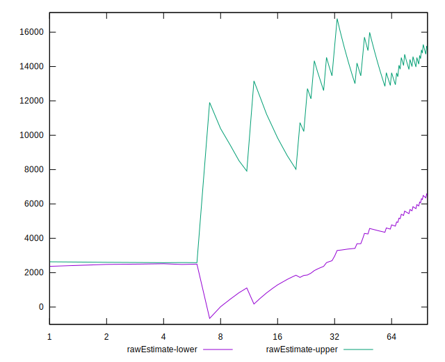
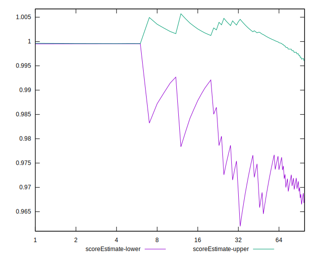
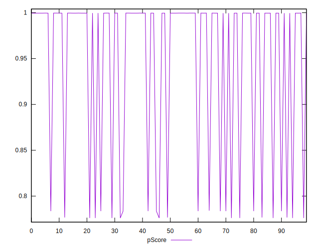
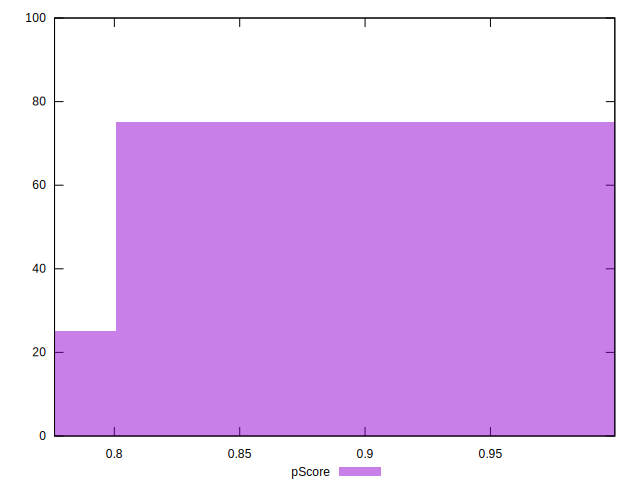
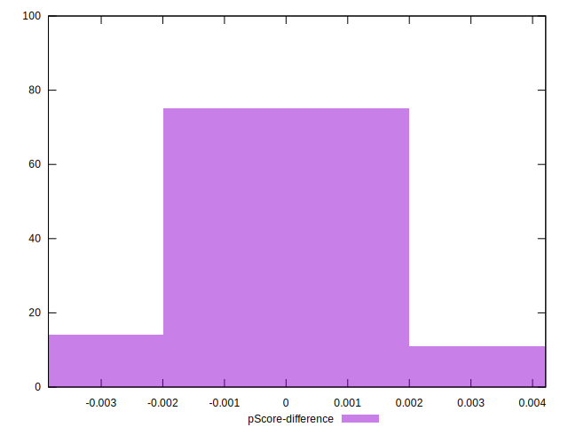

# //uses-long-cache-ttl/samples/pages+cached+noadtech+nomedia+nocss

[→ Parent](../..)


## Raw


```yaml
p90min: 2440
p90max: 53269
p90range: 50829
p90mean: 14205.287234042553
median: 2562
p90stdev: 21146.553865226906
mad: 122
stdevBySn: 145.49720000000002
lfitCenter: 10776.279896505888
lfitStdev: 17249.681607880913
mfitCenter: 10776.279896505888
mfitStdev: 21619.269845102546
mfitConfidence: 2161.9269845102544
p90skewness: 1.2573795637940859
p90eccentricity: 1.0000000000000002
p90discretization: 15.666666666666666
outlandishness: 1.1186261964540107

```


## Score


```yaml
p90min: 0.78
p90max: 1
p90range: 0.21999999999999997
p90mean: 0.9485106382978726
median: 1
p90stdev: 0.09314776006955593
mad: 0
stdevBySn: 0
lfitCenter: 0.9636397269711537
lfitStdev: 0.07607833999551762
mfitCenter: 0.9636397269711537
mfitStdev: 0.09535005915582277
mfitConfidence: 0.009535005915582278
p90skewness: -1.2562972690740244
p90eccentricity: 0.9999999999999999
p90discretization: 47
outlandishness: 0.9926112763540919

```


## Raw Estimate


## Score Estimate


## P Score


```yaml
p90min: 0.7761429257345126
p90max: 0.9996090852968826
p90range: 0.22346615956237004
p90mean: 0.9481847250521013
median: 0.9995466956021494
p90stdev: 0.09297502929704558
mad: 0.00006238969473326694
stdevBySn: 0.00007440594993889416
lfitCenter: 0.963309062005223
lfitStdev: 0.07585372341218734
mfitCenter: 0.963309062005223
mfitStdev: 0.09506854401617615
mfitConfidence: 0.009506854401617615
p90skewness: -1.2575896947596867
p90eccentricity: 0.9999999999999979
p90discretization: 15.666666666666666
outlandishness: 0.992382035995694

```


## Score Difference


```yaml
p90min: 0
p90max: 0
p90range: 0
p90mean: 0
median: 0
p90stdev: 0
mad: 0
stdevBySn: 0
lfitCenter: 0
lfitStdev: 0
mfitCenter: 0
mfitStdev: 0
mfitConfidence: 0
p90skewness: .nan
p90eccentricity: .nan
p90discretization: 94
outlandishness: .nan

```


## P Score Difference


```yaml
p90min: -0.0038570742654874257
p90max: 0.0036284452541361922
p90range: 0.007485519519623618
p90mean: -0.0004604016296216365
median: -0.00045330439785062904
p90stdev: 0.0016191622316129878
mad: 0.00006238969473326694
stdevBySn: 0.00007440594993889416
lfitCenter: -0.0004444911855335697
lfitStdev: 0.0006442410820134536
mfitCenter: -0.0004444911855335697
mfitStdev: 0.0008074364567393729
mfitConfidence: 0.00008074364567393729
p90skewness: 0.4585432879662815
p90eccentricity: 0.9999999999999989
p90discretization: 18.8
outlandishness: 0.8877723750269927

```

