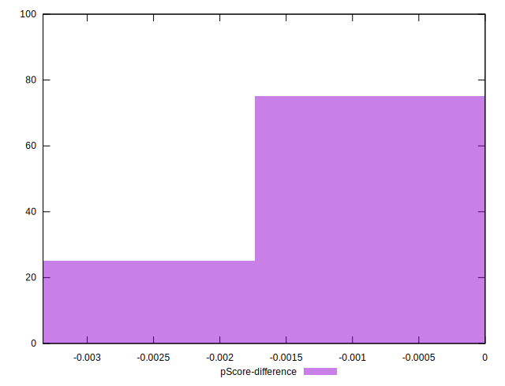

# //uses-text-compression/samples/pages+cached+noadtech+nomedia+nocss

[→ Parent](../..)


## Raw


```yaml
p90min: 300
p90max: 450
p90range: 150
p90mean: 335.1063829787234
median: 300
p90stdev: 63.50983641106082
mad: 0
stdevBySn: 0
lfitCenter: 324.79109524694087
lfitStdev: 51.87159545148953
mfitCenter: 324.79109524694087
mfitStdev: 65.01140396987947
mfitConfidence: 6.501140396987947
p90skewness: 1.256297269074018
p90eccentricity: 1.0000000000000022
p90discretization: 47
outlandishness: 1.0143367346938774

```


## Score


```yaml
p90min: 0.67
p90max: 0.75
p90range: 0.07999999999999996
p90mean: 0.7312765957446811
median: 0.75
p90stdev: 0.0338719127525658
mad: 0
stdevBySn: 0
lfitCenter: 0.7367780825349654
lfitStdev: 0.027664850907460667
mfitCenter: 0.7367780825349654
mfitStdev: 0.03467274878393519
mfitConfidence: 0.003467274878393519
p90skewness: -1.2562972690740293
p90eccentricity: 0.9999999999999979
p90discretization: 47
outlandishness: 0.9965116305646792

```


## Raw Estimate


## Score Estimate


## P Score


```yaml
p90min: 0.6666666666666666
p90max: 0.75
p90range: 0.08333333333333337
p90mean: 0.7304964539007089
median: 0.75
p90stdev: 0.035283242450589405
mad: 0
stdevBySn: 0
lfitCenter: 0.7362271693072555
lfitStdev: 0.028817553028604913
mfitCenter: 0.7362271693072555
mfitStdev: 0.03611744664993256
mfitConfidence: 0.003611744664993256
p90skewness: -1.2562972690739882
p90eccentricity: 0.9999999999999971
p90discretization: 47
outlandishness: 0.996362537114715

```


## Score Difference


```yaml
p90min: 0
p90max: 0
p90range: 0
p90mean: 0
median: 0
p90stdev: 0
mad: 0
stdevBySn: 0
lfitCenter: 0
lfitStdev: 0
mfitCenter: 0
mfitStdev: 0
mfitConfidence: 0
p90skewness: .nan
p90eccentricity: .nan
p90discretization: 94
outlandishness: .nan

```


## P Score Difference


```yaml
p90min: -0.0033333333333334103
p90max: 0
p90range: 0.0033333333333334103
p90mean: -0.0007801418439716492
median: 0
p90stdev: 0.0014113296980236075
mad: 0
stdevBySn: 0
lfitCenter: -0.0005509132277098062
lfitStdev: 0.0011527021211442349
mfitCenter: -0.0005509132277098062
mfitStdev: 0.0014446978659973504
mfitConfidence: 0.00014446978659973504
p90skewness: -1.2562972690740157
p90eccentricity: 1.0000000000000002
p90discretization: 47
outlandishness: 1.1410123966942147

```

