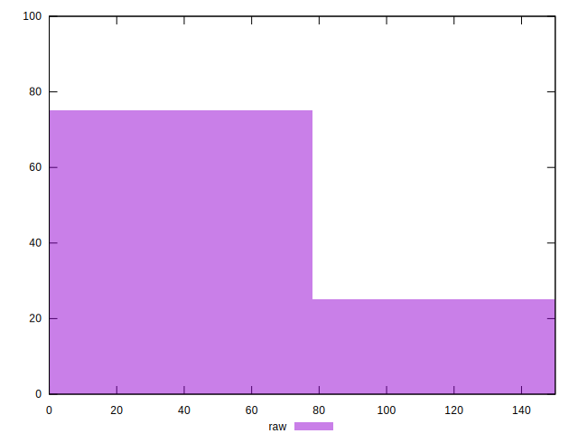
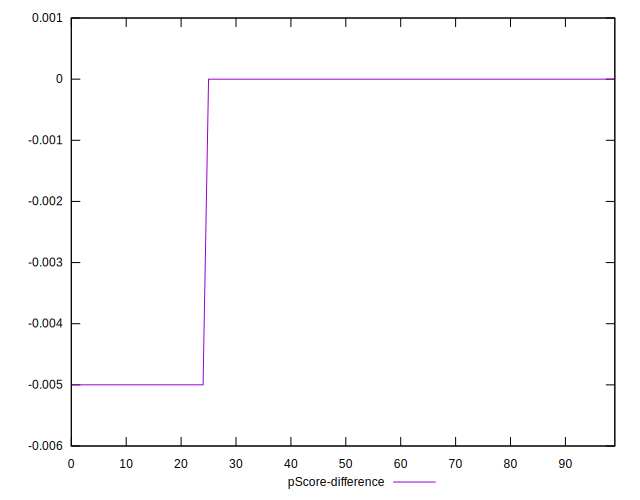

# //uses-webp-images/samples/pages+cached+noadtech+nomedia+nocss

[→ Parent](../..)


## Raw


```yaml
p90min: 0
p90max: 150
p90range: 150
p90mean: 35.1063829787234
median: 0
p90stdev: 63.50983641106078
mad: 0
stdevBySn: 0
lfitCenter: 24.79109524694071
lfitStdev: 51.87159545148937
mfitCenter: 24.79109524694071
mfitStdev: 65.01140396987927
mfitConfidence: 6.5011403969879265
p90skewness: 1.2562972690740195
p90eccentricity: 1.0000000000000027
p90discretization: 47
outlandishness: 1.1410123966942147

```


## Score


```yaml
p90min: 0.88
p90max: 1
p90range: 0.12
p90mean: 0.971914893617021
median: 1
p90stdev: 0.05080786912884868
mad: 0
stdevBySn: 0
lfitCenter: 0.9801671238024476
lfitStdev: 0.04149727636119133
mfitCenter: 0.9801671238024476
mfitStdev: 0.052009123175903206
mfitConfidence: 0.005200912317590321
p90skewness: -1.2562972690740033
p90eccentricity: 0.9999999999999996
p90discretization: 47
outlandishness: 0.9960634264555684

```


## Raw Estimate


## Score Estimate


## P Score


```yaml
p90min: 0.875
p90max: 1
p90range: 0.125
p90mean: 0.9707446808510638
median: 1
p90stdev: 0.052924863675884046
mad: 0
stdevBySn: 0
lfitCenter: 0.9793407539608829
lfitStdev: 0.04322632954290762
mfitCenter: 0.9793407539608829
mfitStdev: 0.05417616997489915
mfitConfidence: 0.005417616997489915
p90skewness: -1.2562972690740155
p90eccentricity: 1.0000000000000002
p90discretization: 47
outlandishness: 0.9958946331394258

```


## Score Difference


```yaml
p90min: 0
p90max: 0
p90range: 0
p90mean: 0
median: 0
p90stdev: 0
mad: 0
stdevBySn: 0
lfitCenter: 0
lfitStdev: 0
mfitCenter: 0
mfitStdev: 0
mfitConfidence: 0
p90skewness: .nan
p90eccentricity: .nan
p90discretization: 94
outlandishness: .nan

```


## P Score Difference


```yaml
p90min: -0.0050000000000000044
p90max: 0
p90range: 0.0050000000000000044
p90mean: -0.0011702127659574478
median: 0
p90stdev: 0.002116994547035362
mad: 0
stdevBySn: 0
lfitCenter: -0.0008263698415646911
lfitStdev: 0.0017290531817163149
mfitCenter: -0.0008263698415646911
mfitStdev: 0.0021670467989959785
mfitConfidence: 0.00021670467989959785
p90skewness: -1.256297269074019
p90eccentricity: 1.0000000000000024
p90discretization: 47
outlandishness: 1.1410123966942152

```

