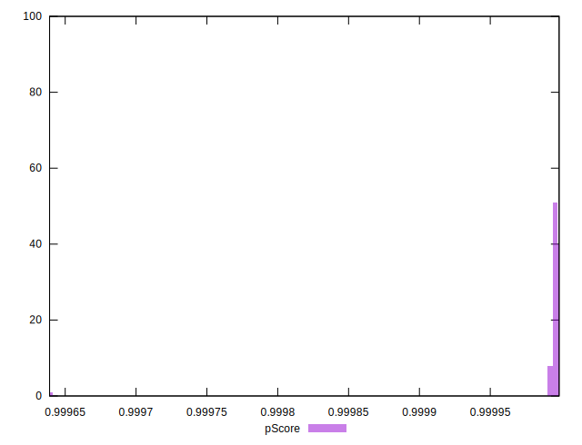
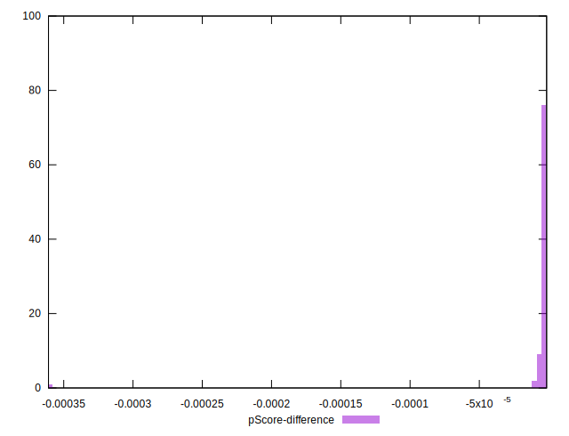

# //bootup-time/samples/pages+cached+noadtech+nomedia+nocss

[→ Parent](../..)


## Raw


```yaml
p90min: 91.024
p90max: 119.41600000000003
p90range: 28.392000000000024
p90mean: 100.65804255319149
median: 99.90599999999998
p90stdev: 6.7293743566717845
mad: 5.401999999999987
stdevBySn: 7.1699111999999845
lfitCenter: 101.10570450724255
lfitStdev: 6.22256635600308
mfitCenter: 101.10570450724255
mfitStdev: 7.798830392209971
mfitConfidence: 0.7798830392209971
p90skewness: 0.630847517354741
p90eccentricity: 0.9999999999999997
p90discretization: 1
outlandishness: 1.0316050418401774

```


## Score


```yaml
p90min: 1
p90max: 1
p90range: 0
p90mean: 1
median: 1
p90stdev: 0
mad: 0
stdevBySn: 0
lfitCenter: 1
lfitStdev: 0
mfitCenter: 1
mfitStdev: 0
mfitConfidence: 0
p90skewness: .nan
p90eccentricity: .nan
p90discretization: 94
outlandishness: 1

```


## Raw Estimate


## Score Estimate


## P Score


```yaml
p90min: 0.9999918404330272
p90max: 0.9999983914035677
p90range: 0.000006550970540475376
p90mean: 0.9999968217289166
median: 0.9999971559348921
p90stdev: 0.0000013916316202265858
mad: 8.959236809658044e-7
stdevBySn: 0.0000012281627874151215
lfitCenter: 0.9999952463830365
lfitStdev: 0.000004475961357012251
mfitCenter: 0.9999952463830365
mfitStdev: 0.00000560978565246613
mfitConfidence: 5.60978565246613e-7
p90skewness: -1.3718935357430961
p90eccentricity: 0.9999999999999999
p90discretization: 1
outlandishness: 0.999992701875163

```


## Score Difference


```yaml
p90min: 0
p90max: 0
p90range: 0
p90mean: 0
median: 0
p90stdev: 0
mad: 0
stdevBySn: 0
lfitCenter: 0
lfitStdev: 0
mfitCenter: 0
mfitStdev: 0
mfitConfidence: 0
p90skewness: .nan
p90eccentricity: .nan
p90discretization: 94
outlandishness: .nan

```


## P Score Difference


```yaml
p90min: -0.000008159566972754106
p90max: -0.0000016085964322787305
p90range: 0.000006550970540475376
p90mean: -0.000003178271083238261
median: -0.00000284406510786539
p90stdev: 0.0000013916316202265856
mad: 8.959236809658044e-7
stdevBySn: 0.0000012281627874151215
lfitCenter: -0.000004753616963835348
lfitStdev: 0.0000044759613573623415
mfitCenter: -0.000004753616963835348
mfitStdev: 0.000005609785652904903
mfitConfidence: 5.609785652904903e-7
p90skewness: -1.371893535908595
p90eccentricity: 0.9999999999999999
p90discretization: 1
outlandishness: 4.614447763072273

```

