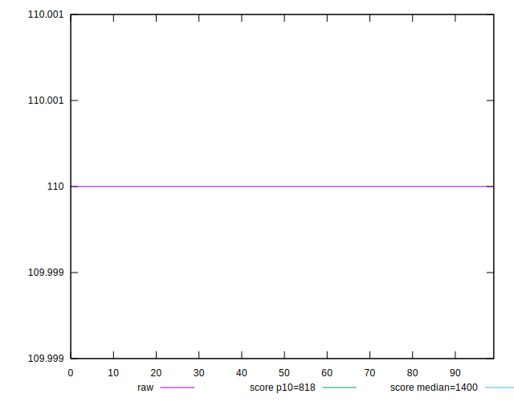
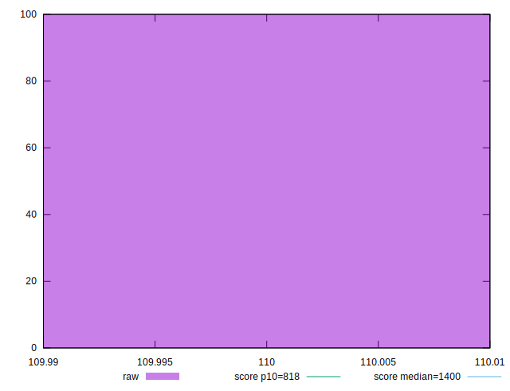
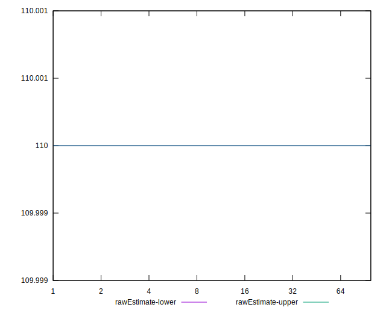
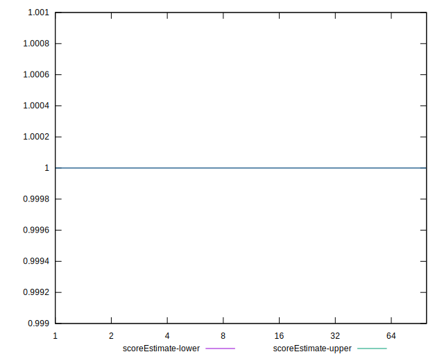
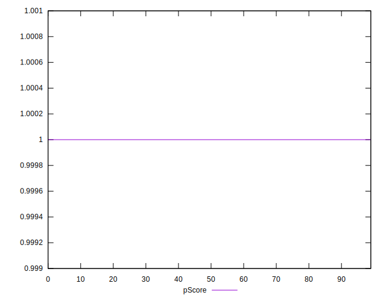
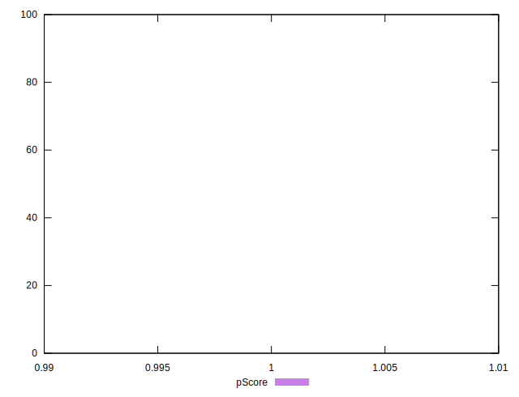

# //dom-size/samples/pages+cached+noadtech+nomedia+nocss

[→ Parent](../..)


## Raw


```yaml
p90min: 110
p90max: 110
p90range: 0
p90mean: 110
median: 110
p90stdev: 0
mad: 0
stdevBySn: 0
lfitCenter: 110
lfitStdev: 0
mfitCenter: 110
mfitStdev: 0
mfitConfidence: 0
p90skewness: .nan
p90eccentricity: .nan
p90discretization: 94
outlandishness: 1

```


## Score


```yaml
p90min: 1
p90max: 1
p90range: 0
p90mean: 1
median: 1
p90stdev: 0
mad: 0
stdevBySn: 0
lfitCenter: 1
lfitStdev: 0
mfitCenter: 1
mfitStdev: 0
mfitConfidence: 0
p90skewness: .nan
p90eccentricity: .nan
p90discretization: 94
outlandishness: 1

```


## Raw Estimate


## Score Estimate


## P Score


```yaml
p90min: 0.9999999993440427
p90max: 0.9999999993440427
p90range: 0
p90mean: 0.9999999993440415
median: 0.9999999993440427
p90stdev: 1.2212453270876722e-15
mad: 0
stdevBySn: 0
lfitCenter: 0.9999999993440415
lfitStdev: 0
mfitCenter: 0.9999999993440415
mfitStdev: 0
mfitConfidence: 0
p90skewness: 1
p90eccentricity: 1
p90discretization: 94
outlandishness: 1

```


## Score Difference


```yaml
p90min: 0
p90max: 0
p90range: 0
p90mean: 0
median: 0
p90stdev: 0
mad: 0
stdevBySn: 0
lfitCenter: 0
lfitStdev: 0
mfitCenter: 0
mfitStdev: 0
mfitConfidence: 0
p90skewness: .nan
p90eccentricity: .nan
p90discretization: 94
outlandishness: .nan

```


## P Score Difference


```yaml
p90min: -6.559572884867748e-10
p90max: -6.559572884867748e-10
p90range: 0
p90mean: -6.559572884867748e-10
median: -6.559572884867748e-10
p90stdev: 0
mad: 0
stdevBySn: 0
lfitCenter: -6.559572884867748e-10
lfitStdev: 0
mfitCenter: -6.559572884867748e-10
mfitStdev: 0
mfitConfidence: 0
p90skewness: .nan
p90eccentricity: .nan
p90discretization: 94
outlandishness: 1

```

