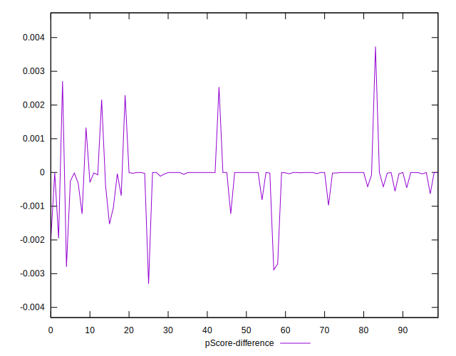

# //estimated-input-latency/samples/pages+cached

[→ Parent](../..)


## Raw


```yaml
p90min: 12.8
p90max: 56
p90range: 43.2
p90mean: 18.85049645390068
median: 15.300000000000093
p90stdev: 8.519296050196012
mad: 2.5000000000000924
stdevBySn: 3.0411300000001638
lfitCenter: 19.674891748118988
lfitStdev: 9.578882863541926
mfitCenter: 19.674891748118988
mfitStdev: 12.00534932464657
mfitConfidence: 1.200534932464657
p90skewness: 2.02067373206718
p90eccentricity: 0.9999999999999991
p90discretization: 1.7407407407407407
outlandishness: 1.5115112747674178

```


## Score


```yaml
p90min: 0.91
p90max: 1
p90range: 0.08999999999999997
p90mean: 0.9978723404255317
median: 1
p90stdev: 0.011000226344434523
mad: 0
stdevBySn: 0
lfitCenter: 0.9890168167994995
lfitStdev: 0.026417348690300314
mfitCenter: 0.9890168167994995
mfitStdev: 0.03310923661726242
mfitConfidence: 0.0033109236617262423
p90skewness: -6.3337652575804135
p90eccentricity: 1.000000000000001
p90discretization: 18.8
outlandishness: 0.9586038256781886

```


## Raw Estimate


## Score Estimate


## P Score


```yaml
p90min: 0.9137333244120289
p90max: 0.9999993380488856
p90range: 0.08626601363685671
p90mean: 0.9977031040765422
median: 0.9999949731846949
p90stdev: 0.01048849264396145
mad: 0.000004364864190753437
stdevBySn: 0.0000054182770106904035
lfitCenter: 0.9889056914834045
lfitStdev: 0.02624225219658019
mfitCenter: 0.9889056914834045
mfitStdev: 0.03288978570606779
mfitConfidence: 0.0032889785706067794
p90skewness: -6.346048952970954
p90eccentricity: 1.0000000000000009
p90discretization: 1.8431372549019607
outlandishness: 0.9586756590586698

```


## Score Difference


```yaml
p90min: 0
p90max: 0
p90range: 0
p90mean: 0
median: 0
p90stdev: 0
mad: 0
stdevBySn: 0
lfitCenter: 0
lfitStdev: 0
mfitCenter: 0
mfitStdev: 0
mfitConfidence: 0
p90skewness: .nan
p90eccentricity: .nan
p90discretization: 94
outlandishness: .nan

```


## P Score Difference


```yaml
p90min: -0.002711180355898235
p90max: 0.0022928255122822983
p90range: 0.005004005868180533
p90mean: -0.00013720296145632371
median: -0.000001773399132931619
p90stdev: 0.0006128033811200656
mad: 0.0000032534161722441723
stdevBySn: 0.0000054182770106904035
lfitCenter: -0.0000843505680152965
lfitStdev: 0.0003437289604600481
mfitCenter: -0.0000843505680152965
mfitStdev: 0.0004308003659828285
mfitConfidence: 0.00004308003659828285
p90skewness: -0.33013034871190977
p90eccentricity: 0.9999999999999976
p90discretization: 1.9583333333333333
outlandishness: 0.8853357853120036

```

