# //first-cpu-idle/samples/pages+cached+noadtech

[→ Parent](../..)


## Raw


```yaml
p90min: 1902.4739999999997
p90max: 2064.5838999999996
p90range: 162.10989999999993
p90mean: 1916.9673249999998
median: 1911.696
p90stdev: 22.82048876210398
mad: 5.10554999999988
stdevBySn: 7.453004624999849
lfitCenter: 1918.4746755249387
lfitStdev: 15.439645131918939
mfitCenter: 1918.4746755249387
mfitStdev: 19.35072553843997
mfitConfidence: 1.935072553843997
p90skewness: 5.579135208291796
p90eccentricity: 0.9999999999999997
p90discretization: 1
outlandishness: 1.007845211406352

```

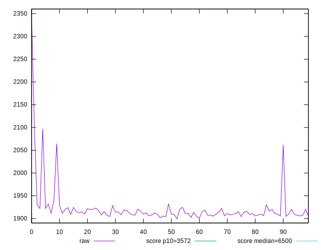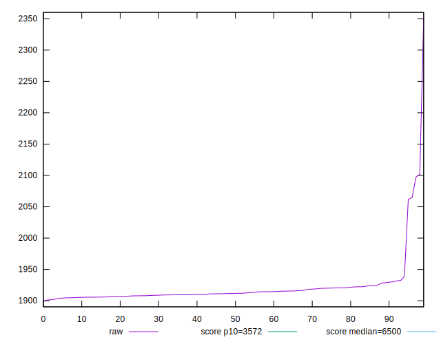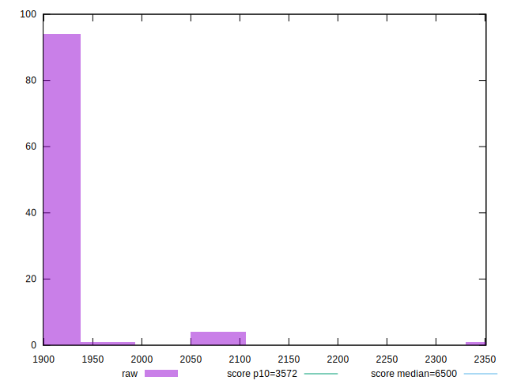
## Score


```yaml
p90min: 0.99
p90max: 1
p90range: 0.010000000000000009
p90mean: 0.9997872340425532
median: 1
p90stdev: 0.0014430489325798455
mad: 0
stdevBySn: 0
lfitCenter: 0.9997545013928887
lfitStdev: 0.0006002664107248266
mfitCenter: 0.9997545013928887
mfitStdev: 0.0007523223794740765
mfitConfidence: 0.00007523223794740765
p90skewness: -6.63488802697019
p90eccentricity: 1.0000000000000022
p90discretization: 47
outlandishness: 0.9994254922001444

```

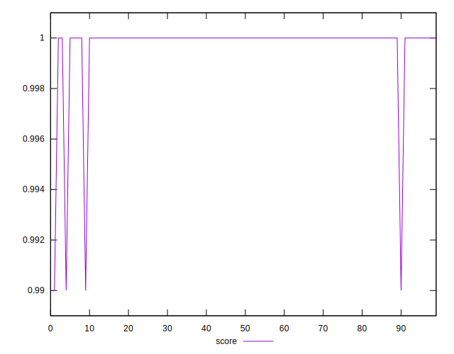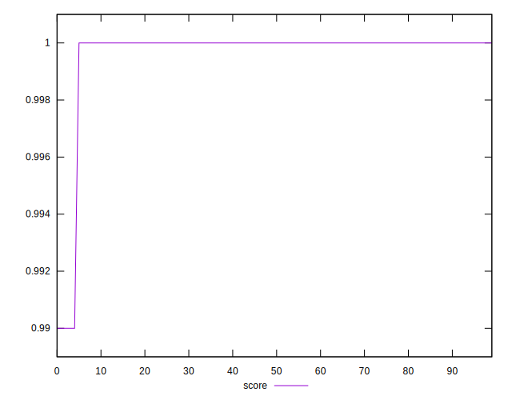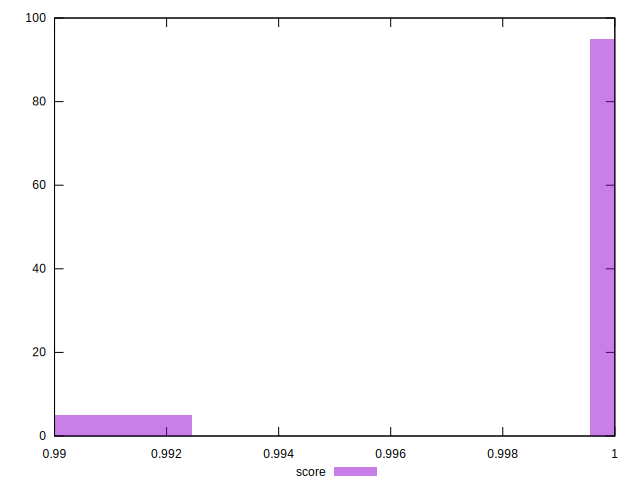
## Raw Estimate

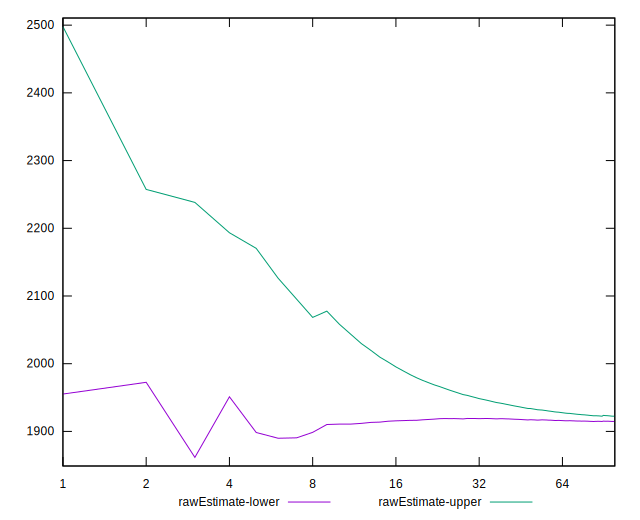
## Score Estimate

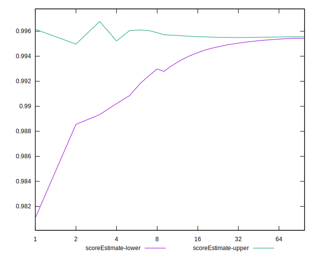
## P Score


```yaml
p90min: 0.9929566375940215
p90max: 0.995731877338917
p90range: 0.0027752397448954635
p90mean: 0.9955138503341217
median: 0.9956001329562361
p90stdev: 0.0003885968005697211
mad: 0.00007340782454351436
stdevBySn: 0.00010784311407405721
lfitCenter: 0.9954720858455919
lfitStdev: 0.0002838008702938413
mfitCenter: 0.9954720858455919
mfitStdev: 0.0003556916432796259
mfitConfidence: 0.00003556916432796259
p90skewness: -5.84519335496158
p90eccentricity: 1.0000000000000002
p90discretization: 1
outlandishness: 0.9996762065214883

```

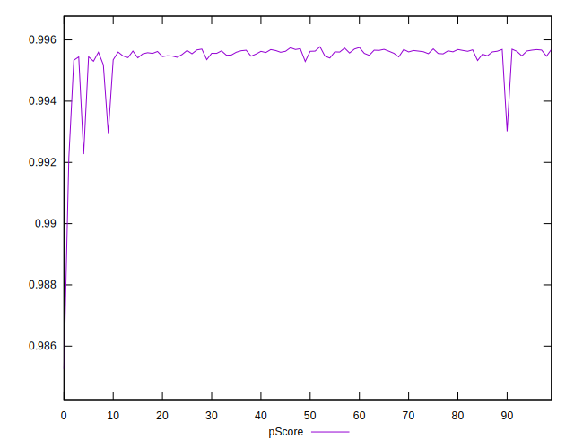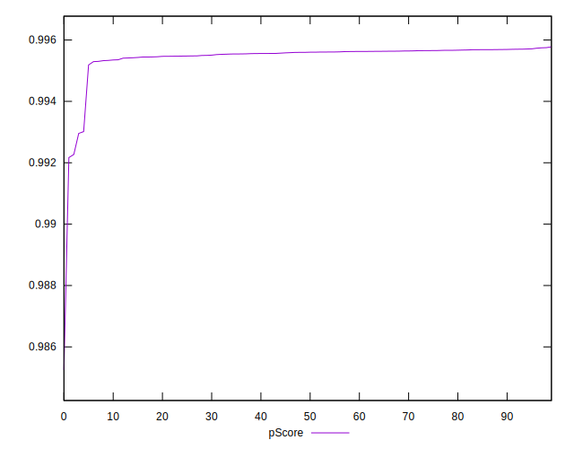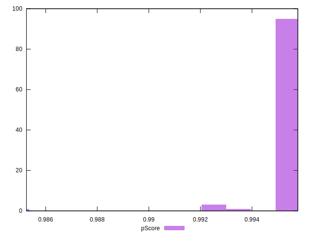
## Score Difference


```yaml
p90min: 0
p90max: 0
p90range: 0
p90mean: 0
median: 0
p90stdev: 0
mad: 0
stdevBySn: 0
lfitCenter: 0
lfitStdev: 0
mfitCenter: 0
mfitStdev: 0
mfitConfidence: 0
p90skewness: .nan
p90eccentricity: .nan
p90discretization: 94
outlandishness: .nan

```


## P Score Difference


```yaml
p90min: -0.004696861070724645
p90max: 0.0021695798985899017
p90range: 0.006866440969314547
p90mean: -0.00434799726674306
median: -0.004391847372899549
p90stdev: 0.0006837203979981042
mad: 0.00007290006273263927
stdevBySn: 0.00010784311407405721
lfitCenter: -0.004279242426087942
lfitStdev: 0.0003353230688537192
mfitCenter: -0.004279242426087942
mfitStdev: 0.0004202651431852739
mfitConfidence: 0.00004202651431852739
p90skewness: 9.204507171706435
p90eccentricity: 1.0000000000000002
p90discretization: 1
outlandishness: 0.9098280533785594

```

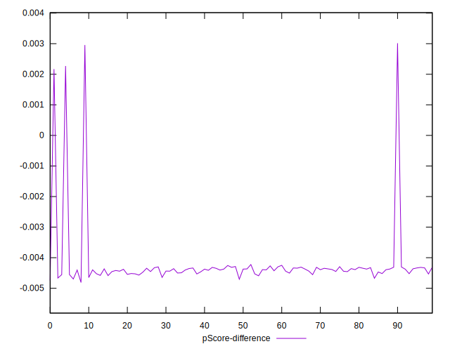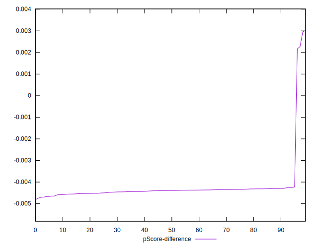