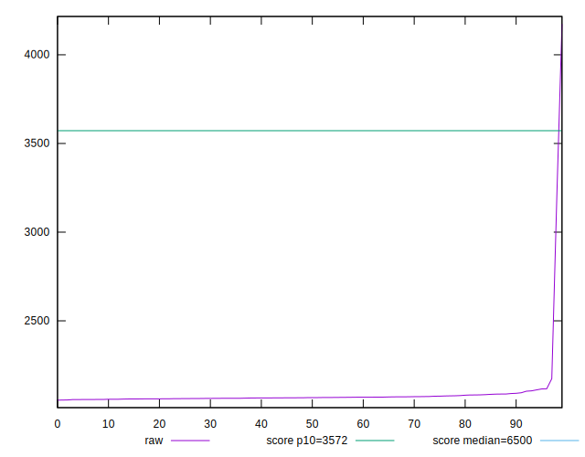
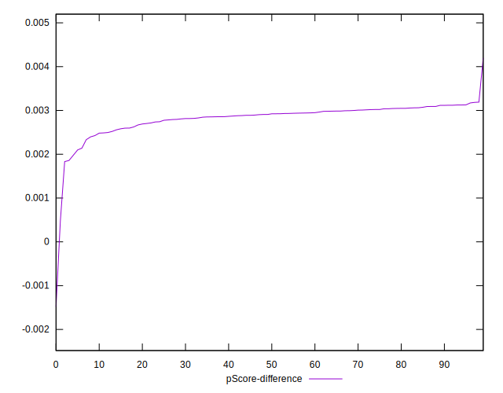

# //first-cpu-idle/samples/pages+cached

[→ Parent](../..)


## Raw


```yaml
p90min: 2056.13
p90max: 2117.048
p90range: 60.917999999999665
p90mean: 2070.429130319149
median: 2067.002
p90stdev: 12.954879178231053
mad: 6.225299999999834
stdevBySn: 9.16334210000025
lfitCenter: 2084.5952587123293
lfitStdev: 41.15980250755678
mfitCenter: 2084.5952587123293
mfitStdev: 51.58616242374308
mfitConfidence: 5.1586162423743085
p90skewness: 1.7108870783041732
p90eccentricity: 1.0000000000000002
p90discretization: 1
outlandishness: 1.0321200664279362

```


## Score


```yaml
p90min: 0.99
p90max: 0.99
p90range: 0
p90mean: 0.9899999999999988
median: 0.99
p90stdev: 1.2212453270876722e-15
mad: 0
stdevBySn: 0
lfitCenter: 0.9889687747248522
lfitStdev: 0.002560520036227056
mfitCenter: 0.9889687747248522
mfitStdev: 0.0032091359635121348
mfitConfidence: 0.00032091359635121346
p90skewness: 1
p90eccentricity: 1
p90discretization: 94
outlandishness: 0.99556049382716

```


## Raw Estimate


## Score Estimate


## P Score


```yaml
p90min: 0.9918321486742161
p90max: 0.993126886947536
p90range: 0.0012947382733199397
p90mean: 0.9928336124559217
median: 0.9929073913160755
p90stdev: 0.00027255042099179187
mad: 0.00012709022219370425
stdevBySn: 0.00018737862076393565
lfitCenter: 0.9918112893019472
lfitStdev: 0.0026111440328265988
mfitCenter: 0.9918112893019472
mfitStdev: 0.003272583734201598
mfitConfidence: 0.0003272583734201598
p90skewness: -1.7920555734524843
p90eccentricity: 1.0000000000000007
p90discretization: 1
outlandishness: 0.9954874413000284

```


## Score Difference


```yaml
p90min: 0
p90max: 0
p90range: 0
p90mean: 0
median: 0
p90stdev: 0
mad: 0
stdevBySn: 0
lfitCenter: 5.166535369026208e-19
lfitStdev: 1.2890316797319448e-18
mfitCenter: 5.166535369026208e-19
mfitStdev: 1.6155616292812394e-18
mfitConfidence: 1.6155616292812395e-19
p90skewness: .nan
p90eccentricity: .nan
p90discretization: 94
outlandishness: .inf

```


## P Score Difference


```yaml
p90min: 0.0018575703725028925
p90max: 0.0031711415297135392
p90range: 0.0013135711572106468
p90mean: 0.0028478570607670625
median: 0.0029153575463509718
p90stdev: 0.00025421120285702253
mad: 0.00012302311058182136
stdevBySn: 0.00018737862076393565
lfitCenter: 0.0028462600151829857
lfitStdev: 0.00022740696189275385
mfitCenter: 0.0028462600151829857
mfitStdev: 0.0002850123605509472
mfitConfidence: 0.00002850123605509472
p90skewness: -1.7015121556137682
p90eccentricity: 0.9999999999999999
p90discretization: 1
outlandishness: 0.9604479593931239

```

