# //interactive/samples/pages+cached+noadtech

[→ Parent](../..)


## Raw


```yaml
p90min: 4207.0560000000005
p90max: 4612.605999999999
p90range: 405.54999999999836
p90mean: 4334.758062183216
median: 4331.449543628192
p90stdev: 40.36130651811298
mad: 4.428406371807796
stdevBySn: 8.633678624999046
lfitCenter: 4362.594974062703
lfitStdev: 84.65175537114219
mfitCenter: 4362.594974062703
mfitStdev: 106.09524186198338
mfitConfidence: 10.609524186198339
p90skewness: 3.5099100719138505
p90eccentricity: 1.0000000000000002
p90discretization: 1
outlandishness: 1.0285585146095941

```

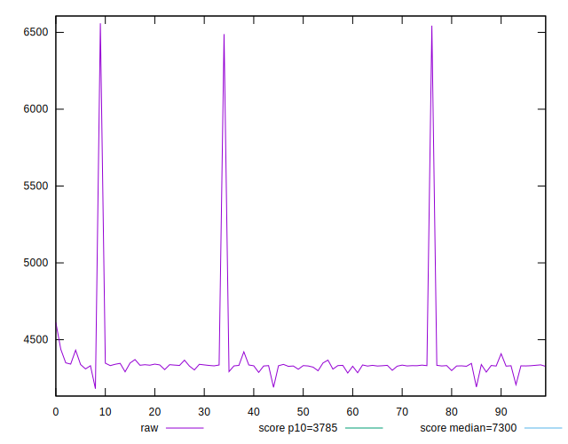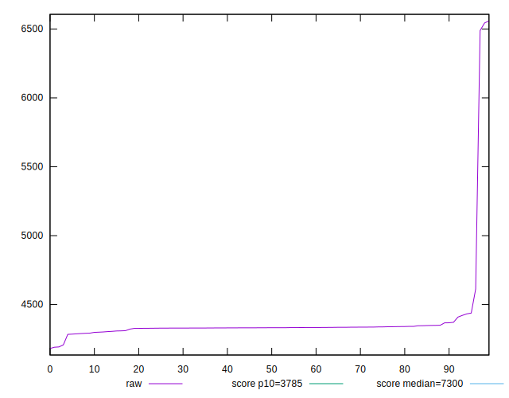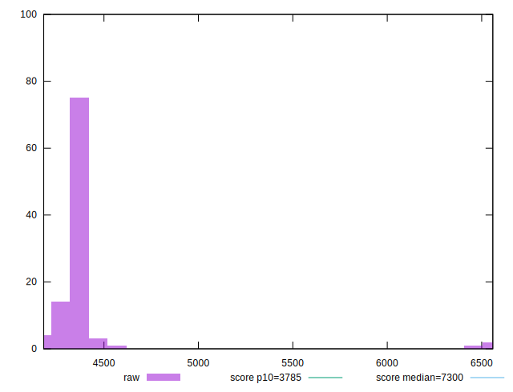
## Score


```yaml
p90min: 0.81
p90max: 0.86
p90range: 0.04999999999999993
p90mean: 0.8475531914893616
median: 0.85
p90stdev: 0.006134341805675952
mad: 0
stdevBySn: 0
lfitCenter: 0.8448723571943312
lfitStdev: 0.01155621864584405
mfitCenter: 0.8448723571943312
mfitStdev: 0.01448357221731932
mfitConfidence: 0.001448357221731932
p90skewness: -3.1180909405156267
p90eccentricity: 1.0000000000000058
p90discretization: 18.8
outlandishness: 0.9822558974560066

```

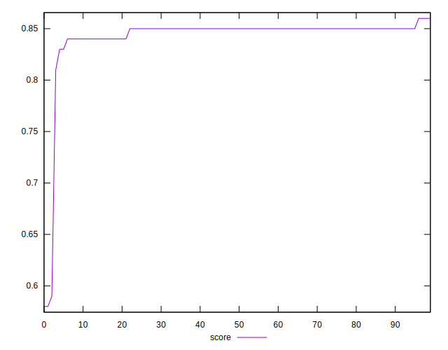
## Raw Estimate

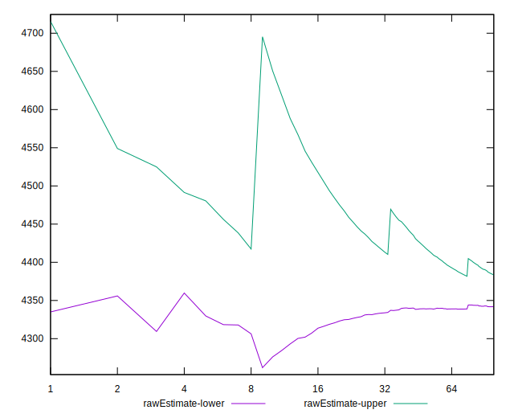
## Score Estimate

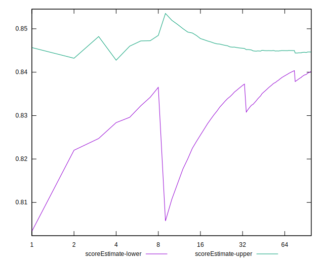
## P Score


```yaml
p90min: 0.8147996989686468
p90max: 0.858876276148266
p90range: 0.044076577179619214
p90mean: 0.8453902120973332
median: 0.845763282244443
p90stdev: 0.004385177988631293
mad: 0.0004740250770418064
stdevBySn: 0.0009237186015890378
lfitCenter: 0.8420672599984147
lfitStdev: 0.009899448623600189
mfitCenter: 0.8420672599984147
mfitStdev: 0.012407118924071158
mfitConfidence: 0.001240711892407116
p90skewness: -3.6742314141356887
p90eccentricity: 0.9999999999999996
p90discretization: 1
outlandishness: 0.9827665355785122

```

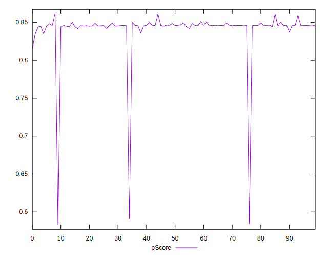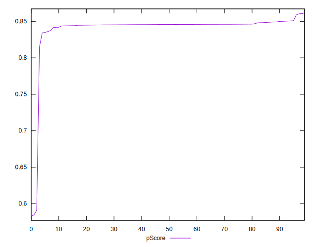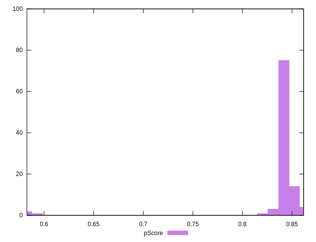
## Score Difference


```yaml
p90min: 0
p90max: 0
p90range: 0
p90mean: 0
median: 0
p90stdev: 0
mad: 0
stdevBySn: 0
lfitCenter: 1.0470608452365924e-18
lfitStdev: 2.5998395675404994e-18
mfitCenter: 1.0470608452365924e-18
mfitStdev: 3.2584156880294808e-18
mfitConfidence: 3.258415688029481e-19
p90skewness: .nan
p90eccentricity: .nan
p90discretization: 94
outlandishness: .inf

```

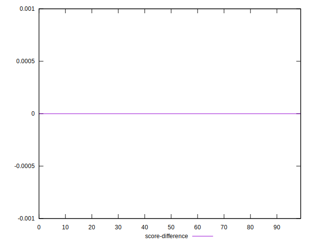
## P Score Difference


```yaml
p90min: -0.004860802316176138
p90max: 0.004822410969485658
p90range: 0.009683213285661796
p90mean: -0.0020468820848875643
median: -0.003953125595023532
p90stdev: 0.0031123561957090546
mad: 0.0006801784793104004
stdevBySn: 0.0009218211836395054
lfitCenter: -0.0024794555780884952
lfitStdev: 0.0027847534795043174
mfitCenter: -0.0024794555780884952
mfitStdev: 0.0034901709083132496
mfitConfidence: 0.00034901709083132496
p90skewness: 1.059023584426592
p90eccentricity: 0.9999999999999991
p90discretization: 1
outlandishness: 0.8853252598386309

```

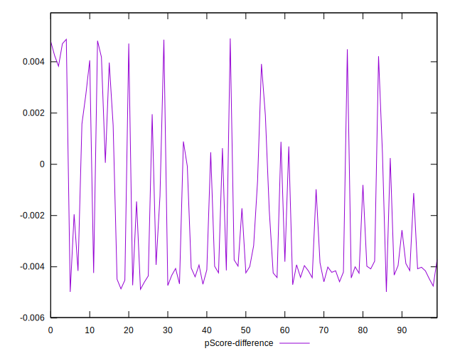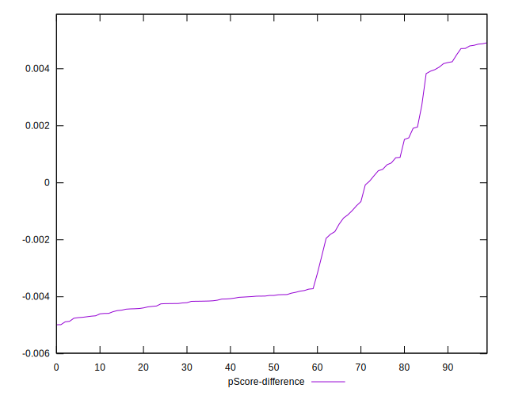