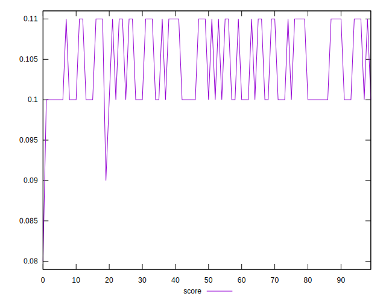
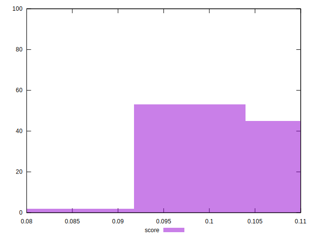

# //interactive/samples/pages+cached

[→ Parent](../..)


## Raw


```yaml
p90min: 13774.792849999998
p90max: 14127.585
p90range: 352.79215000000113
p90mean: 13899.215582978726
median: 13888.5534
p90stdev: 70.04546479728901
mad: 54.740099999999074
stdevBySn: 84.59338393999897
lfitCenter: 13904.341708708784
lfitStdev: 72.87417915967957
mfitCenter: 13904.341708708784
mfitStdev: 91.3342390779934
mfitConfidence: 9.13342390779934
p90skewness: 0.5589626371221756
p90eccentricity: 0.9999999999999999
p90discretization: 1
outlandishness: 1.0025226182195754

```


## Score


```yaml
p90min: 0.1
p90max: 0.11
p90range: 0.009999999999999995
p90mean: 0.10446808510638289
median: 0.1
p90stdev: 0.0049716261470416695
mad: 0
stdevBySn: 0
lfitCenter: 0.10400345438661204
lfitStdev: 0.006229345137833087
mfitCenter: 0.10400345438661204
mfitStdev: 0.007807326335319845
mfitConfidence: 0.0007807326335319845
p90skewness: 0.21398024625550288
p90eccentricity: 0.9999999999999999
p90discretization: 47
outlandishness: 0.99487420244648

```


## Raw Estimate


## Score Estimate


## P Score


```yaml
p90min: 0.09883180602001423
p90max: 0.10769222292213498
p90range: 0.008860416902120749
p90mean: 0.10449378394731222
median: 0.104749875929144
p90stdev: 0.0017731975408020381
mad: 0.0013864794925636525
stdevBySn: 0.00215213799883838
lfitCenter: 0.10438690226120469
lfitStdev: 0.0018085486113830972
mfitCenter: 0.10438690226120469
mfitStdev: 0.0022666795449495817
mfitConfidence: 0.00022666795449495817
p90skewness: -0.5182026373946373
p90eccentricity: 1
p90discretization: 1
outlandishness: 0.9926468711483885

```


## Score Difference


```yaml
p90min: 0
p90max: 0
p90range: 0
p90mean: 0
median: 0
p90stdev: 0
mad: 0
stdevBySn: 0
lfitCenter: 0
lfitStdev: 0
mfitCenter: 0
mfitStdev: 0
mfitConfidence: 0
p90skewness: .nan
p90eccentricity: .nan
p90discretization: 94
outlandishness: .nan

```


## P Score Difference


```yaml
p90min: -0.004586563371507715
p90max: 0.004778704668545991
p90range: 0.009365268040053706
p90mean: -0.00010085193582678403
median: 0.0009341676840750879
p90stdev: 0.003500060039310622
mad: 0.003586688760300716
stdevBySn: 0.004321525441887602
lfitCenter: -0.00008772361894117284
lfitStdev: 0.003814284272187449
mfitCenter: -0.00008772361894117284
mfitStdev: 0.004780496406883032
mfitConfidence: 0.0004780496406883032
p90skewness: -0.00791487477305888
p90eccentricity: 1.0000000000000004
p90discretization: 1
outlandishness: 0.8160129456911849

```

