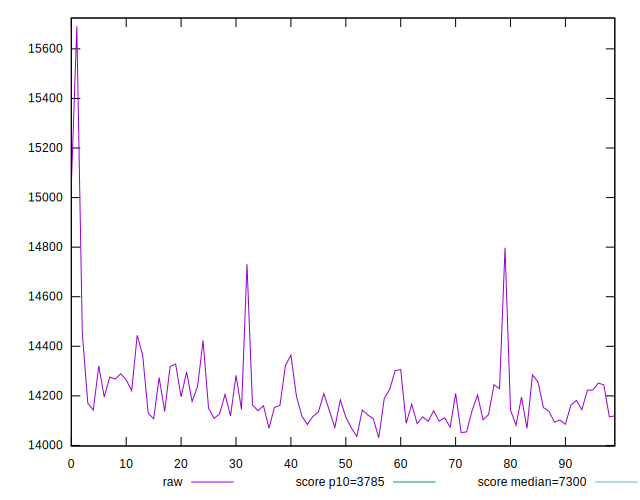
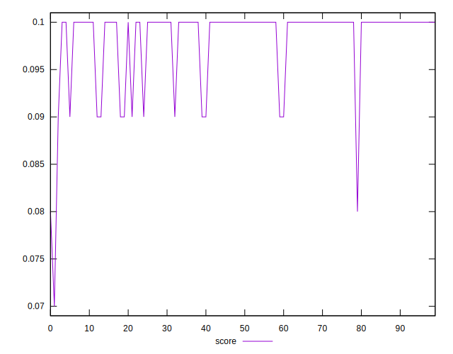
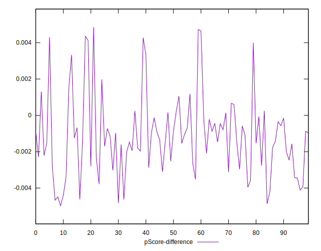

# //interactive/samples/pages

[→ Parent](../..)


## Raw


```yaml
p90min: 14054.572
p90max: 14731.076499999996
p90range: 676.5044999999955
p90mean: 14189.799540425534
median: 14160.649249999997
p90stdev: 104.64228024418964
mad: 59.143750000002
stdevBySn: 90.81231590000198
lfitCenter: 14192.276222669212
lfitStdev: 95.32468330987749
mfitCenter: 14192.276222669212
mfitStdev: 119.47177334760994
mfitConfidence: 11.947177334760994
p90skewness: 1.93590378767983
p90eccentricity: 1.0000000000000004
p90discretization: 1
outlandishness: 1.003549713677889

```


## Score


```yaml
p90min: 0.09
p90max: 0.1
p90range: 0.010000000000000009
p90mean: 0.09861702127659557
median: 0.1
p90stdev: 0.0034521235616144616
mad: 0
stdevBySn: 0
lfitCenter: 0.09889030132394215
lfitStdev: 0.002525751470539962
mfitCenter: 0.09889030132394215
mfitStdev: 0.00316556002855847
mfitConfidence: 0.00031655600285584697
p90skewness: -2.0955340746285094
p90eccentricity: 0.9999999999999992
p90discretization: 47
outlandishness: 0.9875256624645509

```


## Raw Estimate


## Score Estimate


## P Score


```yaml
p90min: 0.08536654156010642
p90max: 0.1006023520276027
p90range: 0.01523581046749628
p90mean: 0.09737999530659333
median: 0.09804052205563712
p90stdev: 0.0024169510281768607
mad: 0.0014092490509303168
stdevBySn: 0.0021630758940174794
lfitCenter: 0.09735195502558279
lfitStdev: 0.0021749521516235618
mfitCenter: 0.09735195502558279
mfitStdev: 0.0027258982823574903
mfitConfidence: 0.00027258982823574903
p90skewness: -1.766024525315521
p90eccentricity: 0.9999999999999994
p90discretization: 1
outlandishness: 0.9896386962079871

```


## Score Difference


```yaml
p90min: 0
p90max: 0
p90range: 0
p90mean: 0
median: 0
p90stdev: 0
mad: 0
stdevBySn: 0
lfitCenter: 0
lfitStdev: 0
mfitCenter: 0
mfitStdev: 0
mfitConfidence: 0
p90skewness: .nan
p90eccentricity: .nan
p90discretization: 94
outlandishness: .nan

```


## P Score Difference


```yaml
p90min: -0.004668036603112963
p90max: 0.004352184709662893
p90range: 0.009020221312775856
p90mean: -0.001192965362241254
median: -0.00140911570954258
p90stdev: 0.0020833016054997177
mad: 0.001273131600517341
stdevBySn: 0.0019702238552163623
lfitCenter: -0.001235058302671176
lfitStdev: 0.00152299879798505
mfitCenter: -0.001235058302671176
mfitStdev: 0.0019087959265498885
mfitConfidence: 0.00019087959265498886
p90skewness: 0.8004356539937435
p90eccentricity: 1.0000000000000009
p90discretization: 1
outlandishness: 0.8905835350108048

```

