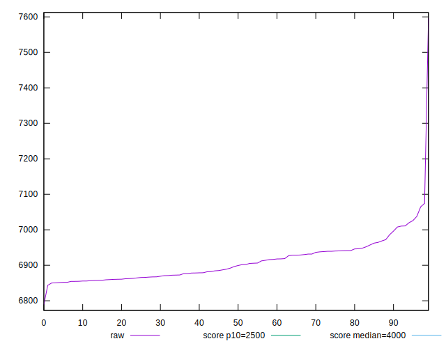

# //largest-contentful-paint/samples/pages+cached+noadtech+nomedia

[→ Parent](../..)


## Raw


```yaml
p90min: 6850.533800000001
p90max: 7037.7485000000015
p90range: 187.21470000000045
p90mean: 6906.811612257183
median: 6897.916499999999
p90stdev: 46.966482935004414
mad: 37.20427391246267
stdevBySn: 53.51695601250035
lfitCenter: 6906.994460893848
lfitStdev: 46.02587521861256
mfitCenter: 6906.994460893848
mfitStdev: 57.684880151851246
mfitConfidence: 5.768488015185125
p90skewness: 0.8319759016573886
p90eccentricity: 1.0000000000000002
p90discretization: 1
outlandishness: 1.0022513301848381

```


## Score


```yaml
p90min: 0.06
p90max: 0.07
p90range: 0.010000000000000009
p90mean: 0.06904255319148943
median: 0.07
p90stdev: 0.0029424078055190106
mad: 0
stdevBySn: 0
lfitCenter: 0.0692566594565609
lfitStdev: 0.001742115295986627
mfitCenter: 0.0692566594565609
mfitStdev: 0.0021834177314906645
mfitConfidence: 0.00021834177314906646
p90skewness: -2.7477857990363463
p90eccentricity: 1.0000000000000009
p90discretization: 47
outlandishness: 0.9872213636719761

```


## Raw Estimate


## Score Estimate


## P Score


```yaml
p90min: 0.061711951607113236
p90max: 0.07118207521308717
p90range: 0.009470123605973935
p90mean: 0.06823894426826678
median: 0.0686609773551933
p90stdev: 0.002406770243911172
mad: 0.001972137538775648
stdevBySn: 0.0027729454461445165
lfitCenter: 0.06825830794537885
lfitStdev: 0.0023228900505321603
mfitCenter: 0.06825830794537885
mfitStdev: 0.002911310942690958
mfitConfidence: 0.0002911310942690958
p90skewness: -0.7679781622289013
p90eccentricity: 1
p90discretization: 1
outlandishness: 0.9908030916576408

```


## Score Difference


```yaml
p90min: 0
p90max: 0
p90range: 0
p90mean: 0
median: 0
p90stdev: 0
mad: 0
stdevBySn: 0
lfitCenter: 0
lfitStdev: 0
mfitCenter: 0
mfitStdev: 0
mfitConfidence: 0
p90skewness: .nan
p90eccentricity: .nan
p90discretization: 94
outlandishness: .nan

```


## P Score Difference


```yaml
p90min: -0.004383828902942699
p90max: 0.0036936971420980513
p90range: 0.00807752604504075
p90mean: -0.0007117838331267111
median: -0.0002582714253296925
p90stdev: 0.0019347234608016969
mad: 0.001363435886873543
stdevBySn: 0.0021615495869573417
lfitCenter: -0.0006102334764302716
lfitStdev: 0.001739811581624644
mfitCenter: -0.0006102334764302716
mfitStdev: 0.002180530453709549
mfitConfidence: 0.0002180530453709549
p90skewness: -0.11478043437000704
p90eccentricity: 1.0000000000000007
p90discretization: 1
outlandishness: 0.9008446096412895

```

