# //mainthread-work-breakdown/samples/pages+cached+noadtech

[→ Parent](../..)


## Raw


```yaml
p90min: 582.5080000000007
p90max: 748.0560000000008
p90range: 165.54800000000012
p90mean: 631.3080000000006
median: 622.5120000000006
p90stdev: 36.864064037510964
mad: 22.543999999999755
stdevBySn: 33.78516540000001
lfitCenter: 629.518492797913
lfitStdev: 29.762292073341392
mfitCenter: 629.518492797913
mfitStdev: 37.301501451966175
mfitConfidence: 3.7301501451966175
p90skewness: 1.2981869866176006
p90eccentricity: 1
p90discretization: 1
outlandishness: 1.0088202662238535

```

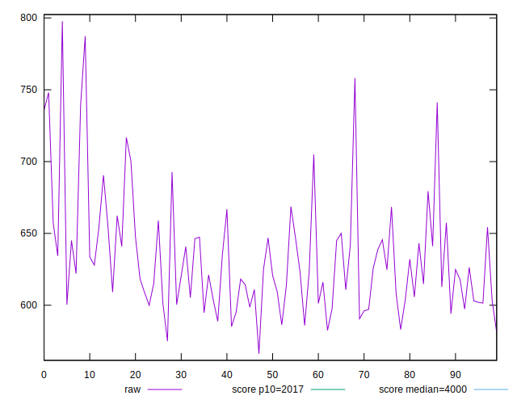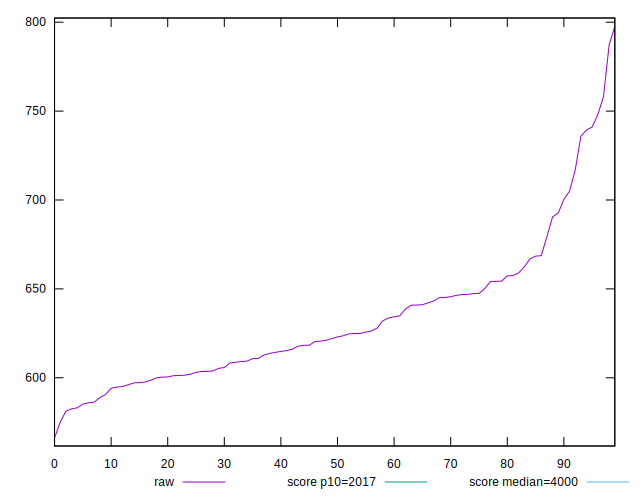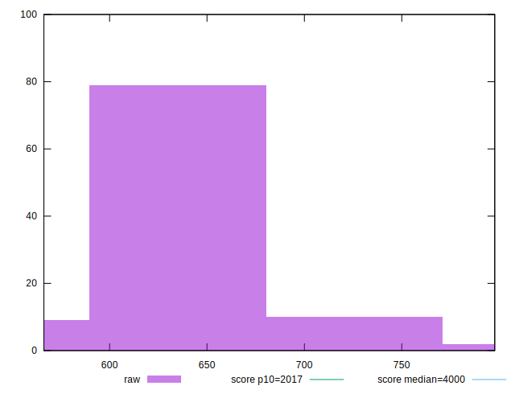
## Score


```yaml
p90min: 1
p90max: 1
p90range: 0
p90mean: 1
median: 1
p90stdev: 0
mad: 0
stdevBySn: 0
lfitCenter: 1
lfitStdev: 0
mfitCenter: 1
mfitStdev: 0
mfitConfidence: 0
p90skewness: .nan
p90eccentricity: .nan
p90discretization: 94
outlandishness: 1

```


## Raw Estimate

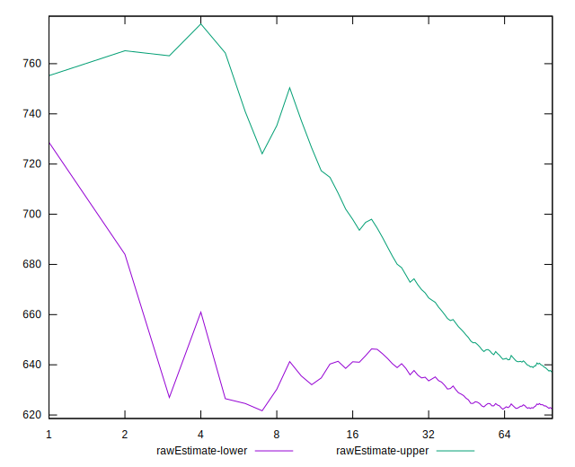
## Score Estimate

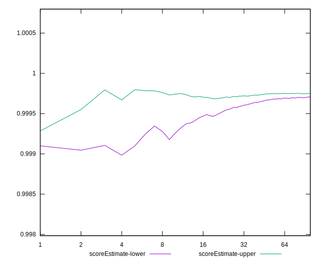
## P Score


```yaml
p90min: 0.9991497377360355
p90max: 0.9998446674625059
p90range: 0.0006949297264703391
p90mean: 0.9997059096699258
median: 0.9997510918327044
p90stdev: 0.00014359696058505354
mad: 0.00006118537848209815
stdevBySn: 0.00009160401456336065
lfitCenter: 0.9997129938332633
lfitStdev: 0.00010776193213494143
mfitCenter: 0.9997129938332633
mfitStdev: 0.00013505955314505828
mfitConfidence: 0.000013505955314505828
p90skewness: -2.1482239388742372
p90eccentricity: 0.9999999999999999
p90discretization: 1
outlandishness: 0.9999594058185746

```

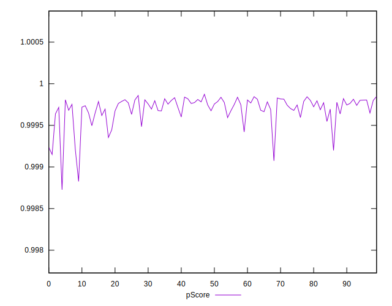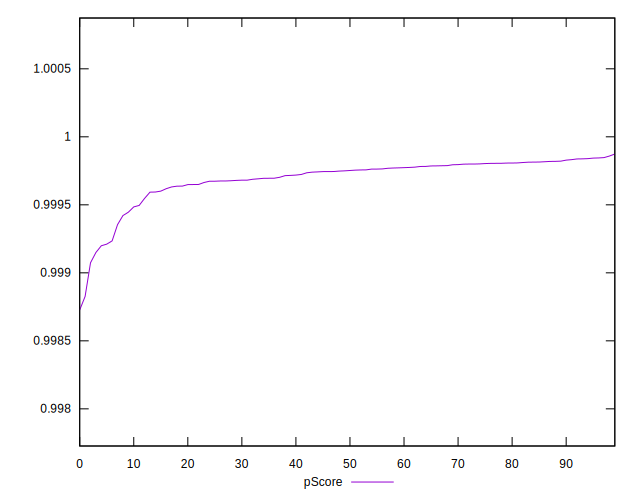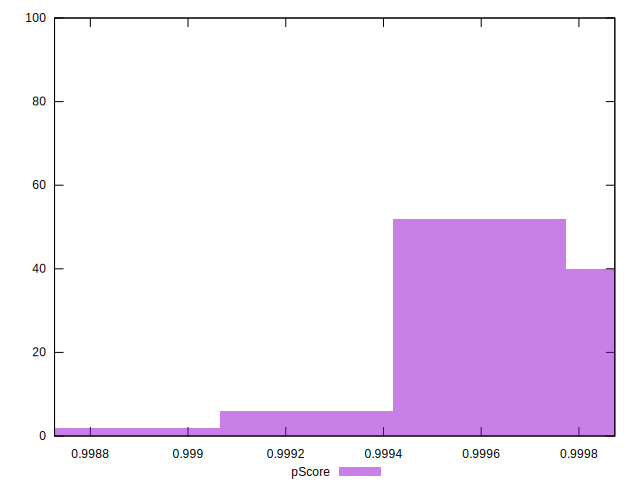
## Score Difference


```yaml
p90min: 0
p90max: 0
p90range: 0
p90mean: 0
median: 0
p90stdev: 0
mad: 0
stdevBySn: 0
lfitCenter: 0
lfitStdev: 0
mfitCenter: 0
mfitStdev: 0
mfitConfidence: 0
p90skewness: .nan
p90eccentricity: .nan
p90discretization: 94
outlandishness: .nan

```


## P Score Difference


```yaml
p90min: -0.0008502622639644519
p90max: -0.0001553325374941128
p90range: 0.0006949297264703391
p90mean: -0.0002940903300741569
median: -0.00024890816729561394
p90stdev: 0.00014359696058505354
mad: 0.00006118537848209815
stdevBySn: 0.00009160401456336065
lfitCenter: -0.00028700616673695033
lfitStdev: 0.00010776193213505316
mfitCenter: -0.00028700616673695033
mfitStdev: 0.0001350595531451983
mfitConfidence: 0.00001350595531451983
p90skewness: -2.1482239388661672
p90eccentricity: 0.9999999999999996
p90discretization: 1
outlandishness: 1.1427544185141543

```

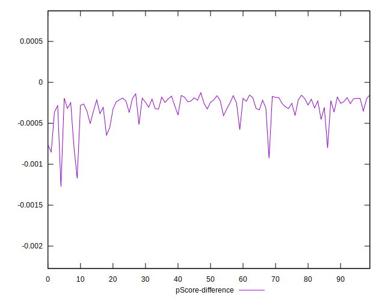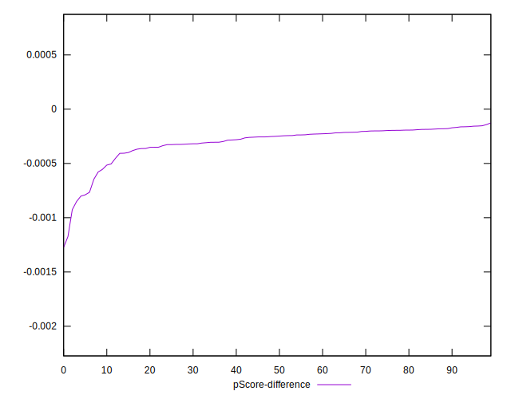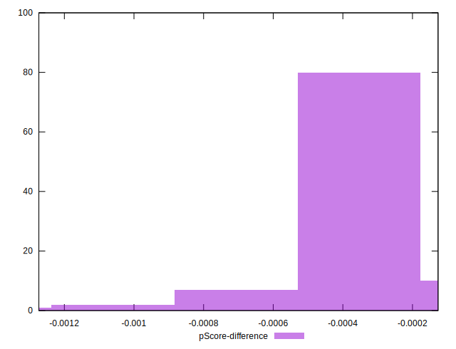