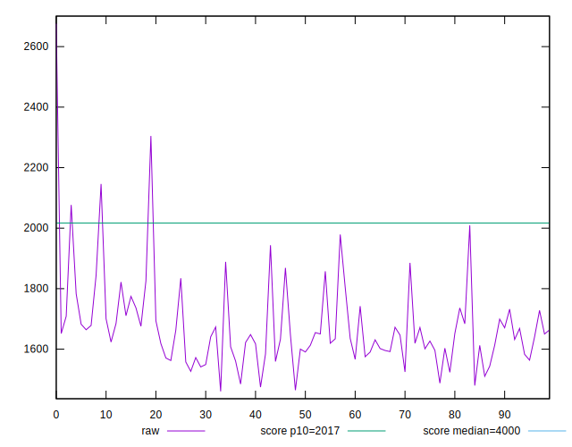
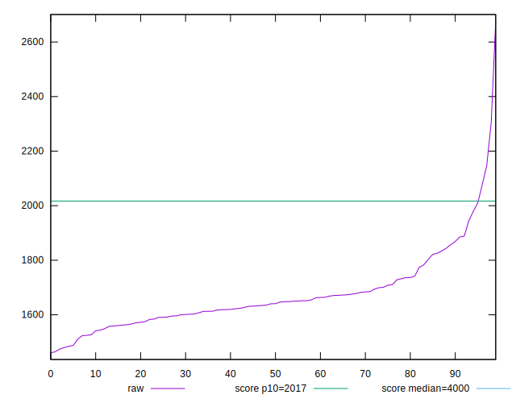
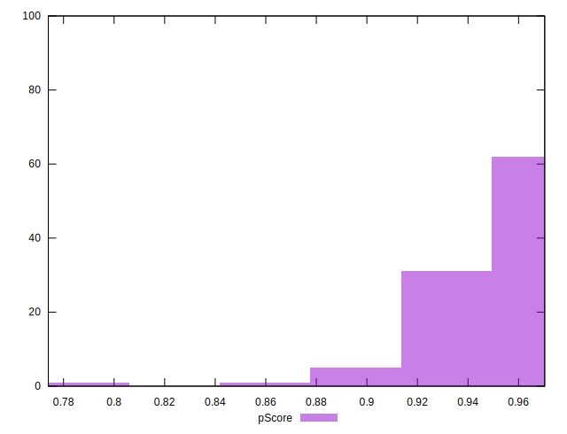
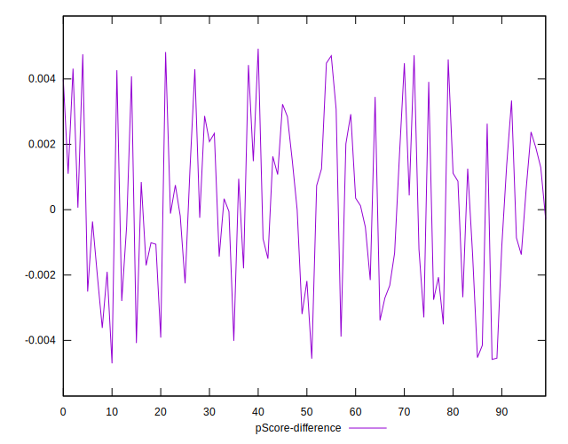
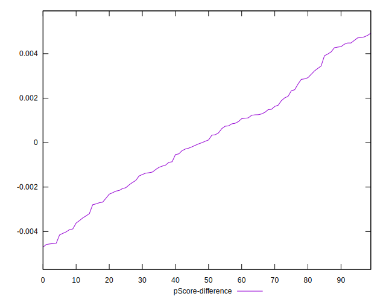

# //mainthread-work-breakdown/samples/pages+cached

[→ Parent](../..)


## Raw


```yaml
p90min: 1479.799999999999
p90max: 2076.8120000000035
p90range: 597.0120000000045
p90mean: 1663.5983829787247
median: 1640.6280000000008
p90stdev: 114.53542113204952
mad: 56.942000000000235
stdevBySn: 95.25057679999973
lfitCenter: 1661.8347701765786
lfitStdev: 90.21278743344789
mfitCenter: 1661.8347701765786
mfitStdev: 113.06496197074911
mfitConfidence: 11.30649619707491
p90skewness: 1.2941050278731923
p90eccentricity: 1.0000000000000004
p90discretization: 1
outlandishness: 1.018663474548273

```


## Score


```yaml
p90min: 0.89
p90max: 0.97
p90range: 0.07999999999999996
p90mean: 0.9486170212765959
median: 0.95
p90stdev: 0.014774983445271854
mad: 0.010000000000000009
stdevBySn: 0.011926000000000011
lfitCenter: 0.9485099614596709
lfitStdev: 0.011473479176845623
mfitCenter: 0.9485099614596709
mfitStdev: 0.014379873671005268
mfitConfidence: 0.0014379873671005268
p90skewness: -1.601705287160723
p90eccentricity: 0.9999999999999997
p90discretization: 10.444444444444445
outlandishness: 0.9940696013497884

```


## Raw Estimate


## Score Estimate


## P Score


```yaml
p90min: 0.890061201933351
p90max: 0.9686448307934484
p90range: 0.0785836288600974
p90mean: 0.9487886240884661
median: 0.9523547514904054
p90stdev: 0.014558858199279458
mad: 0.006269836014166585
stdevBySn: 0.010367752228129011
lfitCenter: 0.9488667216940524
lfitStdev: 0.011701010221664537
mfitCenter: 0.9488667216940524
mfitStdev: 0.014665041546441928
mfitConfidence: 0.0014665041546441928
p90skewness: -1.703217609884115
p90eccentricity: 1.0000000000000007
p90discretization: 1
outlandishness: 0.9940588376897845

```


## Score Difference


```yaml
p90min: 0
p90max: 1.1102230246251565e-16
p90range: 1.1102230246251565e-16
p90mean: 5.0786797934980564e-17
median: 0
p90stdev: 5.530974956507697e-17
mad: 0
stdevBySn: 0
lfitCenter: 4.782134877124825e-17
lfitStdev: 6.823782213503955e-17
mfitCenter: 4.782134877124825e-17
mfitStdev: 8.552342726752296e-17
mfitConfidence: 8.552342726752296e-18
p90skewness: 0.17083256870359323
p90eccentricity: 1.0000000000000002
p90discretization: 47
outlandishness: 1.0111939426717147

```


## P Score Difference


```yaml
p90min: -0.0045415430560799
p90max: 0.004724127704060832
p90range: 0.009265670760140732
p90mean: 0.0001695461997472061
median: 0.0000908816181999228
p90stdev: 0.0025682878859312665
mad: 0.0021382043236335413
stdevBySn: 0.002974471943038498
lfitCenter: 0.00015387957274956262
lfitStdev: 0.002183997839870253
mfitCenter: 0.00015387957274956262
mfitStdev: 0.0027372353713302246
mfitConfidence: 0.00027372353713302244
p90skewness: 0.05991929498642507
p90eccentricity: 0.9999999999999999
p90discretization: 1
outlandishness: 0.9582798772248584

```

