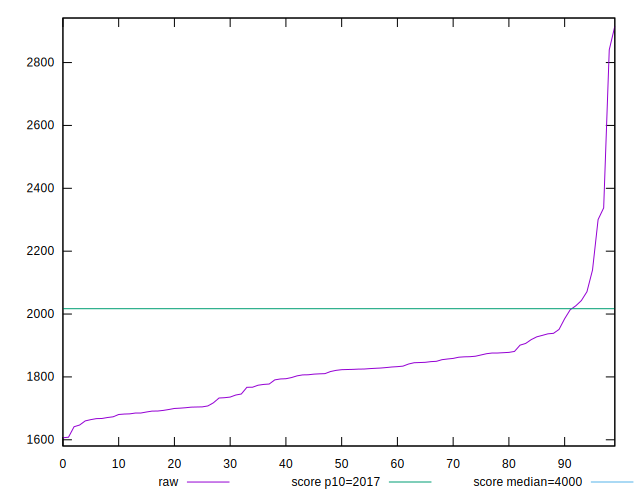
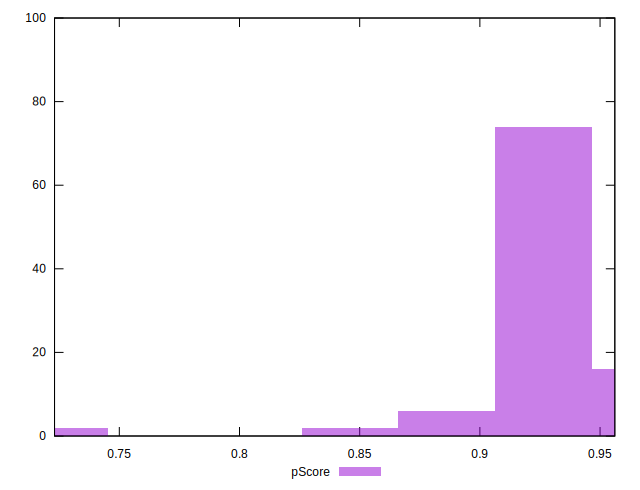
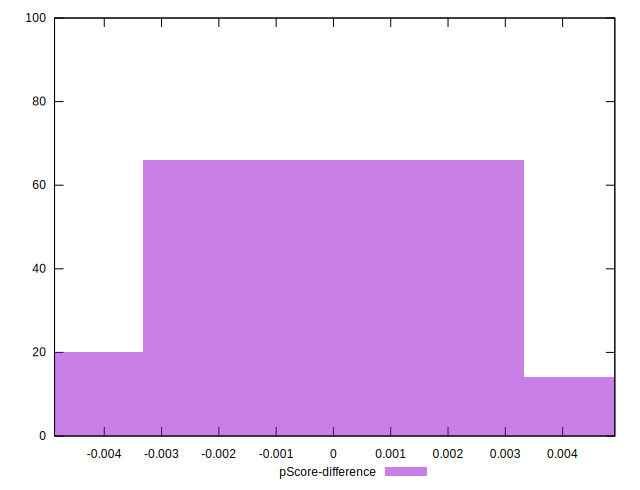

# //mainthread-work-breakdown/samples/pages

[→ Parent](../..)


## Raw


```yaml
p90min: 1646.952000000002
p90max: 2300.5519999999965
p90range: 653.5999999999945
p90mean: 1814.2171063829794
median: 1821.9140000000011
p90stdev: 112.1657329557436
mad: 77.69400000000053
stdevBySn: 102.18435319999908
lfitCenter: 1821.2074632725837
lfitStdev: 92.7266584140687
mfitCenter: 1821.2074632725837
mfitStdev: 116.21563201331868
mfitConfidence: 11.621563201331869
p90skewness: 1.1935846434105597
p90eccentricity: 0.9999999999999997
p90discretization: 1
outlandishness: 1.0228892623962467

```


## Score


```yaml
p90min: 0.85
p90max: 0.95
p90range: 0.09999999999999998
p90mean: 0.9300000000000009
median: 0.93
p90stdev: 0.016885093514065082
mad: 0.010000000000000009
stdevBySn: 0.011926000000000011
lfitCenter: 0.9286868118429074
lfitStdev: 0.014241421230489356
mfitCenter: 0.9286868118429074
mfitStdev: 0.017848974581597815
mfitConfidence: 0.0017848974581597815
p90skewness: -1.4850155757080297
p90eccentricity: 0.9999999999999991
p90discretization: 10.444444444444445
outlandishness: 0.9912022314718467

```


## Raw Estimate


## Score Estimate


## P Score


```yaml
p90min: 0.849746392220077
p90max: 0.9516358568257279
p90range: 0.10188946460565096
p90mean: 0.9297329933062147
median: 0.9294829960952673
p90stdev: 0.016371836703000034
mad: 0.010395356841788606
stdevBySn: 0.014026772616790402
lfitCenter: 0.928480585456291
lfitStdev: 0.013670339077189609
mfitCenter: 0.928480585456291
mfitStdev: 0.01713322924457845
mfitConfidence: 0.001713322924457845
p90skewness: -1.7078916970195184
p90eccentricity: 1.0000000000000002
p90discretization: 1
outlandishness: 0.9912164736466568

```


## Score Difference


```yaml
p90min: 0
p90max: 1.1102230246251565e-16
p90range: 1.1102230246251565e-16
p90mean: 3.897591469428741e-17
median: 0
p90stdev: 5.29912621446783e-17
mad: 0
stdevBySn: 0
lfitCenter: 3.1657710212153656e-17
lfitStdev: 5.672650063496794e-17
mfitCenter: 3.1657710212153656e-17
mfitStdev: 7.109612527778195e-17
mfitConfidence: 7.109612527778195e-18
p90skewness: 0.6240740781687906
p90eccentricity: 0.9999999999999992
p90discretization: 47
outlandishness: 1.0515570247933883

```


## P Score Difference


```yaml
p90min: -0.004578552789664125
p90max: 0.00480201840245198
p90range: 0.009380571192116105
p90mean: -0.00027772831877706457
median: -0.0005170039047328046
p90stdev: 0.0027040710765914053
mad: 0.002437165045724554
stdevBySn: 0.0031418158023815207
lfitCenter: -0.0002868427227710213
lfitStdev: 0.0024003028363138545
mfitCenter: -0.0002868427227710213
mfitStdev: 0.00300833348161776
mfitConfidence: 0.000300833348161776
p90skewness: 0.05901506234159792
p90eccentricity: 0.9999999999999994
p90discretization: 1
outlandishness: 0.8708857413114147

```

