# //max-potential-fid/samples/pages+cached+noadtech

[→ Parent](../..)


## Raw


```yaml
p90min: 65
p90max: 79
p90range: 14
p90mean: 69.38297872340425
median: 68
p90stdev: 3.6352481930508156
mad: 2
stdevBySn: 3.5778000000000003
lfitCenter: 69.1758533493043
lfitStdev: 3.1494279005064265
mfitCenter: 69.1758533493043
mfitStdev: 3.947222516132442
mfitConfidence: 0.3947222516132442
p90skewness: 0.9848851060967454
p90eccentricity: 0.9999999999999996
p90discretization: 6.266666666666667
outlandishness: 1.009738405797715

```

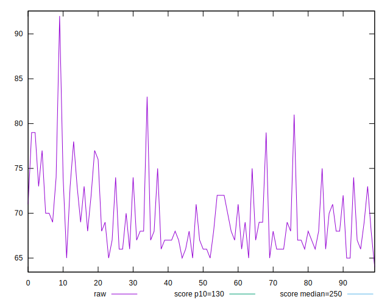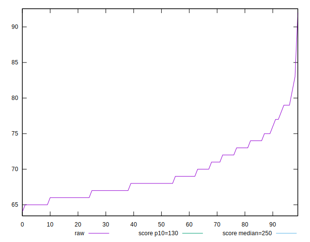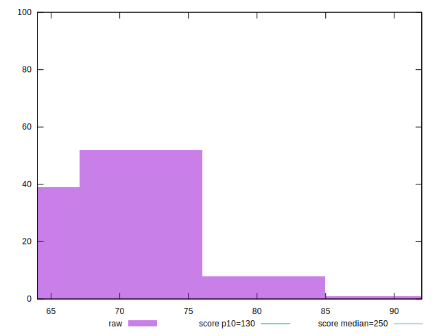
## Score


```yaml
p90min: 0.99
p90max: 1
p90range: 0.010000000000000009
p90mean: 0.9938297872340419
median: 0.99
p90stdev: 0.004861131769700375
mad: 0
stdevBySn: 0
lfitCenter: 0.9931076140709103
lfitStdev: 0.005612252098606479
mfitCenter: 0.9931076140709103
mfitStdev: 0.007033914904439909
mfitConfidence: 0.0007033914904439909
p90skewness: 0.4814569204863807
p90eccentricity: 0.9999999999999997
p90discretization: 47
outlandishness: 0.9995376257141899

```

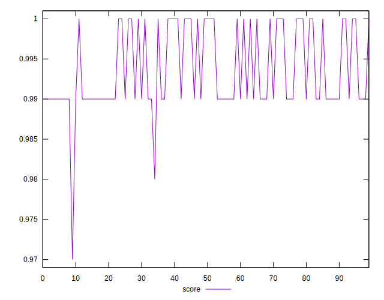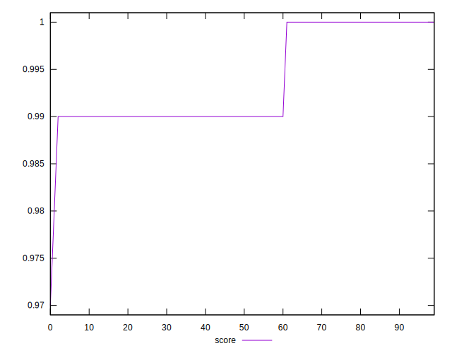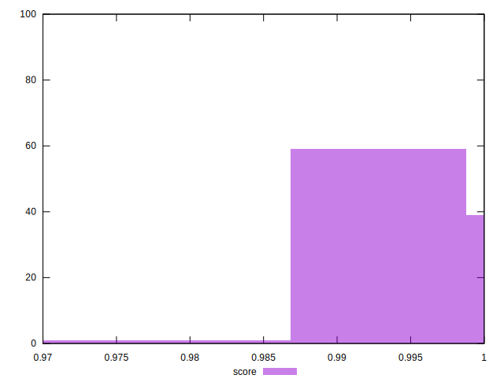
## Raw Estimate

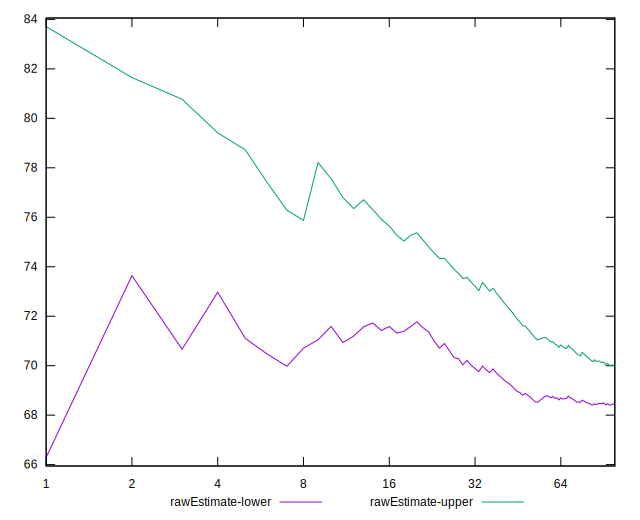
## Score Estimate

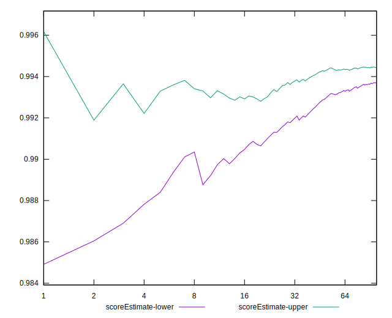
## P Score


```yaml
p90min: 0.9880175836752019
p90max: 0.9958542552567312
p90range: 0.007836671581529342
p90mean: 0.9938139000503927
median: 0.9946375893622611
p90stdev: 0.0019517286880229808
mad: 0.0008358751432610001
stdevBySn: 0.001450995745745059
lfitCenter: 0.9939141291085846
lfitStdev: 0.0017126840181974432
mfitCenter: 0.9939141291085846
mfitStdev: 0.002146531094921104
mfitConfidence: 0.0002146531094921104
p90skewness: -1.3338872998009137
p90eccentricity: 1.0000000000000002
p90discretization: 6.266666666666667
outlandishness: 0.9994172495644719

```

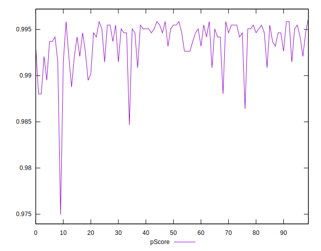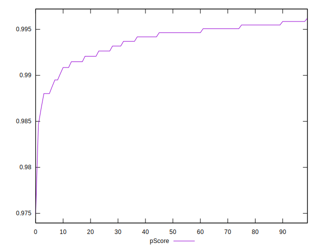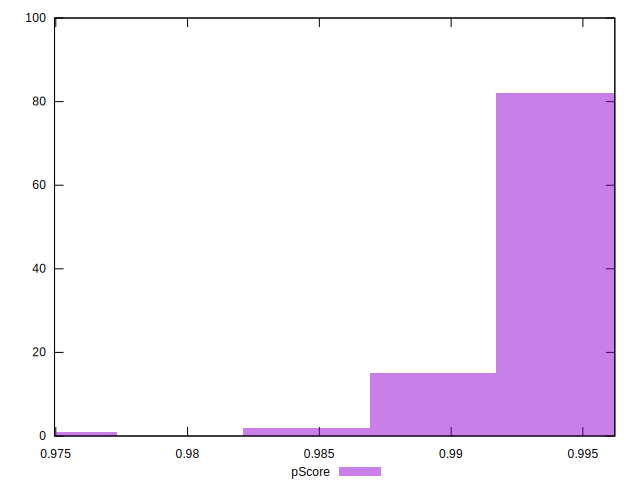
## Score Difference


```yaml
p90min: 0
p90max: 0
p90range: 0
p90mean: 0
median: 0
p90stdev: 0
mad: 0
stdevBySn: 0
lfitCenter: 0
lfitStdev: 0
mfitCenter: 0
mfitStdev: 0
mfitConfidence: 0
p90skewness: .nan
p90eccentricity: .nan
p90discretization: 94
outlandishness: .nan

```


## P Score Difference


```yaml
p90min: -0.004931822957321863
p90max: 0.0046375893622611075
p90range: 0.00956941231958297
p90mean: -0.00007461221277767717
median: 0.0011651869866929898
p90stdev: 0.003874804931588209
mad: 0.0034724023755681177
stdevBySn: 0.004141187073102537
lfitCenter: 0.0000011975952994187631
lfitStdev: 0.004073173033429286
mfitCenter: 0.0000011975952994187631
mfitStdev: 0.005104965351666018
mfitConfidence: 0.0005104965351666018
p90skewness: -0.09947000235739316
p90eccentricity: 1.0000000000000004
p90discretization: 5.529411764705882
outlandishness: 1.029775981928148

```

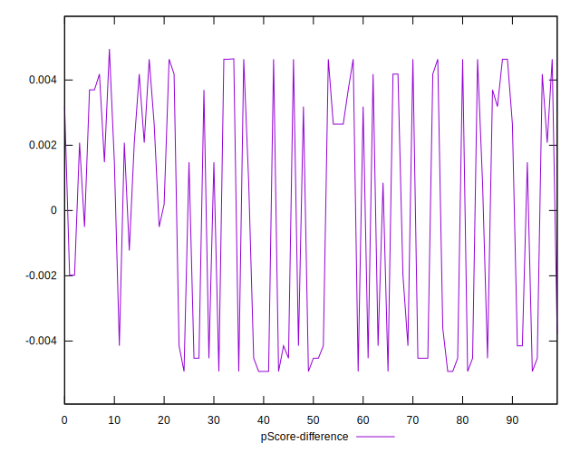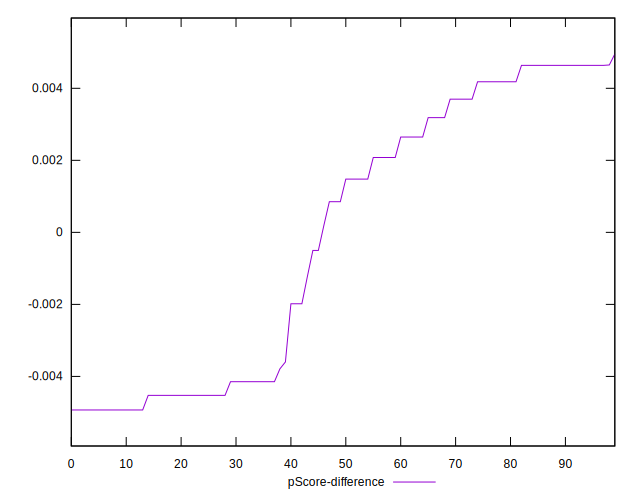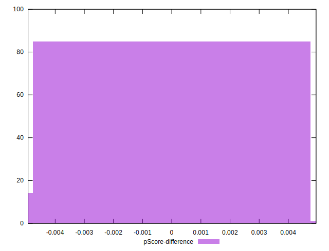