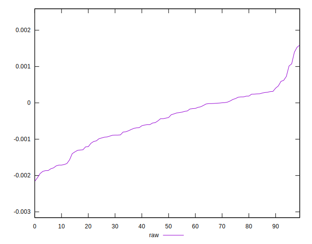

# //meta/pScore-difference/samples/pages+cached+noadtech+nomedia

[→ Parent](../..)


## Raw


```yaml
p90min: -0.0018865043760015298
p90max: 0.001075773602002139
p90range: 0.0029622779780036686
p90mean: -0.00047939448933588226
median: -0.000411423465608831
p90stdev: 0.0007108535582351715
mad: 0.0005438968692964237
stdevBySn: 0.0009297804782826631
lfitCenter: -0.0004483048876380159
lfitStdev: 0.0006249243288810387
mfitCenter: -0.0004483048876380159
mfitStdev: 0.0007832264969271228
mfitConfidence: 0.00007832264969271228
p90skewness: -0.2568542634185107
p90eccentricity: 1
p90discretization: 1
outlandishness: 0.9495321195905662

```

