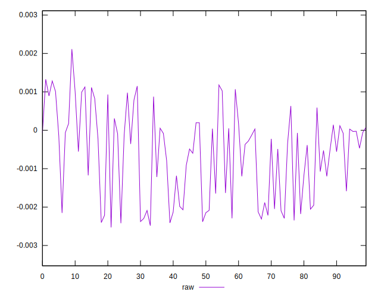
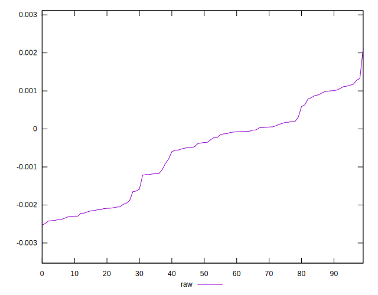
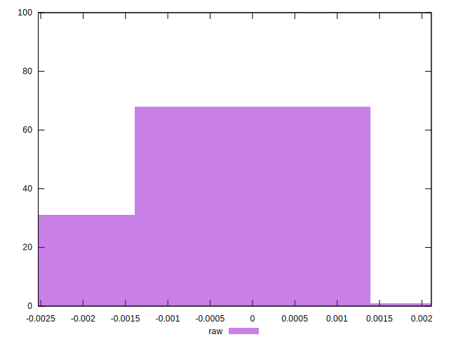

# //meta/pScore-difference/samples/pages+cached+noadtech

[→ Parent](../..)


## Raw


```yaml
p90min: -0.0024124253502431233
p90max: 0.0011791126339066218
p90range: 0.003591537984149745
p90mean: -0.0006267907431436083
median: -0.0003626346352066788
p90stdev: 0.0011335584447363957
mad: 0.0009734734122635723
stdevBySn: 0.0013230946338018362
lfitCenter: -0.0005781600527011043
lfitStdev: 0.0010080583419215913
mfitCenter: -0.0005781600527011043
mfitStdev: 0.0012634137724404535
mfitConfidence: 0.00012634137724404536
p90skewness: -0.1733677479730857
p90eccentricity: 1
p90discretization: 1
outlandishness: 0.9668095544597864

```

