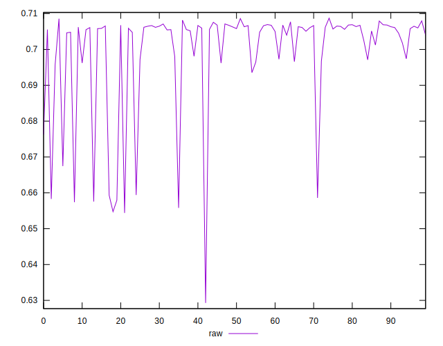
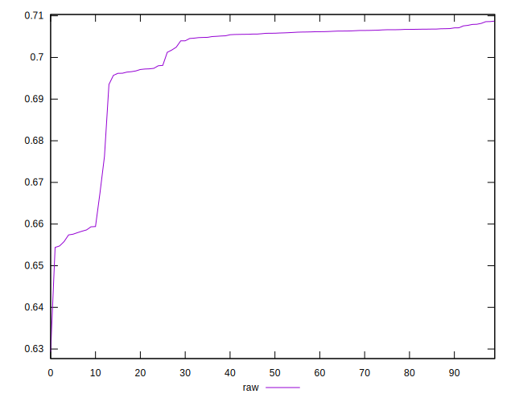
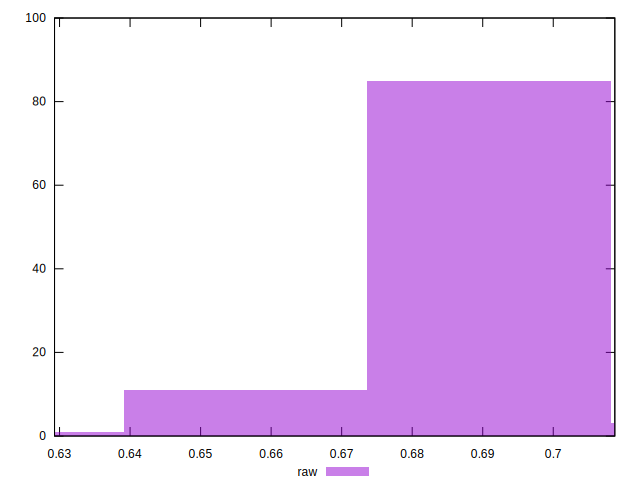

# //meta/pScore/samples/pages+cached+noadtech+nomedia

[→ Parent](../..)


## Raw


```yaml
p90min: 0.6557945601509089
p90max: 0.7081850514286571
p90range: 0.0523904912777482
p90mean: 0.6998873889897254
median: 0.7058151250069551
p90stdev: 0.014039417978112284
mad: 0.0009902277946955973
stdevBySn: 0.0016333375419029647
lfitCenter: 0.701532092761389
lfitStdev: 0.009002663435612308
mfitCenter: 0.701532092761389
mfitStdev: 0.011283165368699838
mfitConfidence: 0.0011283165368699837
p90skewness: -2.3745591882077406
p90eccentricity: 1
p90discretization: 1
outlandishness: 0.9961472979941406

```

