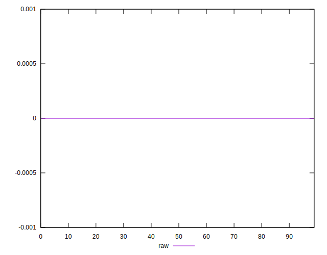
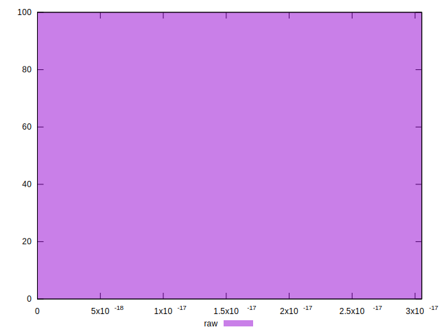

# //meta/score-difference/samples/pages+cached+noadtech+nomedia+nocss

[→ Parent](../..)


## Raw


```yaml
p90min: 0
p90max: 0
p90range: 0
p90mean: 0
median: 0
p90stdev: 0
mad: 0
stdevBySn: 0
lfitCenter: 1.4207972264822074e-19
lfitStdev: 3.5448371192628478e-19
mfitCenter: 1.4207972264822074e-19
mfitStdev: 4.442794480523407e-19
mfitConfidence: 4.4427944805234073e-20
p90skewness: .nan
p90eccentricity: .nan
p90discretization: 94
outlandishness: .inf

```

